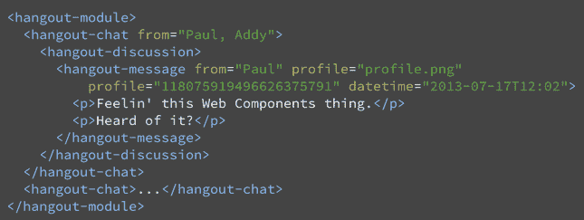
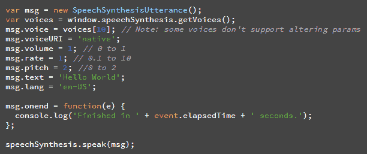

# Chrome 33 Beta 引入了自定义元素并支持语音合成 API TechCrunch

> 原文：<https://web.archive.org/web/https://techcrunch.com/2014/01/16/chrome-33-beta-introduces-custom-elements-and-support-for-speech-synthesis-api/>

# Chrome 33 Beta 引入了自定义元素和对语音合成 API 的支持

就在 Chrome 32 的[发布进入稳定发布渠道的一天后，谷歌今日](https://web.archive.org/web/20221209002053/https://beta.techcrunch.com/2014/01/14/chrome-32-launches-with-tab-indicators-for-sound-and-video-improved-malware-blocking-and-new-win8-metro-design/)[推出了针对桌面和安卓的 Chrome 33](https://web.archive.org/web/20221209002053/http://blog.chromium.org/2014/01/chrome-33-beta-custom-elements-web.html) 的首个测试版[。](https://web.archive.org/web/20221209002053/https://www.google.com/landing/chrome/beta/)

这个版本的主要特点是开发人员感兴趣的更新，包括对自定义元素的支持，这允许开发人员定义他们自己的 HTML 元素。这是 Chrome 团队长期以来非常感兴趣的 Web 组件规范的一部分。

使用自定义元素，开发人员可以定义新的 HTML 元素，扩展现有元素，并将自定义功能捆绑到单个标签中。正如谷歌指出的，这项技术允许开发者“以更干净的方式设计他们的应用程序”。这里有一个[演示应用](https://web.archive.org/web/20221209002053/http://html5-demos.appspot.com/hangouts) 展示了 web 组件的运行。同样值得注意的是，Mozilla 还将 [支持 Web 组件](https://web.archive.org/web/20221209002053/https://beta.techcrunch.com/2013/09/01/mozilla-gets-on-the-web-components-bandwagon-with-brick/) 。

此更新中的另一个主要新功能是对 Web Speech API 的支持，它允许开发人员将语音识别和合成添加到他们的站点中。谷歌去年在 Chrome 上增加了识别功能，今天又增加了内置的语音合成功能。使用这个 API，开发人员可以从给定的机器上获得支持的语音列表，然后使用合成引擎让 web 应用程序对其用户说话。除了 Chrome 33，iOS 7 上的 Safari 也提供了对该功能的部分支持。

以下是其他变化的简要概述:

*   轻松网上支付的 requestAutocomplete API 现已在 Mac 上推出。
*   页面可见性 API 尚未修复。
*   WebFont 下载已经过优化，因此在 Blink 布局完成之前字体(在中间)就可用，这意味着使用 webfont 的净延迟影响通常为零。
*   Blink CSS 动画和过渡实现现在由新的 Web 动画模型支持。
*   这种变化不应该影响开发人员或网站。
*   Chrome 现在支持最新版本的网络通知 API。