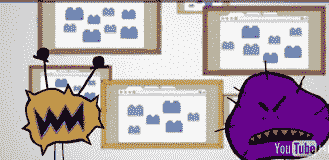

# Chrome 浏览器沙盒 Flash 可抵御恶意软件 

> 原文：<https://web.archive.org/web/http://techcrunch.com/2010/12/16/chrome-browser-sandboxes-flash-to-protect-against-malware/>

# Chrome 浏览器沙盒 Flash 可抵御恶意软件

Flash 的一个大问题是它引入了各种各样的安全漏洞，尤其是如果你没有最新的安全补丁和更新。谷歌已经选择在其 Chrome 浏览器和 Android 操作系统中采用 Flash(与另一家不让 Flash 靠近其 iPhones 和 iPads 的公司相反)。但它希望将 Flash 带来的安全风险降至最低。今天，它在它的[测试频道](https://web.archive.org/web/20230205040439/http://www.google.com/intl/en/landing/chrome/beta/)和[沙盒 Flash](https://web.archive.org/web/20230205040439/http://chrome.blogspot.com/2010/12/safer-plug-ins-faster-search-and-richer.html) 和其他扩展中发布了一个新版本的 Windows Chrome 浏览器。(chrome 的新版本在三个渠道同时发布:开发者、测试版和稳定版)。沙盒将很快出现在 Mac 和 Linux 版本中。

大约一周前，谷歌在其大型 Chrome 活动中预览了这些变化，自 3 月以来，它一直在谈论沙盒 Flash 至少[。](https://web.archive.org/web/20230205040439/https://techcrunch.com/2010/03/30/flash-player-to-come-bundled-with-google-chrome-new-browser-plugin-api-coming/)

沙盒隔离网站和应用程序，使恶意软件不会超出该标签传播到计算机的其他部分。插件是一个巨大的安全漏洞，Chrome 正试图遏制这一漏洞。Chrome 现在还会自动更新所有安全补丁的 Flash。全球有 1 . 2 亿 Chrome 用户，这将大大有助于让 Flash 更加安全。现在，如果他们能让 Flash 不至于让 Chrome 崩溃，那就太好了。

除了沙盒功能，Windows 的测试版还会在你开始将 URL 绑定到地址栏时开始加载经常访问的网站。甚至在你输入完网址或按下回车键之前，页面就已经加载了。它就像谷歌即时浏览。