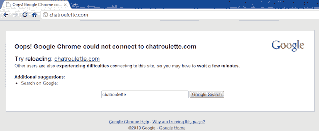

# 谷歌 Chrome 是新的“人人皆可下载，还是只有我一个人”| TechCrunch

> 原文：<https://web.archive.org/web/https://techcrunch.com/2010/08/31/chrome-downforeveryoneorjustme/>

# 谷歌 Chrome 是新的“为所有人服务还是只为我服务”

你点击了一个网站；它倒下了。你马上重新装弹；还是跌了。你开始害怕了。“他们怎么又下来了！？那边有人负责吗？！WTF？!"但很多时候，只有你。你看起来像个蠢驴，因为你刚刚在 Twitter 上(或者在脸书，当 Twitter 宕机的时候)发了一通牢骚。谢天谢地，看起来 Chrome 现在有可能让你摆脱这种尴尬。

技术极客们非常熟悉像[Down For everybody 或 only Me](https://web.archive.org/web/20230324161001/http://downforeveryoneorjustme.com/)这样的网站(它是由当时的 Twitter 员工偶然创建的，并于今年早些时候出售)。你去那里，输入一个网址，看看世界上其他人是否也有访问这个网站的困难。但是最新版本的 Chrome 现在似乎为你做了同样的事情，正如博客 [Rudefox 今天](https://web.archive.org/web/20230324161001/http://rudefox.com/google-chromes-new-feature-tells-user-if-other-users-face-downtime/)指出的。

当今天试图加载 Chatroutlette】和我们其他人一样)却发现它已经关闭时，作者得到了一个相当典型的浏览器提示。谷歌浏览器无法连接到 chatroulette.com。”但有趣的是，在那下面写着“*其他用户也在* ***连接本网站*** *遇到困难，所以你可能要**等几分钟。***

看，谷歌监视我们有一些好处。他们现在可以让我们每个人或者就我一个人少去一趟。

*【谢谢汤姆】*