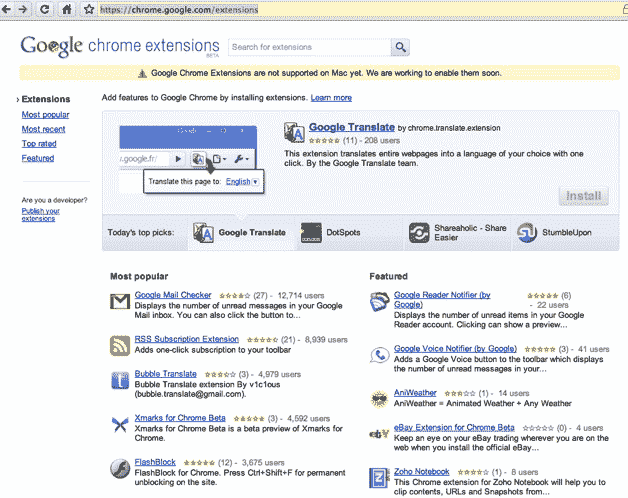

# 现在 Chrome 扩展也上线了！

> 原文：<https://web.archive.org/web/https://techcrunch.com/2009/12/08/chrome-extensions-live/>

# 现在 Chrome 扩展也上线了！

当 Mac 用户今天第一次在 T2 正式体验 Chrome 浏览器时，Windows 和 Linux 用户也有所收获。终于，比预期早了一天， [Chrome 扩展](https://web.archive.org/web/20221208231851/https://chrome.google.com/extensions)现在面向所有人开放(之前只面向开发者)。

扩展是谷歌所说的附加组件或插件。从上周开始，我们一直在等待 Chrome extensions gallery 的发布。这里有一个 [11 早期扩展](https://web.archive.org/web/20221208231851/http://www.beta.techcrunch.com/2009/12/05/11-chrome-extensions-for-starters/)的预览，但现在有更多。

一些特色扩展包括来自 Brizzly、Picnik、Remember The Milk (ChromeMilk)、谷歌阅读器、NPR、Clip To Evernote、Woot、Feedly 和 Chromed Bird 的扩展。而且他们甚至还有脸书 Adblock，虽然我没看到正规的 Adblock ( **更新**，有 AdSweep 和 Adblock 在别处也有，见评论)。我很想看看这些，但我用的是苹果电脑。我想我得等等了。这些扩展目前只能在 Windows 和 Linux(测试版)上运行。

然而，等待不应该太长，因为扩展已经在 Chromium for Mac 中运行(开发者构建)。一旦我最喜欢的插件或它们的等价物登陆 Chrome，那就是让我留在 Firefox 上的最后一件事。

