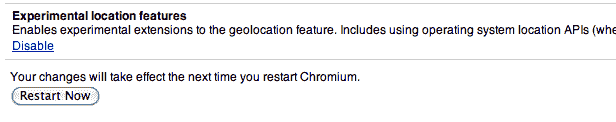

# 凭借 Chrome，谷歌正在向更深层次的位置整合迈进 

> 原文：<https://web.archive.org/web/https://techcrunch.com/2010/12/13/chrome-location/>

# 凭借 Chrome，谷歌正朝着更深层次的位置整合迈进

现在应该很清楚，谷歌非常重视地理位置。最初在 2009 年初发布 Latitude 只是第一步。现在他们有了[健壮的 API](https://web.archive.org/web/20221005084431/https://beta.techcrunch.com/2010/05/19/google-latitude-api/)，谷歌 [Places](https://web.archive.org/web/20221005084431/https://beta.techcrunch.com/2010/04/20/google-places/) ，关键高管[玛丽莎·梅耶尔](https://web.archive.org/web/20221005084431/http://www.crunchbase.com/person/marissa-mayer)现在负责这些和各种相关的[项目](https://web.archive.org/web/20221005084431/https://beta.techcrunch.com/2010/12/08/googles-next-big-thing/)。今天早些时候，他们终于推出了 Latitude iPhone 应用程序。但如果对 Chrome 的一个相当小的调整有任何迹象的话，谷歌打算更深入。

更具体地说，Chrome 所基于的开源浏览器 Chromium 最近刚刚获得了一个隐藏在一个标志后面的新实验性功能(意味着你必须显式启用它)。在 Chromium version 10 的最新版本中，你会看到一个名为“实验位置特性”的选项。显然，当打开时，这允许浏览器运行“*地理定位功能的实验性扩展*”

描述对此做了更多的澄清:“*包括使用操作系统定位 API(如果可用的话)，并向谷歌定位服务发送额外的本地网络配置数据，以提供更高精度的定位*。”显然，最后一点特别有趣。显然，谷歌希望提高浏览器中的位置准确性——这是一个问题，因为大多数数据来自 WiFi 三角测量数据，而不是 GPS(大多数电脑都没有)。但看起来他们也打算利用从 Chrome 的这一功能中收集的数据建立自己的位置数据库和服务。

目前，消费者看到的定位应用程序下正在酝酿一场战争。它涉及位置和地点数据库和服务。过去，包括大公司在内的所有人都去像 [Skyhook Wireless](https://web.archive.org/web/20221005084431/http://www.skyhookwireless.com/) 和 [Localeze](https://web.archive.org/web/20221005084431/http://www.localeze.com/) 这样的公司获取位置数据和功能。但是，越来越多的科技超级大国，如苹果、谷歌和脸书，正在打造自己的产品。为什么？因为他们都想拥有本地空间。

但是谷歌的定位可能是最有趣的。毕竟，他们的数百万部安卓手机都在地图产品中内置了定位功能。苹果在 iPhone 上也有这种功能，但请记住，iPhone 上也包含谷歌地图(尽管据说苹果只是简单地使用谷歌的数据来构建自己的应用程序)。现在，谷歌开始真正推动他们的位置服务，如纬度和新的火锅。如果你认为没有人在使用 Latitude，谷歌今天明确表示，它有 900 万活跃用户，几乎是 Foursquare 总用户数的两倍。

当然，有多少人实际上在使用 Latitude，而有多少人在 Android 设备上通过地图使用它，甚至没有真正意识到这一点，这仍然是个问题。但这几乎无关紧要，谷歌仍在获取这些数据。这就是他们控制所有这些入口点如此重要的原因。很快，Chrome 将成为另一个。这是防止 Chrome 笔记本起飞的关键。定位服务将成功地从智能手机转移到笔记本电脑。

所有这些都是梅耶尔上周在 LeWeb 演讲的关键:走向“[情境发现](https://web.archive.org/web/20221005084431/https://beta.techcrunch.com/2010/12/08/googles-next-big-thing/)”。在不进行搜索的情况下获取结果*。*

