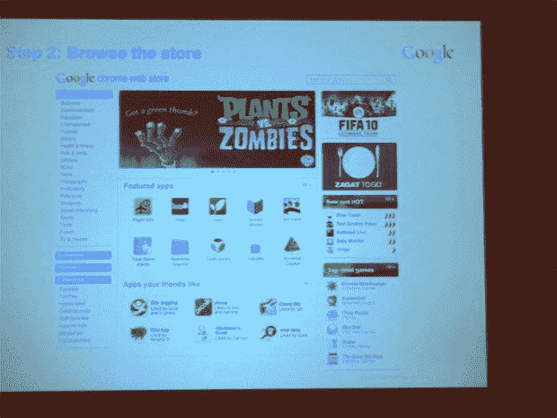

# Chrome 网上商店定于 10 月推出，谷歌仅收取 5%的收入 TechCrunch

> 原文：<https://web.archive.org/web/https://techcrunch.com/2010/08/17/chrome-web-store-2/>

# Chrome 网上商店定于 10 月份推出，谷歌仅抽取 5%的收入

谷歌的[网络应用商店](https://web.archive.org/web/20221006093759/https://beta.techcrunch.com/2010/05/19/chrome-web-store/)几乎已经准备就绪。

游戏门户网站 1Up.com[详细介绍了](https://web.archive.org/web/20221006093759/http://www.1up.com/news/google-shows-future-browser-games)由谷歌开发者支持者马克·德劳拉和迈克尔·马赫莫夫在 GDC Europe 上所做的演示，其中包含了关于 Chrome 网络商店的新细节——这是谷歌 I/O 上首次[宣布的](https://web.archive.org/web/20221006093759/https://beta.techcrunch.com/2010/05/19/chrome-web-store/)功能，将允许用户从他们的 Chrome 网络浏览器购买网络应用。在他们的谈话中，谷歌员工透露，网上商店将(可能)在 10 月份推出，他们给出了更多关于网上商店支付工作的细节。

一条关键消息:当网络商店首次宣布时，谷歌产品副总裁桑德尔·皮帅[表示](https://web.archive.org/web/20221006093759/https://beta.techcrunch.com/2010/05/20/chrome-web-store-details/)将会有一个标准的 70/30(开发者/谷歌)分成——与苹果的应用商店和安卓市场相同。然而，1Up 报告中的幻灯片显示(用粗体字显示)，谷歌将只收取 5%的“处理费”，没有额外的收入分成。

这是一个非常有趣的变化，因为这意味着开发人员现在有强烈的动机开发和推广他们的应用程序的 web 版本，而不是本地版本。谷歌可能在短期内赚不了多少钱，但如果它能帮助网络战胜本地应用，那么这个决定将在很大程度上为谷歌带来回报。

幻灯片还表明，商店将推出对免费试用、订阅和其他应用内支付平台的支持。在发布时，你可以使用 Google Checkout 从世界任何地方购买应用程序，但只能使用美元(多种货币和应用内交易将于 2011 年上半年推出)。

同样有趣的是:在“大部分时间”里，申请会被自动批准并公布(报告没有指出该规则的例外情况)。每个应用程序配置文件将包括客户评论，包括那些由你的朋友留下的。

