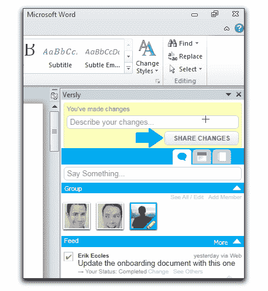

# 思科收购协作软件制造商 Versly 

> 原文：<https://web.archive.org/web/http://techcrunch.com/2011/08/29/cisco-acquires-collaboration-software-maker-versly/>

# 思科收购协作软件制造商 Versly

今早思科[宣布](https://web.archive.org/web/20230203131658/http://newsroom.cisco.com/press-release-content?type=webcontent&articleId=464637)已经收购了旧金山初创公司 [Versly](https://web.archive.org/web/20230203131658/http://www.crunchbase.com/company/versly) ，这是一家私人控股公司[开发与微软 Office 应用集成的](https://web.archive.org/web/20230203131658/http://www.versly.com/)协作工具。

收购的财务条款没有透露，但在收购完成后，所有 Versly 员工将被整合到思科的协作软件集团(CSG)。

Versly 构建插件，使[组人员能够围绕 Word 文档、Excel 电子表格、PowerPoint 演示和电子邮件中的内容进行协作。](https://web.archive.org/web/20230203131658/http://support.versly.com/entries/20230961-getting-started-with-versly)

从表面上看，该服务仍处于私人测试阶段，因此这是 Versly 的快速退出。

以下是思科 CSG 副总裁兼总经理 Murali Sitaram 对此次收购的推介:

> “协作是思科的重中之重。通过此次收购，我们将社交技术整合到个人和团队在工作中使用的业务应用程序中，从而增强我们的协作产品并改善用户体验。”

Versly 的软件将集成到 Cisco Quad、Jabber 和 WebEx 等产品中。

根据其 CrunchBase 简介，Versly 得到了来自 Accel Partners、Baseline Ventures、500 Startups 和一些天使投资人的种子资金支持，其中包括 Scott Dietzen、Kenny Van Zant、Jonathan Katzman 和 Rasool Rayani。

这家公司是由前 BEA 和 Sun 高管本杰明·雷诺和前雅虎老板埃里克·埃克尔斯创办的。团队的其他成员在这里详细介绍。