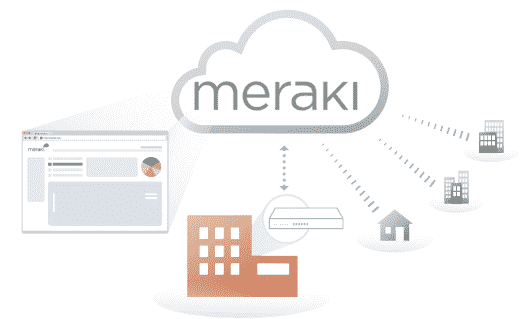
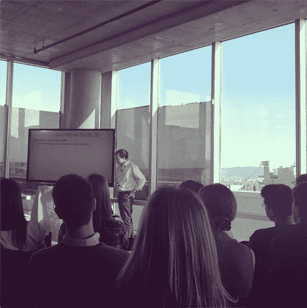

# 思科以 12 亿美元现金收购企业 Wi-Fi 初创公司 Meraki 

> 原文：<https://web.archive.org/web/https://techcrunch.com/2012/11/18/cisco-acquires-enterprise-wi-fi-startup-meraki-for-1-2-billion-in-cash/>

网络技术巨头思科刚刚同意收购云基础设施初创公司 Meraki，我的行业消息来源证实收购价格为 12 亿美元，全部为现金。我还拿到了 CEO 桑吉·比斯瓦斯写给 Meraki 员工的信。对于这家拥有 330 名员工的旧金山初创公司来说，这是一个巨大的胜利。【**更新**:[公关](https://web.archive.org/web/20221209065349/http://www.marketwatch.com/story/cisco-announces-intent-to-acquire-meraki-2012-11-18)刚刚打来电话，确认了我们的收购细节和 12 亿美元的价格。]

博客作者 Greg Ferro [今天早上首先提到了关于思科和 Meraki 的谣言，推测他们可能会在本周晚些时候宣布一项交易。然而，TechCrunch 可以确认购买和价格标签。](https://web.archive.org/web/20221209065349/https://twitter.com/etherealmind/status/270138919234977792)

对于那些不熟悉的人来说，Meraki 始于 2006 年麻省理工学院的一个研究项目。它为大中型公司、学校和组织提供内部网状 Wi-Fi 网络和安全设备以及管理它们的软件。这项技术使运行强大的云网络变得简单而经济，而无需庞大的 it 部门。它还旨在帮助企业适应员工越来越多地通过智能手机和平板电脑访问企业网络的情况。

今年早些时候，一位业内人士在一次全体会议上向我透露了 Meraki 的财务数据。它悄悄地完成了一轮 4000 万美元的融资，每年花费大约 6500 万美元，仅在 2012 年 Q2 奥运会上就带来了 2000 万美元的收入。在今天的收购之前，Meraki 总共只筹集了 8000 万美元，这意味着像谷歌、Felicis Ventures 和红杉这样的早期投资者可能会获得可观的回报。

[更新:思科官方发布的消息解释说:“收购 Meraki 补充和扩展了思科的战略，以提供更多以软件为中心的解决方案来简化网络管理，帮助客户增强移动工作人员的能力，并为合作伙伴创造新的收入机会。”

最终，[思科发布了一篇由企业发展副总裁 Hilton Romanski 撰写的博客文章](https://web.archive.org/web/20221209065349/http://blogs.cisco.com/news/cisco-announces-intent-to-acquire-meraki/),称“我们的构建、购买、合作伙伴战略始终以客户需求和捕捉市场变化为导向……今天，我们很高兴地宣布一项重大收购，以应对快速发生的向云网络的转变。”他接着说，思科被 Meraki 吸引是因为它“正以巨大的利润呈指数级增长。”

红杉资本(Sequoia Capital)在 2007 年 2 月支持了 Meraki 的 500 万美元首轮融资，并写了一篇小小的祝贺博文，名为“[麻省理工学院的三个家伙如何改变了网络行业](https://web.archive.org/web/20221209065349/http://sequoiacapital.tumblr.com/post/36033519237/cisco-acquires-meraki-how-3-guys-from-mit-transformed)”。它打开“快速:你最后一次插上以太网电缆是什么时候？如果你很难回答这个问题，你就是思科同意收购 Meraki 的原因之一。”

普通合伙人 Douglas Leone 解释说，Meraki 花了不稳定的一年时间决定专注于中小型企业市场，但一旦它发布了让 it 团队在家解决问题的软件，它就真正起飞了。这笔交易花了四天时间达成握手协议，将帮助思科度过企业从移动接入的转变。]

我们贴在下面的 Meraki 首席执行官写给 Meraki 员工的信指出，Meraki 已经达到了 1 亿美元的运营成本，并在计划 IPO 时首先拒绝了思科的收购要约。在考虑到科技公司从 IPO 中获得的低估值以及有助于保留 Meraki 身份的整合计划后，它接受了“非常重要的报价”。

Meraki 的所有部门目前都将继续运营，该公司将成为思科新的旧金山云网络集团办公室的核心。该交易预计将在思科 2013 财年 Q2 完成，该财年将于明年 1 月结束。

Meraki 将继续支持其现有的硬件、服务和客户，并开发新产品和新功能。Meraki 的许可证不会改变，它也不打算要求其客户购买思科的 SmartNet 服务。一旦收购完成，Meraki 将考虑扩展思科以规模为中心的企业产品，但目前将继续专注于中端市场和便利性。

以每位员工 360 万美元的现金价格，比斯瓦斯和他的联合创始人 CTO 约翰·比克特(John Bickett)以及产品管理副总裁汉斯·罗伯逊(Hans Robertson)的退出是巨大的成功。Meraki 看到了一个巨大的机会，可以让中型组织更容易地连接起来——这是网络巨头们没有解决的问题。它不得不面对像 Aruba Networks 和 Aerohive 这样敏捷的竞争对手(现在看起来可能是有吸引力的收购)，所以它迅速筹集资金，推动其野火般的增长，并接触了 20，000 名客户。

现在，它没有冒险与变化无常的华尔街投资者打交道，而是进行了巨额现金收购。恭喜这些来自麻省理工学院的斗志昂扬的小伙子们。

2019 年 11 月 19 日更新:今天早上，首席执行官桑吉特·比斯瓦斯来到了 Meraki 的旧金山。团队，其他办公室通过 WebEx 观看。我们对他的这张照片进行了评分，解释了公司将如何保留其身份并仍然拥有一个旧金山办事处。紧接着，一些应得的香槟被打开了。

这是给 Meraki 员工的信，自从泄露给我后，这封信已经发表在 Meraki 的 sassy " [思科收购常见问题](https://web.archive.org/web/20221209065349/http://www.meraki.com/company/cisco-acquisition-faq)"上:

来自:Sanjit Biswas，Meraki 公司首席执行官。

> 大家好，
> 
> 你们中的一些人可能已经通过 Twitter 或 Google Alerts 听说了，有传言说思科打算收购 Meraki。我们最初的计划是在明天正式宣布之前向所有人公布这个消息，但看起来社交媒体已经捷足先登了！
> 
> 鉴于这是一件大事，无论是字面上还是象征性的，我想花几分钟时间提供一些关于即将发布的更多背景信息。我宁愿在明天的活动中亲自做这件事，但我认为 Meraki 的每个人都了解情况是很重要的。
> 
> 首先，这对于梅拉奇来说是一个意料之外的事件。当我们六年前开始创业时，我们是麻省理工学院的三个人，想知道我们的自举式创业在未来几年将把我们带向何方。我们有一些关于如何建立网络的令人兴奋的想法，并且知道我们想要对世界产生重大影响，但还没有想出如何将这些点连接起来。对我们来说幸运的是，我们的客户多年来帮助我们指引道路，并且能够有机地一起建立一套令人惊叹的产品和令人惊叹的公司。
> 
> 今年对我们来说特别神奇(抱歉连续三次说神奇，但确实是)。我们成功推出了另一个主要产品系列，实现了 1 亿美元的预订率，员工从 120 人增加到 330 人，同时实现了正现金流。
> 
> 因此，当思科几周前提出收购要约时，我们的第一反应是礼貌地说“谢谢，但我们计划做自己的事情，让 Meraki 上市”。事实证明，这正是他们有兴趣与我们交谈的原因——在过去的六年里，我们开发了一种创新的产品和销售模式，这确实是我们自己的东西，在市场上独一无二。他们已经从客户、合作伙伴和分析师那里听说 Meraki 已经建立了真正不同的东西，并想看看思科是否能通过他们庞大的销售渠道在全球范围内分发该技术。
> 
> 这是一个非常重要的提议，所以我们花时间仔细考虑了它的含义。首先，我们决定把它分成两个主要部分——定性和定量。作为工程师，这些数字可能更容易推理:我们一直在研究上市公司的估值，能够看到价格是一个有吸引力的报价，并给我们带来了高利润率、高增长和良好的未来执行能力。然而，定性部分更难:我们是否能够继续做让我们成为思科一部分的事情？
> 
> 事实证明，思科团队也明白我们的团队、文化和环境对我们有多重要，并做好了准备作为他们报价的一部分。他们概述了一些帮助我们做出决定的关键概念:
> 
> *   思科赞赏我们开发创新产品的方式:关注我们的客户，快速尝试软件和硬件方面的新想法。他们希望看到我们在未来几年继续发布新的功能和产品，并希望“云化”其他思科产品。
> 
> *   除了技术，他们还认为我们的业务模式高度整合，注重客户体验。这种整合跨越团队，因此他们希望所有部门继续做他们正在做的事情，同时找出如何利用思科的分销渠道。
> 
> *   最后，思科认识到我们在旧金山建立了一种文化和环境，帮助我们招聘和留住了各部门的杰出人才。因此，他们希望我们成为一个新的“云网络小组”，基于 SF、有趣的办公室、免费的食物等等。
> 
> 经过几周的考虑，我们上周晚些时候决定加入思科是 Meraki 的正确道路，并将帮助我们实现产生最大影响的目标。作为创始人，我们三个人都计划继续担任业务部门的领导，并期待着继续朝着年收入$1B 的目标前进。我们继续对你们所有人保持透明，虽然有些事情像我们的电子邮件地址等。将会改变我们的日常运营，我们将确保像我们的文化这样的重要事情保持不变。
> 
> 就接下来发生的事情而言:本周我们的工作与上周一样——打造令人惊叹的产品，并交付给我们的客户。我们也将继续作为一个独立的公司运营，直到收购完成，我们预计在思科的财政季度结束前。计划是让员工从 Meraki 转到思科。
> 
> 我再次为不得不发送对我们所有人如此重要的邮件道歉。我们将计划在明天的活动中更详细地介绍我们的计划，该活动将重新安排在上午 10:00 在新设施和 WebEx 上举行(比原计划提前三个小时)。AJ/Kathy 将在今天下午通过电子邮件发送更多关于物流的详细信息。
> 
> 谢谢，明天早上见，
> 
> 桑吉特
> 
> —
> Meraki 公司首席执行官 Sanjit Biswas。
> 
> http://www.meraki.com/