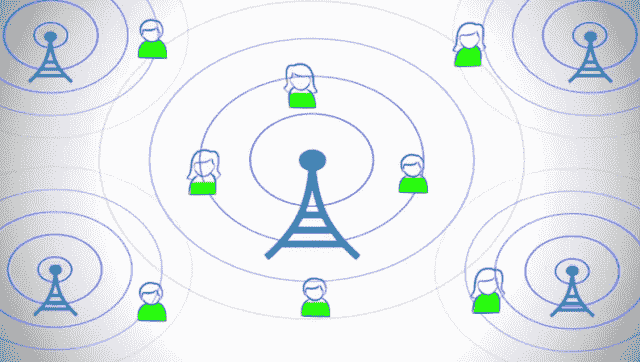

# 思科将以 4.75 亿美元现金收购以色列移动初创公司 Intucell，Bessemer 将获得近一半 

> 原文：<https://web.archive.org/web/https://techcrunch.com/2013/01/23/cisco-buys-israeli-mobile-startup-intucell-for-475-million-cash-and-bessemer-gets-nearly-half/>

Bessemer Venture Partners 今天大获全胜。两年前，该公司投资 600 万美元，收购了以色列初创公司 Intucell 的近一半股权，该公司的网络技术让运营商能够处理更多的移动流量。今天，[思科公司宣布计划以 4 . 75 亿美元现金收购 Intucell](https://web.archive.org/web/20230217184003/http://www.marketwire.com/press-release/cisco-announces-intent-to-acquire-intucell-nasdaq-csco-1748745.htm) ，BVP 告诉我，它将接受近一半的售价。

资助 [Intucell 的整个 600 万美元首轮融资](https://web.archive.org/web/20230217184003/http://www.crunchbase.com/company/intucell)对 [Bessemer](https://web.archive.org/web/20230217184003/http://www.bvp.com/) 来说是一个冒险的赌注。当时，这家初创公司只有 6 名员工，没有客户。但贝塞麦的两个合作伙伴一起意识到 Intucell 及其自组织网络(SON)软件有一些特殊之处。

#### 解决移动数据危机

[Intucell 的技术](https://web.archive.org/web/20230217184003/http://intucellsystems.com/technology/overview/)帮助移动运营商动态调整他们的蜂窝网络，以最大限度地提高移动通信速度，最大限度地减少掉话。如果没有 SON 软件，运营商的服务会变慢，在高负载下或当用户旅行到静态网格的地理区域边缘时变得不稳定。任何优化都必须手动进行，这既低效又不充分。

Intucell 的儿子使用大数据来评估网络状态，并让运营商的发射塔相互通信。通过这种方式，他们可以实时扩展或收缩他们的蜂窝，这样街区边缘的用户就可以被邻近的发射塔接收到，而街区中心的用户可以获得更好的接收效果。

Adam Fisher 是 BVP 在以色列赫兹利亚的欧洲办事处的负责人，他发现了 Intucell。他对创始人 Rani Wellingstein 和 26 岁的科技神童 Ido Susan 印象深刻，Rani welling stein 是一位连续创业者，也是 Celltick 的电信资深人士，曾将 NKO 卖给 ECI。费舍尔曾在 Celltick 支持拉尼，并帮助他招募员工。

费舍尔得到了鲍勃·古德曼的支持，他是贝塞麦纽约办事处的创始合伙人。作为一名电信老手，古德曼认识到 Intucell 将是一项伟大的投资，因为它可以帮助运营商解决“移动数据危机”。随着智能手机和平板电脑的普及，以及用户爱上耗费带宽的应用和视频，网络拥塞正在降低运营商向客户提供的服务质量。有了如此雄厚的财力和巨大的损失，Goodman 意识到运营商可以成为 Intucell 的重要客户。

古德曼和费舍尔一起处理了 BVP 对 Intucell 的投资，并在这家初创公司的董事会中各占一个席位。在尽职调查期间，Goodman 最终将 Intucell 介绍给了& T 的[，后者很快向 Intucell 支付了 5000 万美元](https://web.archive.org/web/20230217184003/http://www.attinnovationspace.com/innovation/story/a7781187)以使用其技术。Intucell 的 SON 在美国的全面推广将有助于将电话掉线率降低 10%，尤其是在旧金山，那里的运营商以不稳定著称。这笔资金将有助于 Intucell 扩大规模，并向其他合作伙伴推销，最终使该业务增长到 85 名员工，并使现金流在世界各地的部署达到收支平衡。

#### 思科讨好运营商

在 BVP 投资两年后，思科也看到了 Intucell 的潜力。该公司希望进入一个向运营商销售的业务，但不想销售硬件基站——一个利润率不断下降、中国竞争日益激烈的市场。Intucell 的无线接入网络软件业务是进入这一领域的另一个选择。

所以今天[思科宣布](https://web.archive.org/web/20230217184003/http://blogs.cisco.com/news/cisco-announces-intent-to-acquire-intucell/)将以 4 . 75 亿美元的现金和基于保留的激励方式收购 Intucell 的所有业务和运营。该交易预计将在监管机构批准后，在思科 2013 财年完成。届时，Intucell 将被整合到思科的服务提供商移动事业部，并向思科副总裁兼软件和应用总经理 Shailesh Shukla 汇报。这笔交易使 Intucell 成为思科收购的第十二家以色列初创公司，尽管上一家是在 2005 年。

思科服务提供商 SVP 移动集团总经理 Kelly Ahuja 解释道:

> “未来的移动网络必须能够智能扩展，以应对不断增长且往往不可预测的流量模式，同时还能让运营商产生增量收入流。通过加入 Intucell 行业领先的 SON 技术，思科的服务提供商移动产品组合为运营商提供了无与伦比的网络智能和独特的能力，不仅能够适应爆炸式增长的网络流量，还能从中获利。”

Bessemer Venture Partners 的出售收益将支付给它的“BVP 七号”基金，也就是支持 Eloqua、Cornerstone 和 Pinterest 的那只基金。Bessemer 的路线图投资战略围绕着识别一个大市场，然后找到合适的公司来应对这个市场。这就是为什么古德曼告诉我，BVP“肯定在寻找更多有解决方案的公司”来应对移动数据危机。事实上，它最近资助了一家名为 Traffix 的初创公司 700 万美元的首轮融资，Traffix 是一家 4G 网络信号专家，帮助电信公司建设高性能的移动网络。BVP 最近还支持了 T4 的 Vasona 网络公司，该公司帮助运营商减轻网络上的视频压力。

今天对于以色列的创业公司来说也是一个重要的日子，他们将因为开发适用于世界各地公司的尖端技术而获得更多的尊重。BVP 的费希尔告诉我:

*“如今，以色列几乎在风险基金投资的所有领域都是科技先锋，包括互联网、移动、企业基础设施、半导体和电信。我们用同样的眼光看待以色列初创企业和美国初创企业，因为它们有非常相似的目的、结构和雄心，不像许多其他外国初创企业那样首先专注于国内市场。像 Intucell 这样的出口不会被忽视，因为它证明了不可思议的结果是可能的，以色列不仅生产出口，而且是企业。”*