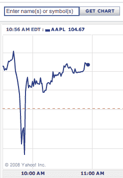

# 公民“记者”用虚假的(史蒂夫·乔布斯)心脏病发作谣言打击苹果股票 

> 原文：<https://web.archive.org/web/https://techcrunch.com/2008/10/03/citizen-journalist-hits-apple-stock-with-false-steve-jobs-heart-attack-rumor/>

# 公民“记者”用虚假的(史蒂夫·乔布斯)心脏病发作谣言打击苹果股票

在 CNN[iReport](https://web.archive.org/web/20230122172346/http://www.ireport.com/index.jspa)虚假报道史蒂夫·乔布斯心脏病发作后，苹果公司的股票今天早上暂时下跌了 10 个百分点。这份报告已经被[删除](https://web.archive.org/web/20230122172346/http://www.ireport.com/docs/DOC-102841)，但是仅仅是在[硅巷知情人](https://web.archive.org/web/20230122172346/http://www.alleyinsider.com/2008/10/apple-s-steve-jobs-rushed-to-er-after-heart-attack-says-cnn-citizen-journalist)和其他人与苹果确认乔布斯没有心脏病发作之后。股价又回升到了开盘价。SIA 捕捉到了最初的报道:

> 几小时前，史蒂夫·乔布斯突发严重心脏病，被紧急送往急诊室。我有一个内部人士告诉我，在史蒂夫声称遭受严重的胸痛和呼吸急促后，护理人员被叫来。我的消息来源选择匿名，但他相当可靠。我还没有在其他地方看到任何关于这方面的东西，到目前为止，我没有进一步的信息，所以我认为这将是一个好的开始。如果其他人有更多信息，请分享。

这只是一个想快速赚钱的卖空者，还是有人想看看他们能以多快的速度传播多远的虚假谣言？关于公民记者的价值，它说了什么？

CNN 没有与公民新闻的兴起抗争，而是决定通过推出 iReport 来试图拉拢它。CNN 的 iReport 网站允许任何人发布关于新闻的帖子和视频。它的标语是“未经编辑”。未过滤。新闻。”有时这些报道会出现在 CNN 上(大概是在经过审查之后)。

但是正如这个事件所显示的，即使是未经核实的报道也比出现在 Twitter 或一个随机的博客上更有分量，因为它是在 CNN 网站上。这可能纯粹是因为它分布得更广了。这也可能是因为人们倾向于相信他们在 CNN 品牌网站上读到的东西。

不过，我们不要让一个坏苹果毁了整个实验。显然，有很多聪明人可以为一般的新闻采访做出贡献。iReport 和其他网站需要一个更好的真相过滤器，允许匿名报道新闻。一个更好的贡献者声誉系统会有所帮助。应该鼓励他们使用真名。也许需要在上面放一个更大的免责声明:“阅读风险自担。”

苹果也可以从中吸取教训。如果没有对史蒂夫·乔布斯健康状况的高度关注，如果市场知道在紧急情况下谁会接任，苹果的股价就不会跌这么多。