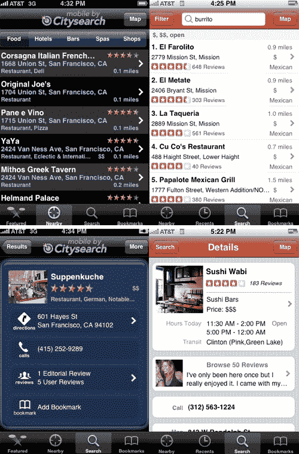

# iPhone 上的 Citysearch 和 Yelp:你能区分它们吗？TechCrunch

> 原文：<https://web.archive.org/web/https://techcrunch.com/2008/12/10/citysearch-vs-yelp-on-the-iphone-can-you-tell-them-apart/>

# iPhone 上的 Citysearch 和 Yelp:你能区分它们吗？

Citysearch 现在有了一个 iPhone 应用。它看起来很像 [Yelp 的](https://web.archive.org/web/20230326024045/http://www.yelp.com/) iPhone 应用程序，两个月前发布，目前是第三大最受欢迎的旅游应用程序(仅次于 Urbanspoon 和 Google Earth)。两者都可以接入 iPhone 的 GPS，让你找到附近的餐馆、酒吧、俱乐部、酒店和商店。两者都可以让你评价和回顾你去过的地方。

两者甚至在底部共享完全相同的导航按钮:附近、搜索和书签。只有 Citysearch 上的第一个按钮不同。它显示城市搜索编辑为您所在的城市提供的特色编辑内容。Yelp 选择了一个最近按钮，Citysearch 把它放在了书签页面上。

这两个应用程序在外观和感觉上非常相似(见上面的截图)，但本质上它们是不同的，因为它们来自不同的数据库。Citysearch 正在利用其最近在[的革新](https://web.archive.org/web/20230326024045/https://techcrunch.com/2008/11/18/the-new-citysearch-launches-in-beta-goes-hyper-social-with-facebook-connect/)，该革新按照社区对每一条数据进行了重新分类。这有助于你在附近找一个吃饭的地方。你仍然不能通过社区(只有邮政编码和城市)进行搜索，但这很快就会实现。即将推出的还有上传照片和其他多媒体以及评论的功能。

这两个应用程序的强大之处在于，当人们正在吃饭或有任何想要分享的体验时，他们可以给餐厅或商店评分或评论。最终，你更喜欢的将会归结为你最信任的评论。(更正:Yelp 应用程序实际上只允许你上传照片，而不是评论。所以优势，城市搜索就那个)。

但是下一次，当你吃了一顿大餐或者和服务员发生了一次令人讨厌的口角时，只要拿出你的 iPhone 告诉全世界就行了。

