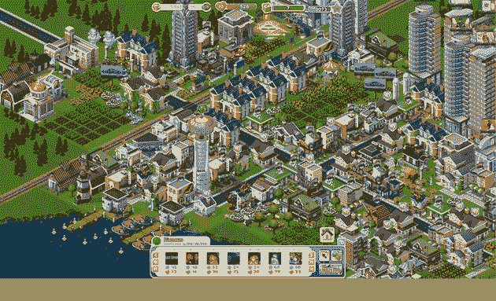

# CityVille 增加 20 个新关卡以取悦 1 亿玩家 

> 原文：<https://web.archive.org/web/http://techcrunch.com/2011/02/01/cityville-adds-20-new-levels-to-please-100-million-players/>

# CityVille 增加了 20 个新关卡来取悦 1 亿玩家

Zynga 的 [CityVille 在 2010 年 12 月推出一个多月之后，每月就有 1 亿](https://web.archive.org/web/20230203065317/https://techcrunch.com/2011/01/03/will-cityville-be-first-to-blow-past-100-million-monthly-active-users/)玩家，成为有史以来最大的脸书应用。

我们已经注意到，脸书高管(包括马克·扎克伯格)、谷歌高管和其他人都在玩，而且玩得足够久，以至于看起来他们不只是在四处打探。凯鹏华盈合伙人兼电子艺界前首席创意官[宾·戈登](https://web.archive.org/web/20230203065317/http://www.crunchbase.com/person/bing-gordon)在 60 级时就已经透支了[。](https://web.archive.org/web/20230203065317/https://techcrunch.com/2011/01/10/bing-gordon-kleiner-perkins-partner-and-level-60-cityville-player/)

不过，Zynga 今天增加了更多关卡。新的最高是 80 级，戈登激增到 67 级。

觉得都是废话？确实是。但这是极其有利可图的废话。使用脸书信用支付的 Zynga，据传每月至少要向脸书支付 3000 万美元作为他们 30%的提成。

对于模拟城市的仿制品来说还不算太寒酸。