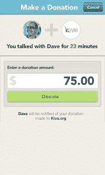

# Clarity 推出移动导师服务，为初创公司创始人提供好的建议

> 原文：<https://web.archive.org/web/https://techcrunch.com/2012/05/03/clarity-mobile-mentorship-app/>

我经常听到人们说，他们搬到旧金山和硅谷是为了融入最丰富的事物——在当地的咖啡店里向自己敞开心扉，遇到一位新的导师，或者在一次偶然的电梯邂逅中推介一位顶级风险投资家。建议网站和指南书籍都很棒，Quora 等问答网站也很有帮助，但当你试图建立一家新公司时，还是没有什么比得上来自曾经在那里工作过的人的一对一谈话。

一家名为 [Clarity](https://web.archive.org/web/20230313093653/https://clarity.fm/) 的新公司希望为创业者提供这种服务，无论他们身在何处。Clarity 今天向公众推出，它提供了一个连接企业家和导师(如成功的商人和风险资本家)之间电话的市场。建议者可以免费交谈，也可以为他们的时间定价，Clarity 让他们要么保留这笔钱，要么捐给他们选择的慈善机构。如果这笔钱没有捐给慈善机构，Clarity 将收取 15%的佣金。

【T2

#### 它是如何工作的

马爹利召集了众星云集的 1000 名顾问，他们参加了 Clarity 的发布会，包括著名投资人和 500 Startups 创始人[戴夫·麦克卢尔](https://web.archive.org/web/20230313093653/http://www.crunchbase.com/person/dave-mcclure)，Greylock Partners 负责人兼 Twitter 和脸书校友[乔希·埃尔曼](https://web.archive.org/web/20230313093653/http://www.crunchbase.com/person/josh-elman)，Startup Weekend 首席执行官[马克·纳格尔](https://web.archive.org/web/20230313093653/http://www.crunchbase.com/person/marc-nager)，Color and Science labs 联合创始人[彼得·法姆](https://web.archive.org/web/20230313093653/http://www.crunchbase.com/person/peter-pham)，Rypple 联合创始人[丹尼尔·德博](https://web.archive.org/web/20230313093653/http://www.crunchbase.com/person/daniel-debow)，以及精益创业大师[埃里克·里斯](https://web.archive.org/web/20230313093653/http://www.crunchbase.com/person/eric-ries)。

Clarity 的关键在于它安排了一个双盲电话呼叫过程——双方都不知道对方的实际电话号码。该网站还要求用户通过脸书连接，因此已经有了一层身份验证。创始人可以通过展示每位顾问专业知识的精选主题页面浏览 Clarity 目录，或者在 Clarity 中插入一些样本问题，以获得他们应该与谁交谈的建议。Clarity 适用于世界各地的电话号码——在五个月的测试阶段，它已经代理了来自 60 多个国家的 4000 多个电话。

#### 为什么它很重要

Clarity 是由丹·马爹利创立的，他是一位年轻的技术行业老手，创建并出售了两家成功的公司——同时也是好建议的给予者和接受者。“在我工作生涯的最初几年，我仍然住在我的祖国加拿大，我非常渴望得到建议。我给我所在省的部长发了电子邮件，他尊重我是一个年轻的企业家，并把我介绍给三个已经建立了上亿美元公司的人。这是我搬到旧金山的首要原因，”马爹利说。“我知道，在正确的时间获得正确的建议可以极大地改变企业家的生活。”

马爹利表示，这对创始人和导师来说都是一次积极的经历。“在测试期间，我自己已经打了大约 400 个电话，人们没有意识到的是，如果你自己不从中受益，就很难给别人提建议。我会说，‘嘿，我在 101 公路上开了 45 分钟，如果你想谈产品或营销，打电话给我。’你排队打电话，你进入这种节奏，这真的很有活力。我和一些我绝对会投资的企业家谈过。"

#### 电话:回到未来？

Clarity 由马爹利自筹资金，总部位于旧金山，有四名全职员工。到 2012 年底，该公司预计员工人数将增加两倍，达到 12 人左右。目前，这项服务的重点是技术和商业，但马爹利表示，未来它可以扩展到任何数量的主题，从餐饮业务到体育运动，再到一般的生活指导。

许多人对不再使用智能手机上的语音通信功能感到自豪，并说我过时了——但我仍然认为与他人交谈是一项重要的技能(或者像我的一位老老板过去常说的那样，“给一部好手机。”)事实上，我见过的大多数真正成功的人仍然更喜欢通过电话交谈，而不是发电子邮件或短信。看清楚未来如何起飞会很酷。

下面是几个更清晰的截图:

