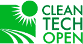
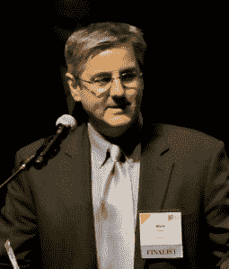
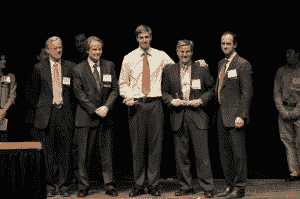

# Puralytics 首席执行官谈用光清洁水，赢得清洁技术公开赛 

> 原文：<https://web.archive.org/web/https://techcrunch.com/2010/11/25/cleantech-open-winners-puralytics/>

[清洁技术公开赛](https://web.archive.org/web/20221007030556/http://www.cleantechopen.com/app.cgi/content/home/index)——美国科技初创公司一年一度的著名比赛，旨在保护、恢复和减少人类对环境的负面影响——本周宣布了 2010 年的获胜者。来自俄勒冈州比弗顿的净水创业公司 Puralytics 获得了第一名。

Puralytics 团队发明并销售了一种基于纳米技术的光化学净水系统，与其他可用系统相比，该系统可以更快地净化水，从中去除更多杂质，并且需要更少的电力。据估计，全球 65 亿人口中有 15%缺乏足够的淡水来过上健康的生活，因此具有有前途的水技术的公司很受欢迎，并可以帮助缓解全球水和人道主义危机。

清洁技术公开赛的执行主任 Rex Northen 说:“Puralytics 脱颖而出，因为他们开发了一些将对环境和社会产生巨大影响的东西。他们的技术可以让你使用 LED 灯或阳光作为清洁水的机制，并且它没有许多其他人拥有的有毒输出。这个团队也非常强大。”

Puralytics 的首席执行官和创始人马克·欧文(Mark Owen)是一位连续创业者和发明家，他的 30 多项成功专利(根据他自己的计算)为他工作和创办的公司创造了超过 10 亿美元的收入。

欧文与 TechCrunch 谈论了赢得 2010 年清洁技术公开全国商业竞赛，以及他的最新创新如何用光清洁水。以下是经过编辑的对话记录。

**TC:你的公司解决了什么环境问题？**

莫:净化水是一个肮脏的过程，使用过滤器、膜、化学清洁剂和汞灯。今天使用的系统浪费了他们试图净化的大部分水，并且需要大量的电力。例如，在反渗透系统中，大约 80%可以净化的水进入了下水道。

我们有不同的方法来净化饮用水或轻工业和商业用水。我们的系统处理所有的水，用一半的电，而且不需要你制造任何有毒的东西。它还能去除水中其他物质，如杀虫剂和药物。

环保局刚刚发布了一份清单，列出了 169 种内分泌干扰化合物，他们将从现在开始追踪国内饮用水中的这些化合物。这些东西即使是少量的也会对一些人(和动物)造成健康问题，包括咖啡因。我们的系统将它们从水中移除。

**TC:Puralytics 的技术是如何工作的？**

莫:如果我在一个满是孩子的教室里解释 Puralytics，我会说，“你的水里有些小东西可能对你不好。我们用一种特殊的光让它们消失。”

我们使用发光二极管来照亮我们开发的纳米技术涂层，这是在一个网格上，水流过主系统。这个技术根本不是过滤。相反，它所做的是创造一种化学反应，导致分子在水中分裂和分解。

合适波长的光和这种纳米技术涂层会引起五种光化学过程，这些过程会将水中的污染物带到网格表面，然后将吸收的能量释放到分子中，使分子分裂。

大多数有机分子由大量的碳、氢、氧和一些其他物质组成。从本质上讲，我们把一个长分子分解开来，一直分解，然后重新形成二氧化碳、水和矿物质。我们积极地破坏水中的污染物，但把对你有益的矿物质留在水中。其他治疗方法会去除对你有益的矿物质。但是我们的没有。

 **TC:能看到过程吗？**

莫:其实看不出来。你会看到一种略带紫色的光。如果可以，你可能会看到一些看起来像水的东西变成蒸汽，消散在空气中。那里有东西正在改变形态。

**TC:你是从哪里得到这个想法的？**

莫:我之前的公司是光生科技。我还是个导演。我们实际上制造发光二极管(LED)干燥设备，可以使用很少的能量非常快速地干燥油墨、涂料和粘合剂。如果你有任何宜家家具，他们会喷涂涂层，让它看起来更好，更耐用，Phoseon 灯可以在三秒钟内干燥它。

我开始思考我还能用 led 做些什么。最初的想法是用 LED 阵列取代医院和水中用于杀菌的汞灯。结果证明效率不高。我了解到，还有其他杀死细菌的好办法。但是没有有效的方法从水中去除化学物质、重金属和其他令人担忧的东西。

另一件激发我灵感的事是我在日本看到的一座建筑，在东京的博览城内。它被喷上了一层防止弄脏的涂层。阳光激活涂层，分解表面的污垢和化学物质，因此它基本上保持清洁。我问自己，是否可以让水变得干净，而不是让建筑变得干净。

我召集了一个团队——化学、光学和物理方面的专家——我们开始计算哪些波长的光是最佳的，我们可以使用哪种纳米技术，哪种涂层是最佳的，以及所有其他可以在 2007 年左右开始这个想法的事情。

TC:你已经有客户了吗？他们是谁？

莫:我们从 2009 年开始发货给客户。大多数是工业过程客户。他们需要超纯的水，以便在实验室或生产产品的过程中使用。自来水不够干净。我们对制药、生物技术和半导体制造商以及咖啡连锁店都很有用。我们有几个财富 500 强的客户。

Puralytics 的下一步是什么？

莫:我告诉过你我们的主要产品 Puralytics Shield，它使用发光二极管来净化水，供轻工业和商业使用。我们还有一个叫太阳能包的。它使用相同的技术，但没有 led。所以，你在包里有一个纳米技术涂层的网。你把袋子装满水，放在阳光下，纳米技术会在几个小时而不是几分钟内净化水。这对发展中国家无法获得清洁饮用水的人们来说非常重要。

我们的合作伙伴之一，[水合技术人道主义水部门](https://web.archive.org/web/20221007030556/http://www.htiwater.com/divisions/humanitarian/index.html)，正在帮助我们将太阳能袋出售给可以分发它的非营利组织。我们还与世界各地的不同援助组织合作——包括肯尼亚的一个组织和孟加拉国的一个组织——为发展中国家的应用提供我们的技术。我们会想出更多的办法。

我们得到了四笔政府拨款，一轮种子基金，现在还有一些奖金。我们将利用它开发下一代产品，扩大我们的市场份额。但我们也将很快寻求筹集增长资本。

[编者按:国家竞赛奖包括价值 15 万美元的商业服务，以及来自投资者财团的 10 万美元种子投资:威尔逊·松西尼投资公司、斯蒂费尔家族基金会和清洁技术公开赛。]

*图片由[道格拉斯·施瓦兹摄影](https://web.archive.org/web/20221007030556/http://www.pitchengine.com/pitch/103917/)* 提供

*关于 2010 年清洁技术开放国家商业竞赛获胜者的更多信息可通过竞赛的[获胜者网站](https://web.archive.org/web/20221007030556/http://www.cleantechopen.com/app.cgi/content/home/index)和竞赛的 [Youtube 频道](https://web.archive.org/web/20221007030556/http://www.youtube.com/user/CTOtv1)获得。*