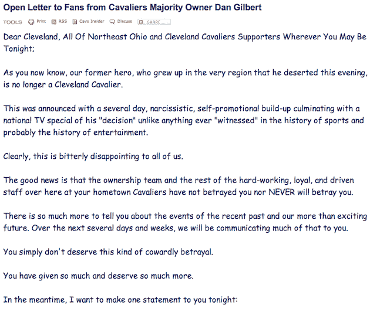
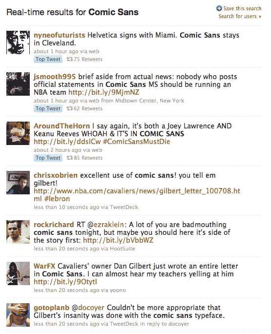

# 骑士队老板上网撕勒布朗一个新的...在 Comic Sans TechCrunch 中

> 原文：<https://web.archive.org/web/https://techcrunch.com/2010/07/08/cleveland-cavs-owner-letter-lebron/>

# 骑士队老板上网撕勒布朗一个新的…在漫画无

全国的注意力分散已经结束。NBA 球星勒布朗·詹姆斯已经选择了他将要效力的球队:迈阿密热火队。当然，这意味着他不会回到他的家乡克里夫兰骑士队，老板丹尼尔·吉尔伯特对此不太高兴。今晚在骑士队 NBA.com 主页上的一封措辞严厉的信中，他让*非常*清楚地告诉了所有人。

一封信，贴在漫画上。

是的，吉尔伯特用可能是有史以来最糟糕的字体写了整封信来美化电脑屏幕。Glibert 通常是六岁儿童和祖母的主食，出于某种原因，他决定用这种字体来写下无疑将是他所写的最公开的信息。这太糟糕了，因为消息本身的内容非常好，非常有趣。吉尔伯特对引号、大写字母和粗体字母的使用清楚地表明了他有多生气。

这很好，因为所有的克利夫兰人(顺便说一下，我的家乡)今晚也很愤怒。吉尔伯特的信应该会给人一些安慰，如果没有别的原因，他保证——是的，*保证*——骑士会在勒布朗之前赢得总冠军。这座城市已经有近 50 年没有赢得过任何大型体育赛事的冠军了(那是在 1964 年克利夫兰·布朗赢得 NFL 冠军的时候，那时甚至还没有超级碗)。

但同样，所有人都可以谈论的是没有失礼的该死的漫画。由于这封信，“漫画无”目前是推特上的热门话题——仅次于“勒布朗·詹姆斯”！

汤森路透(Thomson Reuters)的安东尼德·罗萨可能在一条推特中总结了最好的[:*我最后一次看到用漫画写成的信是一封连锁电子邮件，里面有我母亲写的 LOLcats*](https://web.archive.org/web/20230121161830/http://twitter.com/antderosa/status/18089981500)

显然，Gilbert 并没有很好地跟上[这里](https://web.archive.org/web/20230121161830/http://bancomicsans.com/)T2 的一些互联网内容。我等待勒布朗在温丁斯的回应。

