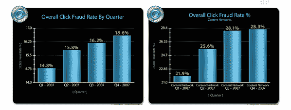
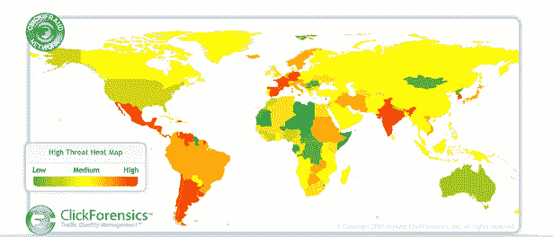

# 点击欺诈不断上升，2007 年上升了 15%技术危机

> 原文：<https://web.archive.org/web/https://techcrunch.com/2008/02/22/click-fraud-keeps-rising-up-15-percent-in-2007/>

# 点击欺诈不断上升，2007 年上升了 15%

 点击取证在 2007 年第四季度和全年都有一些[数据流出](https://web.archive.org/web/20221207191958/http://www.clickforensics.com/Pages/Releases.aspx?r=01312008)[点击欺诈](https://web.archive.org/web/20221207191958/http://en.wikipedia.org/wiki/Click_fraud)(点击不真实的网络广告)。全年的行业平均点击欺诈率上升了 15%，截至年底，网络广告上 16.6%的点击是欺诈性的。仅搜索引擎广告网络，包括谷歌 AdSense 和雅虎出版商网络的点击欺诈率就增长得更快。这一数字在第四季度上升了 47%，年末点击欺诈率为 28.3%。根据这一数据，谷歌或雅虎广告每三次点击中就有一次是欺诈性的。

尽管同比增长令人担忧，但与 2007 年第三季度相比，点击欺诈率保持相当稳定，当时总体点击欺诈率为 16.2%，搜索引擎点击欺诈率为 28.1%(见上图)。四分之一不会成为趋势，但点击欺诈率会趋于平稳吗？人们可以抱有希望。如果谷歌能够让这个比率真正下降，它的股票可能会再次飙升。

点击取证还在下方发布了便利的热图，显示了点击欺诈最猖獗的国家。(红色表示不良，绿色表示良性)。点击欺诈的最大来源是印度(4.3%)、德国(3.9%)和韩国(3.7%)。墨西哥也出现了赤字。

