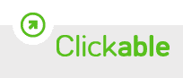
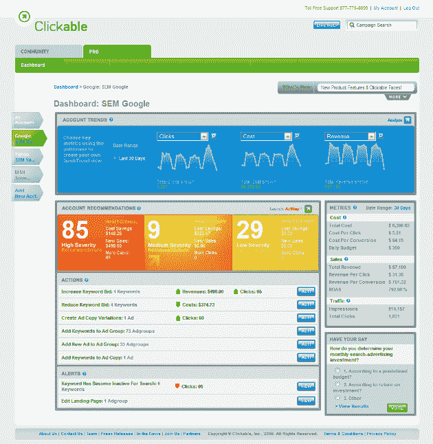

# Clickable 推出功能强大的搜索广告管理软件套件 2.0 版 

> 原文：<https://web.archive.org/web/https://techcrunch.com/2009/02/09/clickable-launches-version-20-of-powerful-search-ad-management-software-suite/>

# Clickable 推出功能强大的搜索广告管理软件套件 2.0 版

 [可点击的](https://web.archive.org/web/20221001085600/http://www.clickable.com/)今天发布了其搜索广告管理套件的 2.0 版本，为该软件增加了一系列功能，这些功能应该可以使中小型企业更容易在谷歌、雅虎和 MSN 等各种广告网络举行的在线营销活动中保持领先地位。

虽然可点击用户已经可以导入不同的帐户，以便从一个旨在使他们更加直观和有效的界面管理他们的活动，但可点击 Pro 2.0 现在使他们能够从一个中心位置整合对广告网络中多个搜索广告活动的管理。为了实现这一目标，Clickable 增加了一些功能，如批量编辑和过滤关键词，允许代理商和广告商在所有广告网络和账户中快速搜索、编辑和导出大量关键词，以及一个推荐引擎，使广告商能够更有效地开展搜索活动。

Clickable Pro 2.0 还增加了对它所谓的新兴谷歌广告格式的测试支持，这意味着不太标准的媒体投放，如图像广告(横幅)，本地商业(地图)和移动(文本和图像)广告。此外，该公司现在已经在可点击的 Pro 界面中添加了之前处于测试阶段的的 Convers~~ion 跟踪功能，以便让广告商和代理商更容易跟踪和衡量活动。~~

像 Clickable 这样的管理工具对于为多个客户管理搜索广告预算的机构，以及选择在不同广告网络上做广告的企业主来说非常方便。如今，基本上每个人都应该寻求最大限度地优化他们的在线广告工作，Clickable 为新客户提供了 15 天的免费试用，以测试他们的软件套件是否有助于产生更多的投资回报。对于费用超过 2500 美元的广告活动，Clickable Pro 的定价为每月广告总支出的 5%，对于那些设法将费用控制在该金额以下的人，每月固定为 129 美元。

Clickable 总部位于纽约州，迄今为止已经筹集了总计[2050 多万美元的资金](https://web.archive.org/web/20221001085600/http://www.crunchbase.com/company/clickable)，最近一次是由 Founders Fund、Union Square Ventures 和 FirstMark Capital 牵头的[1450 万美元的 B 轮融资](https://web.archive.org/web/20221001085600/http://www.beta.techcrunch.com/2008/07/30/clickable-raises-145-million-more-for-online-ad-management/)。

