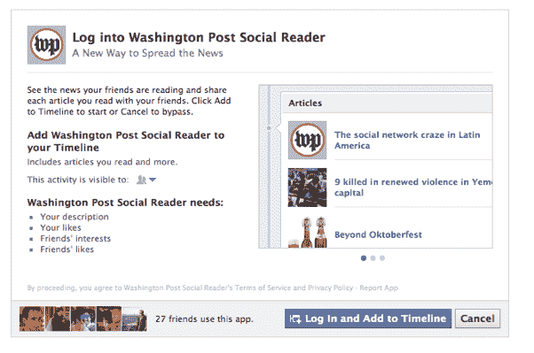
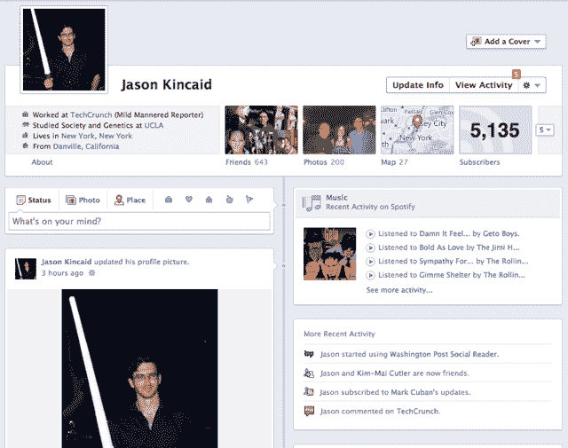

# 执着于摩擦:关于脸书 F8 TechCrunch 的一些想法

> 原文：<https://web.archive.org/web/http://techcrunch.com/2011/09/25/clinging-to-friction-some-thoughts-on-facebooks-f8/>

自从脸书第一次在 f8 推出一系列突破性的新功能以来，已经过去了 72 个小时，这是我预测该公司长期前景、它将重塑网络的方式以及其不可避免的 IPO 定价所需要的全部时间。

好吧，也许不是。但这给了我一些时间来尝试这些功能，而不是将我的印象建立在脸书精心制作的主题演讲的基础上。虽然其中许多显然有很大的潜力，但在实践中，我发现它们是一个混合体(或者，在某些情况下，是一个彻头彻尾的令人恼火的东西)。

**社会过度润滑**

f8 大会上的一个重大声明是无摩擦共享。要点如下:脸书将让第三方网站和应用整合有效的共享消防水管。打开它，你在应用程序中所做的一切都会与你的脸书朋友分享。

正如脸书首席执行官马克·扎克伯格在他的主题演讲中解释的那样，这个想法是很多人没有像他们应该的那样经常分享，因为点击所有这些“分享”对话框会产生摩擦。因此有了“无摩擦分享”这个术语:你访问一个网站或应用程序，激活一次分享，就大功告成了。你在该应用程序上做的一切都会自动共享，如果你决定要保密你的活动，你可以随时关闭它。很漂亮，对吧？

我对这种新的无摩擦分享的担忧是，它实际上根本没有消除摩擦——它只是移动了摩擦。以前，我不得不付出一些努力(尽管是很小的努力)来明确地分享一篇内容，现在有了这种新的轻松分享，我将处理我脑海中的一种困扰感，我想知道我*是否真的*想要我刚刚点击的文章与朋友分享。我认为这个词是压力，或者焦虑。这在我的书中被定义为摩擦的形式。

换句话说，老派的分享方式，唯一真正潜在的缺点是我会忘记分享我朋友可能会感兴趣的东西。了不起。有了这种新的、润滑的分享，一个精神上的失误可能会导致我和我的朋友分享一些不寻常的事情。这取决于谁是你的脸书“朋友”和你的职业，可能真的很重要。

当然，人们会毫不犹豫地愿意免费分享应用程序和网站——你很难在《经济学人》上找到许多让你感到尴尬的故事(为什么是的，我*花了一下午阅读阿根廷的贸易限制)。但是有很多主流网站发布的新闻主题可能是你不想让老板或家人知道的。比如毒品合法化。或者性(ack！).或者泽西海岸。这意味着另一场隐私反弹可能即将来临。*

我知道，我知道——媒体(包括我在内)之前已经多次对脸书的隐私剥离功能叫嚣犯规，其绝大多数用户一次又一次地表明他们只是不在乎。但我认为这更多是因为他们的矛盾心理，而不是因为脸书知道它的用户认为什么是社会可以接受的。也许这是他们越线的时候了，也许不是——不管怎样，我们都会看到很多关于无摩擦共享的新闻文章，可能还会看到一些来自国会的信件。

如果没有别的，我敢打赌，在接下来的几个月里，这个特性的“接受”对话框上的警告标志会变得更加突出。看看下面的方框——他们不会特意指出这是在分享*你通过应用阅读的每一篇*文章，对吧？

此外，撇开隐私和摩擦不谈，还有另一个大问题:首先，有人想看看这些自动分享的项目吗？

**自动收报机**

脸书本月推出的一大特色，也是促成这种无摩擦分享的特色之一，就是 Ticker。它是主页右侧边栏上的实时流，如果你在足够宽的屏幕上打开浏览器，它会跟随你浏览整个网站。

与使用一系列算法试图呈现有趣内容的新闻提要不同，自动收报机应该是你所有朋友做的每件事的实时流(或者至少，它使用选择性少得多的算法)。因为所有这些内容都是不断流过的，所以你不必为填充这些自动共享的帖子而感到难过，因为你的朋友只会看到几秒钟。反正就是这个想法。

第一天我看到这个心脏跳动器的时候，我觉得它很漂亮。最后，脸书给了我一个不断更新的内容流供我浏览，就像 Twitter 一样。我和其他人一样喜欢浪费时间，所以这是一个受欢迎的补充。

但我越来越相信，至少在目前的形式下，Ticker 还存在不足。

在过去的几年里，当我浏览我的各种社交信息时，我和自己玩了一个小游戏。叫做“一点都不在乎”。每当我在 Twitter 上阅读一篇文章，脑海中的声音说出前面提到的短语时，我就在心里加上一个数字。如果这个数字达到某个阈值，我就会咒骂几声，然后发誓一整天都不上 Twitter。我觉得这是一种宣泄。

我应该指出的是，只有少数我不感兴趣的帖子会引起这种发自内心的反应——我真的不介意，比如说，一个我朋友真心认为很棒但没有引起我共鸣的链接。相反，我希望这些更新从一开始就不要被分享。Foursquare 的辛迪加签到经常属于这一类，同样的还有多推特咆哮和直播流和博客的“直播推特”面板(一开始并不特别有趣)。

在这场游戏中，脸书的新闻总体表现良好。当然，它有很多失误，但我很少在我的订阅源中看到引起真正烦恼的内容——这就是为什么我五年来每天都阅读我的新闻订阅源。

这又把我带回了脸书的心脏。它输给了我的游戏，而且输得很惨。

我不在乎一个从高中起就没说过话的“朋友”对一个我不认识的人的评价。我不在乎我的同事是否在听 Lady Gaga 两年前的一首歌。当我的一个脸书朋友在浏览他们朋友的帖子时进行“喜欢”马拉松时，我不需要看到四个单独的更新来告诉我每一个。

如果这些无关紧要的更新是规则的例外，我不会感到困扰——但它们构成了我的 Ticker feed 中显示的大部分更新。这个滚动条几乎是实时更新的，所以它一直在移动，吸引着我的目光。更糟糕的是，即使是我真正的朋友的股票更新也很少很引人注目。我对朋友们上网习惯的细枝末节不感兴趣。

以脸书最近推出的音乐整合为例。现在，当我盯着我的电脑时，我看到了我的朋友们正在听的一系列歌曲。有时候我从来没听过这首歌。有时候我会。有时候我真的很喜欢这首歌。而且，几乎总是，我的直接冲动既不是“喜欢”他们的更新，也不是自己开始听这首歌。我通常只是耸耸肩。

最根本的问题是，这些帖子没有任何背景或重点。我看到一首又一首的歌曲滚动而过，我不知道哪些歌曲对我的朋友来说实际上是重要的。我不知道哪些是他们喜欢的曲目，哪些是他们走开去吃午饭时留下的曲目。而且，随着越来越多的应用程序和网站开始整合到 Ticker 中，我也会遇到同样的问题。我不会知道我的朋友们赞同了哪些新闻文章，以及他们只是因为在 Twitter 中看到一个链接而碰巧点击了哪些文章。这里有太多的东西。

当然，你仍然可以明确地分享你真正喜欢的内容(喜欢和分享按钮使这变得容易)。但这些帖子会像以前一样在新闻订阅中分享，如果它们出现在 Ticker 中，它们将会受到很多噪音的干扰。

尽管如此，这一功能并不是注定的。现在，脸书的员工正在仔细研究现有的无摩擦应用程序的所有初始数据，他们无疑会进行大量的调整，以确保你看到许多你至少有点感兴趣的内容。但是在这一点上，我的眼睛已经变得麻木了。

**好东西**

脸书在 f8 上推出了其他主要功能。尽管我有上述抱怨，但我真的很喜欢其中的一些。

首先，我们有脸书[时间轴](https://web.archive.org/web/20230204205232/https://techcrunch.com/2011/09/22/facebook-timeline/)，这是一个经过全面修改的简介，它直观地概述了你在网站上的历史(如果你花时间添加你在脸书时代之前的额外内容，还有你的整个生活)。

我觉得很俏皮。是的，第一次滚动时可能会不和谐——而且，取决于你多年来所面临的生活障碍，可能会相当悲伤。但同样的情况也可以发生在一个装满照片或情书的满是灰尘的鞋盒里，从你的时间线中删除你不想看到的东西并不需要做很多工作(我对那些根本不想重温过去的人的建议是:脸书可以提供一个选择，简单地从一个更近的日期开始时间线)。

有些人写道，时间线令人毛骨悚然，因为它让人们如此迅速地获得你过去的全面快照。我理解这种情绪，但我不认为它像之前讨论的自动分享那样令人毛骨悚然。首先，我怀疑很多人无论如何都会习惯性地翻看朋友的照片(甚至是多年前的)，如果有人*真的*想了解你的过去，那么多次点击你墙上的“更多”按钮也不会造成太大的障碍。

换个角度来看:仅仅因为你很少回顾你在脸书的历史并不意味着你的潜在雇主、重要的人或无聊的朋友不会。所以也许你应该清理一下。

时间线也是新的 Open Graph API 的一些更引人注目的部分发挥作用的地方。开发者现在将能够制作出现在用户时间线中的小部件，并且他们可以根据用户在其应用程序中的操作来更新这些小部件。因此，举例来说，如果你的 iPad 上有一个与脸书集成的食谱应用程序，你可以在你的时间线中有一个部分展示你最近制作的食谱(甚至可能是每个食谱的照片)。脸书几年前就提供了类似的第三方插件，但因为杂乱而被删除了。时间线通过以一种圆滑混乱的方式呈现一切来解决这个问题，这种方式灵活而不过度混乱，对于用户和开发人员来说都有很大的潜力。

此外，尽管我之前抱怨过音乐分享，但实际上我真的很喜欢[音乐仪表板](https://web.archive.org/web/20230204205232/https://techcrunch.com/2011/09/23/go-beyond-ticker-use-facebook-music-dashboard-to-see-what-your-friends-listen-to/)，它展示了脸书从你朋友的收听习惯中收集的趋势——比如顶级专辑和艺术家。这个仪表板，以及显示类似趋势的结构化新闻提要故事，似乎是展示这种自动共享数据的正确方式。我可能不关心我的朋友现在正在听的歌曲，但是如果我的两个朋友今天听了同一张专辑，那么嘿，也许我会去看看。

**分享还算关爱吗？**

最后，我想后退一步，看看 f8 主题演讲中提到的[扎克伯格定律](https://web.archive.org/web/20230204205232/https://techcrunch.com/2011/07/06/mark-zuckerberg-explains-his-law-of-social-sharing-video/)。法律是这样的，“你在网上分享的信息量每年翻一番”。而且，鉴于脸书刚刚推出的功能，这似乎肯定会是这种情况(甚至可能是一种保守的说法)。

问题是，我不确定脸书或其用户是否准备好迎接分享的激增。在 Twitter 和脸书之间，我想我每天可以分享的内容已经接近极限了。见鬼，有时我发现自己对某些朋友分享太多感到恼火。这意味着脸书需要更好地识别我会感兴趣的内容。

该网站对好友列表的日益重视将有助于这一点，因为它很容易专注于你最亲密的朋友分享的内容。但即便如此，你真的如此关心你的好朋友，以至于你想了解他们听的每首歌，读的每篇文章，或者玩的游戏吗？总有一天，你会厌倦他们的。

尽管如此，这对于脸书来说并不是什么新鲜事。自从 News Feed 诞生以来，他们就一直试图展示有趣的内容，他们最近的推荐相关功能，[智能列表](https://web.archive.org/web/20230204205232/https://techcrunch.com/2011/09/08/facebook-begins-auto-grouping-colleagues-school-mates-and-local-friends-into-smart-lists/)，有时实际上非常智能。让我们只希望这些算法能够跟上 f8 即将发布的内容浪潮。