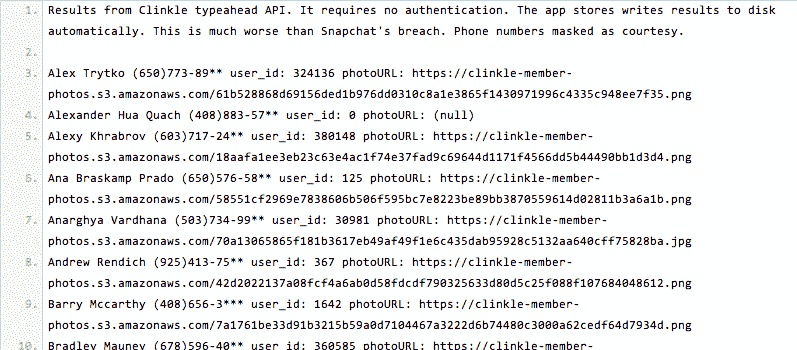

# Clinkle 还没上线就被黑了

> 原文：<https://web.archive.org/web/https://techcrunch.com/2014/01/30/clinkle-gets-hacked-before-it-even-launches/>

Clinkle 是最热门的应用，几乎什么都没做。秘密支付服务已经从知名投资者那里为 T2 筹集了 3000 万美元，但是还没有公开发布。但这不代表不能黑。

今天，一位嘉宾用户向 PasteBin 发布了一份包含 33 个用户名、用户 id、个人资料照片和电话号码[的列表。根据提供的数据，这些用户似乎是测试该应用程序的 Clinkle 员工。](https://web.archive.org/web/20230325225016/http://pastebin.com/2d8MNMa7)

创始人卢卡斯·杜普兰榜上有名(没错，这是他的 Clinkle [个人资料照片](https://web.archive.org/web/20230325225016/https://clinkle-member-photos.s3.amazonaws.com/13429ed4d53739796e1ffd34750cc4c574f110860265447954fb9130b276e470.png)，如上图所示)，还有前网飞首席财务官和 Clinkle 首席运营官·巴里·麦卡锡。前贝宝高管[迈克·利伯拉托](https://web.archive.org/web/20230325225016/https://techcrunch.com/2014/01/28/clinkle-liberatore-cfo/)，现任 Clinkle 首席财务官，也榜上有名。

数据似乎是通过 Clinkle 的私有 API 访问的。黑客称之为“typeahead”，该 API 似乎是自动完成工具的基础，允许用户键入单个字母(如“A”)并找到所有以该字母开头的用户名(如“Adam”和“Andrew”)。[注意:Twitter 有一个同名的类似工具——不清楚它们是不是同一个。]

Clinkle 似乎在自己的应用程序中使用了这个 API(大概是为了让用户在付款时可以找到朋友)，这使得一个黑客可以搜索用户名，从而找到相关的用户 id 和电话号码。

黑客是这么说的:

> Clinkle typeahead API 的结果。它不需要认证。应用商店会自动将结果写入磁盘。这比 Snapchat 的违规要严重得多。伪装成礼貌的电话号码。

换句话说，无论是谁侵入该应用程序，都不需要用户 ID 来访问 Clinkle 的测试人员列表或他们的个人信息，这些信息似乎都保存在 Clinkle 服务器上。

但平心而论，Clinkle 的漏洞与 Snapchat 的不太一样，考虑到 460 万 Snapchat 用户的信息被发布，而不是一小群员工测试人员。

以下是 Clinkle 对此次违规的解释:

> 你所描述的可见性是作为我们初步用户测试的一部分有目的地构建到系统中的，并且总是打算关闭的。正如你在列表中看到的，我们已经进行了内部测试，注册仅限于 Clinkle 员工。我们使用的是开放的 API，现在已经关闭了。也就是说，只有姓名、电话号码、照片和独一无二的身份证是可以访问的。

Clinkle 指出，一名斯坦福大学的学生是所谓的黑客，但这尚未得到证实。

据传将于今年晚些时候推出的 Clinkle 目前在 iTunes 中有一个 [iOS 应用程序](https://web.archive.org/web/20230325225016/https://itunes.apple.com/us/app/clinkle/id458523629?mt=8)，在 Google Play 商店中有一个 [Android 应用程序](https://web.archive.org/web/20230325225016/https://play.google.com/store/apps/details?id=com.clinkle&hl=en)，供那些希望加入等候名单的人使用。

根据应用程序的大小(52MB)和下载后发现的解压缩文件，似乎完整的 Clinkle 应用程序已经存在，而不是为等待名单注册者构建的占位符应用程序。

目前，该应用程序有一个等候名单墙，一旦管理员授予权限，“VIP”成员就可以绕过它。这可能允许 Clinkle 向投资者和合作伙伴演示该应用程序，而不必经过一些繁琐的下载过程。

在筹款的过程中，我敢肯定那个小伎俩派上了用场。不过，今天没那么多。

黑客产生了一些关于 Clinkle 团队的有趣数据。

创始人卢卡斯·杜普兰被列为第一个用户(用户 ID: 1)，照片非常像他拿着现金。首席财务官[巴里·麦卡锡](https://web.archive.org/web/20230325225016/https://techcrunch.com/2013/10/22/clinkle-barry-mccarthy-coo/)也和一张合法的个人资料照片一起被列在名单上，他是公关主管，证实了这些照片和数据的真实性。

来自 Clinkle 的[团队页面](https://web.archive.org/web/20230325225016/https://www.clinkle.com/team)的照片，其中 22 名身份不明的 Clinkle 员工与傻瓜化名在一起，似乎也与泄露的个人资料照片中的人相似。最后，我们可以把面孔和名字联系起来。

那么这意味着什么呢？

好吧，Clinkle 实际上还没有推出，所以很有可能团队还没有专注于安全性。然而，安全和信任应该是支付公司的首要任务。尤其是对于一个如此年轻的公司。

Clinkle 是由十几名斯坦福学生于 2011 年创立的，在关键员工完成他们的学位时，它一直处于人们的视线之外。该公司在一轮聚会中筹集到[2500 万美元之前，曾得到斯坦福大学教授的部分资助。超过 18 名投资者参与其中。](https://web.archive.org/web/20230325225016/https://techcrunch.com/2013/06/27/clinkle-raises-celebrity-filled-25m-round-as-it-gears-up-to-eliminate-the-physical-wallet/)

《华尔街日报》宣布这是历史上最大的斯坦福创业公司出走事件，其他所有新闻媒体也紧随其后。Clinkle 风靡一时。

说真的，[硅谷不会就此闭嘴](https://web.archive.org/web/20230325225016/http://valleywag.gawker.com/tag/clinkle)。

然而，在秋天，两轮裁员让许多人怀疑这家斯坦福驱动的支付创业公司是否真的是贸易的救世主。该公司削减了大约 30 名员工，然后又削减了 16 名。

大约在同一时间，该应用程序在运行中的[截图和视频](https://web.archive.org/web/20230325225016/https://techcrunch.com/2013/09/30/leaked-youtube-video-tumblr-blog-reveal-all-about-stealthy-payments-startup-clinkle/)被泄露，泄露了 Clinkle 的秘密。

有传言称，该公司正在经历领导层的问题。那些承诺的股权并没有得到。人们工作过度而报酬过低。产品时间表或产品本身没有透明度。22 岁的卢卡斯·杜普兰拿着六位数的薪水回家，还虐待员工。

今天，和以前一样的问题又爬回到我们的意识中。

他们一直在用那些钱做什么？发布个人资料照片，证实[我们最害怕的事情](https://web.archive.org/web/20230325225016/https://clinkle-member-photos.s3.amazonaws.com/13429ed4d53739796e1ffd34750cc4c574f110860265447954fb9130b276e470.png)？此次泄密是 Clinkle 有意公开还是无意懒惰的结果尚不清楚，但照片不会说谎。