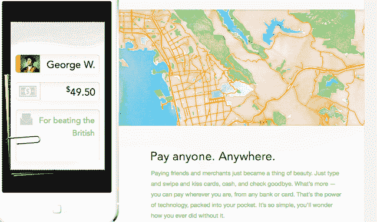
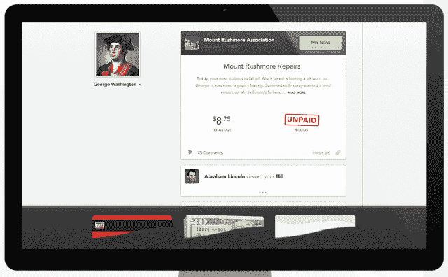

# Clinkle 筹集了名人云集的 2500 万美元，准备消除实体钱包

> 原文：<https://web.archive.org/web/https://techcrunch.com/2013/06/27/clinkle-raises-celebrity-filled-25m-round-as-it-gears-up-to-eliminate-the-physical-wallet/>

移动支付初创公司 Clinkle 已经从超过 18 位投资者那里获得了 2500 万美元的投资。

该公司自 2011 年成立以来一直处于隐形模式，今年 4 月,[《华尔街日报》的一篇报道](https://web.archive.org/web/20230325225016/http://online.wsj.com/article/SB10001424127887324020504578396912443242512.html)解释说，十几名学生将离开斯坦福大学，创办一家部分由教授资助的初创公司，这让该公司成为大肆宣传和猜测的对象。

Beta 测试人员、一名前员工，甚至 Clinkle 的网站都让我们看到了这款应用将如何运行以及它将会是什么样子。这是硅谷最有趣也是最神秘的初创公司之一。

## 资金

有这么多参与者的一轮融资被轻蔑地称为[“派对轮”](https://web.archive.org/web/20230325225016/https://techcrunch.com/2012/08/27/party-rounds-excellent/)，一些投资者如[克里斯·迪克森](https://web.archive.org/web/20230325225016/http://nonchalantrepreneur.com/post/29850301087/party-rounds)对此提出了警告。

Clinkle 创始人卢卡斯·杜普兰告诉我，Clinkle 吸引了这么多投资者，因为“拥有一群在多个领域拥有丰富经验的人对我们来说很重要”，因为该公司在试图解决一个大问题时面临着广泛的挑战。

“这不是一个小的社交应用，”他说。“我们试图从根本上改变人们的交易方式。每一个人，每一天，都必须这样做。”

杜普兰拒绝就任何投资者是否会加入 Clinkle 的董事会或任何筹资时间表置评。

“我不想被新闻和媒体分散注意力，”杜普兰说。“我决定，最好是真正专注于产品，一旦一切就绪，我们对公司的发展感到满意，就宣布新一轮融资。”

杜普兰说，大部分资金将用于招聘。该公司目前约有 50 名员工，并将“迅速扩张”杜普兰表示，随着这家年轻的初创公司与规模大得多的竞争对手展开竞争，新员工将担任从工程到营销到设计等一系列角色。

## 这个想法

大一结束后的那个夏天，杜普兰在伦敦留学时想出了这个主意。他感到沮丧的是，他可以下载应用程序在国外做几乎任何事情——打电话给朋友，播放音乐，甚至与加州的朋友拼字游戏——除了支付三明治的费用。

第二年夏天，杜普兰和大约 10 名其他学生在帕洛阿尔托租了一所房子，开始开发 Clinkle。

杜普兰说:“我认为宣传和现实之间有很大的差距。”。"目前没有现金和信用卡的有力竞争者."

杜普兰说面临两大障碍:技术和采用。

## 这项技术

杜普兰说，还没有一个可扩展的解决方案能够让手机在不更换销售点系统的情况下向商家付款。杜普兰说，Clinkle 已经找到了一种不需要改变基础设施就能做到这一点的方法。

Clinkle 在斯坦福做了一个小测试，杜普兰说“进行得非常好”

Stuart Upfill-Brown 本月早些时候从斯坦福大学毕业，是该应用的 beta 测试人员。他说，他会为一些小事，比如深夜披萨，向其他测试这款应用的朋友还钱。

“它将手机银行带到了几乎一个社交媒体的水平，”他说，并解释说你可以用时尚的小纸条回报朋友，并个性化你的钱包。

“我认为界面很直观，因为它的设计看起来像你的钱包或钱夹，”另一位斯坦福大学毕业生兼 beta 测试者丹尼·奥根(Danny Organ)说。“一切都直观地呈现在你面前，这很好。”

两人表示，安装过程快速而简单:输入银行账户信息，设置安全码，添加其他拥有该应用的朋友。Clinkle 在应用程序中使用一个独立的银行，名为“Clinkle cash”。用户可以从他们的银行账户来回转账，变成“叮当现金”这些叮当作响的美元随后被用于点对点和点对点交易。

一位不愿透露姓名的前雇员说:“你现在可以在手机上用钱包做任何事情。”。"那包括支票、信用卡、现金."

Upfill-Brown 在 Treehouse 和 Coho 等校园主流餐厅使用该应用程序，他可以通过该应用程序提前点餐和付款，然后去取食物。

“很明显，他们试图把你的整个钱包都放进你的手机里，而其他东西只包含一个元素。“Clinkle 感觉更像是‘我可以把钱包留在家里’”，Upfill-Brown 说。

Upfill-Brown、Organ 和这位前雇员都谈到了这款应用的可用性和美学设计。

“他们是一家非常有动力的公司，有很多人才，”这位前雇员说。“他们的首席设计师罗布·瑞安是他们公司最好的资产……这就是为什么它看起来这么好，功能这么好。”

除了个人点对点交易，Clinkle 还增加了团体支付。在应用程序中会有一个消息线程，你可以创建群组和进行群组交易。

## 采用

“在真空中构建伟大的技术不会有很大帮助，”杜普兰说。

提到脸书通过小型大学网络传播，杜普兰说，该公司希望在发布应用程序时做到明智和系统化。

“我认为像手机钱包这样的东西对人们有用，你必须被普遍接受，”他说，并指出让每个商家做同样的事情是一个巨大的问题。

“形成新网络的最佳方式是从小的闭环群体开始，然后从那里慢慢扩展，”他说。他说，Clinkle 将在明年向“相当多”的学院和大学发布。他拒绝给出公众何时能获得这款应用的时间表。

杜普兰解释说，从大学开始让这个问题变得容易管理得多，因为有很多点对点支付，而且很多点对点支付都是向相同的几个商家支付的——校园披萨店、杂货店、最近的有便宜美味的 Natty Light 的地方等等。

Clinkle 将根据学生群体的需求在学校推出，他们将通过在线等候名单来评估这些需求。(编辑:我之前写道，它将在任何有 1750 名学生输入电子邮件地址的学校推出，事实上，这只是我在网站上看到的基于斯坦福大学规模的数字，并不是每个学校都通用的)

该公司提出了在大学举办类似抽奖的比赛来促进增长的想法，学生们可以从每一次邀请中获得门票，从而注册；本周早些时候，竞赛的规则和奖品，从野外旅行到 Clinkle 奖品，都在 Clinkle 的网站上。现在，杜普兰告诉我，公司正在重新考虑这场竞争，以及其他增长战略。

这位前 Clinkle 员工表示，该公司不会对点对点交易收取任何费用，并将寻求在其他地方赚钱，如果客户使用 Clinkle 优惠券或特别优惠，可能会从商家那里收取少量费用。杜普兰表示，Clinkle 将对点对点交易收取费用；虽然拒绝透露细节，但他说费用将是“有竞争力的”，将由商家支付。

“将支付货币化比将许多其他社交应用或其他东西货币化容易得多，”杜普兰说。“当有真正的价值被交换时，就有一吨在排队。”

## 判决

这个想法很棒——我非常同意杜普兰关于当前应用程序与现金和信用卡的观点。这款应用很漂亮，早期用户对它的评价也很好。我对这场竞赛有点怀疑——本质上是为增长买单——但如果他们能够真正占领大学市场并从那里扩散开来，这将是一个很小的代价。

现在他们只需要发布应用程序。

这位前员工说，他不知道为什么他们花了这么长时间才发布这款应用程序，因为它在小型测试团队中运行良好，但他认为这与公司的增长战略有关，而不是工程问题。

“他们有斯坦福大学的顶级工程师，他们有很多，他们已经研究了一段时间，”他说。

“我想公司里的很多人也有同样的心态，”这位前员工在谈到为什么它还没有推出时说。

杜普兰说，为了让人们接受 Clinkle，该产品必须比现金和信用卡好一个数量级。

“误差幅度为零，”杜普兰说。

注意:我从这篇文章中删除了两段关于 Clinkle 技术的内容。虽然我的消息来源给我的信息是准确的，但这远远不是一个完整的画面，而且缺乏更多的细节，可能会误导读者。