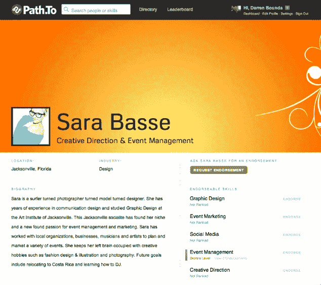

# Cliqset 创始人以专业人脉和背书平台路径承担 LinkedIn。致 

> 原文：<https://web.archive.org/web/http://techcrunch.com/2011/08/30/cliqset-founder-takes-on-linkedin-with-professional-connections-and-endorsement-platform-path-to/>

# Cliqset 创始人以专业人脉和背书平台路径承担 LinkedIn。到

早在五月份，我们就听说 [Cliqset](https://web.archive.org/web/20230204105420/http://www.crunchbase.com/company/cliqset) 创始人 [Darren Bounds](https://web.archive.org/web/20230204105420/http://www.crunchbase.com/person/darren-bounds) 正在为[一个名为 Glow 的隐秘的新社交项目工作。类似 FriendFeed 的社交聚合平台 Cliqset 于去年秋天关闭。今天，Bounds 展示了他最新的创业公司(不叫 Glow)——](https://web.archive.org/web/20230204105420/https://techcrunch.com/2011/05/28/cliqset-founder-takes-on-personal-publishing-and-social-conversations-with-stealthy-startup-glow/)[path . to .](https://web.archive.org/web/20230204105420/http://path.to/)

路径。To 的基本目标是简化专业人士在网上联系和推销自己的方式。有点像 About.me 遇上职业社交网络 LinkedIn。用户可以通过简单的用户发现创建照片丰富、时尚的专业个人资料

在您的个人资料中，您可以从脸书和其他网站导入信息，并列出您的技能和经验。类似于你在 LinkedIn 上推荐人脉的方式，Path。允许用户按技能“认可”伙伴关系。路径。To 还提供“排行榜”,根据人们获得的支持数量对他们进行排名。您可以按技能、姓名或行业搜索专业人士，并访问关于您个人资料的分析。

Bounds 告诉我们，LinkedIn 上有很多噪音，影响了专业人士的个人资料。路径。他说，To 旨在帮助用户脱颖而出，相互联系，并在网上创建一个雇主可以获得专业技能和经验的地方。Bounds 解释道，Path.to 从 LinkedIn 那里“砍掉了肥肉”。

对于 Path 来说，这无疑是雄心勃勃的。来应对 LinkedIn 庞大的用户群，但看看 LinkedIn 的用户是否觉得有必要扩展到另一个平台进行背书应该是很有趣的。

