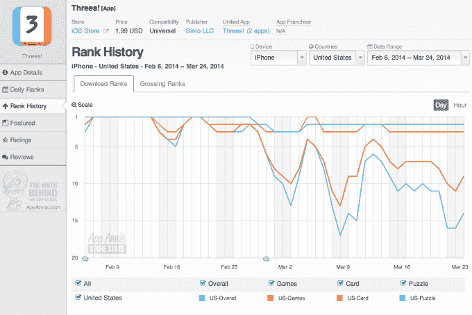

# 克隆，到处都是克隆——“1024”、“2048”和其他流行付费游戏“三”的副本充斥着应用商店 

> 原文：<https://web.archive.org/web/http://techcrunch.com/2014/03/24/clones-clones-everywhere-1024-2048-and-other-copies-of-popular-paid-game-threes-fill-the-app-stores/>

虽然“Flappy Bird”[热潮](https://web.archive.org/web/20230206171409/https://techcrunch.com/tag/flappy-bird/)可能正在降温——目前，iTunes 应用商店前 20 名中只有一个“Flappy Bird”山寨版——但这款病毒游戏及其随后的许多变体的更持久影响仍然继续到可笑的地步。例证:手机应用克隆的最新祸害是一款名为“2048”的游戏，这是一款“克隆人的克隆人的克隆人”[，](https://web.archive.org/web/20230206171409/http://www.independent.co.uk/life-style/gadgets-and-tech/2048-game-how-to-play-the-addictive-successor-to-flappy-bird-9207556.html)，它本身也有许多克隆人。

这开始有点疯狂了。

这场最新的克隆人战争，准备击败“Flappy Bird”传奇，始于开发商店 Sirvo (Greg Wohlwend 和 Asher Vollmer)的一款精心设计的、[令人上瘾的益智应用程序“three”](https://web.archive.org/web/20230206171409/https://techcrunch.com/2014/02/11/threes/)。该游戏于 2014 年初推出，并于 2 月份开始升温。使用类似数独的机制和糖果粉碎式匹配，“三”涉及匹配三的倍数以获得更高的分数。

然而,“Threes”是一款收费游戏，售价 1.99 美元，这意味着有空间让另一个可能不那么谨慎的开发者进来，通过解决免费玩家的问题来填补空白。有人照做了。“ [1024](https://web.archive.org/web/20230206171409/https://itunes.apple.com/us/app/1024!/id823499224?mt=8) ”很快出现，有效地剽窃了“三”，甚至在其应用商店描述中直接引用了它复制的热门游戏，称:“无需为三游戏付费。这是给你的简单又好玩的礼物，而且是免费的。”

很快,“三”克隆人的战斗开始了。接下来是一款名为“ [2048](https://web.archive.org/web/20230206171409/http://saming.fr/p/2048/) ”的游戏，在网上推出，也是“三”和“1024”的副本。它的创作者解释说，他开发这个网络应用程序是因为他的手机不能运行早期游戏的 iPhone 和 Android 版本，尽管他拒绝在一个在线常见问题中详细说明他的游戏到底是如何出现的，这个常见问题的开头不是一个，而是两个，问这个游戏实际上是否“只是一个盗版”。

[另一个“2048”游戏很快紧随其后](https://web.archive.org/web/20230206171409/http://gabrielecirulli.github.io/2048/)，这一次是来自 19 岁的意大利开发者 Gabriele Cirulli，他在网络版中加入了动画，[在黑客新闻](https://web.archive.org/web/20230206171409/https://news.ycombinator.com/item?id=7373566)上指出，关于这一版本，“没有动画，玩起来有点困难”奇鲁利说，他的尝试本来是一个周末项目，并声称当他第一次在应用商店看到“1024”和在线变体“2048”时，他甚至没有听说过最初的“三”

然而，奇鲁利并没有试图从他的游戏中获得收入，[告诉华尔街日报](https://web.archive.org/web/20230206171409/http://blogs.wsj.com/digits/2014/03/18/want-to-stay-anonymous-dont-make-a-hit-computer-game/)他“不认为这是他自己的作品”(尽管早期版本允许捐赠)。文章将奇鲁利设定为“Flappy Bird”王位的继承人，因为当人们抱怨在他的游戏上浪费时间时，他感到内疚。(“Flappy Bird”的创作者 Dong Nguyen，如果你还记得的话，[著名地承认他对他的游戏的上瘾本质](https://web.archive.org/web/20230206171409/http://www.forbes.com/sites/lananhnguyen/2014/02/11/exclusive-flappy-bird-creator-dong-nguyen-says-app-gone-forever-because-it-was-an-addictive-product/)感到“内疚”，这是他今年早些时候从 iTunes 应用商店下架该游戏的原因之一。)

然而，Cirulli 并没有感到太过内疚——他的代码仍然保存在 GitHub 上，其他人可以根据自己的喜好访问、复制和定制它。许多人已经这样做了，构建有趣的在线克隆，融入[俄罗斯方块](https://web.archive.org/web/20230206171409/http://prat0318.github.io/2048-tetris/)元素、[神秘博士](https://web.archive.org/web/20230206171409/http://games.usvsth3m.com/2048-doctor-who-edition/)、doge meme 、 [3D](https://web.archive.org/web/20230206171409/http://joppi.github.io/2048-3D/) ，当然还有 [Flappy Bird](https://web.archive.org/web/20230206171409/http://logarithmic-flappy-2048.ajf.me/) 本身。

与此同时，App Store“2048”克隆版继续推出。今天在 iTunes 应用商店的搜索揭示了最新的淘金热是什么样子的:现在有超过 24 种“2048”游戏的变体，以及其他游戏在它们的标题或游戏描述中填入“2048”一词，希望能出现在搜索结果中。还有一些其他的“1024”，加上涉及 8 或 5 而不是 3 或 2 的衍生产品。

对于“Threes”的制造商来说，好消息是克隆产品的出现并没有摧毁它的市场份额——这款应用仍然是美国益智游戏、纸牌游戏和普通游戏类别的前 10 名，也是美国应用商店的前 20 名应用。(都是付费排名，平心而论，不如免费排名有竞争力。)

虽然竞争激烈的手机游戏行业一直充斥着克隆游戏(通常是来自 Zynga 等大公司的 T2 从 T4 小开发商的作品中获利，或者起诉那些抄袭他们自己成功的游戏)，但这些简单游戏的兴起，在“Flappy Bird”病毒的推动下，意味着其他克隆游戏的创作和销售速度大大缩短了。

例如，我们甚至看到过[只不过是手机游戏模板](https://web.archive.org/web/20230206171409/https://techcrunch.com/2014/02/19/how-one-scammer-manipulated-apples-top-charts-to-earn-tens-of-thousands-daily-using-a-10-gamesalad-template/)就蹿升到 App Store 排行榜榜首的情况。

苹果的 iTunes 和 Google Play 这两个应用商店的最终结果是，顶级排行榜很容易受到影响，因为克隆者通常是更加肆无忌惮的类型，他们利用技巧和漏洞来操纵排名。

这就提出了一个问题:今天的应用商店应该更多地推广原创游戏，还是一如既往地让市场力量主宰顶级游戏？当一个应用程序试图从另一个应用程序的成功中获益时，应该尝试监管吗？值得一提的是，苹果和谷歌已经开始在某种程度上解决这个问题，因为他们在最近几周都拒绝了标题中使用“Flappy”的应用。当然，这些显然不是全面的拒绝。

对于苹果和谷歌来说——由于审查过程不那么繁琐，后者受克隆的影响更大——这种向快速克隆的转变意味着他们必须很快决定是否要在这些新游戏及其快速发布的变体方面采取更坚定的立场。如果没有，应用程序商店可能会开始奖励那些没有建立专注于质量和持久成功的游戏公司，而是快速赚钱的人。