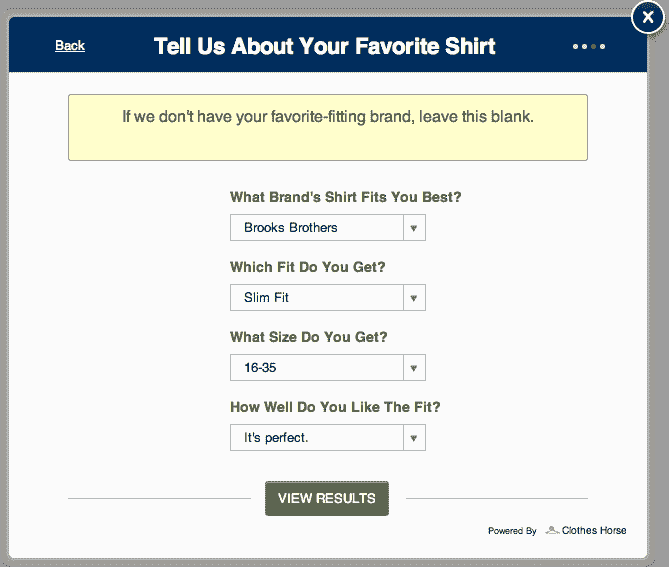
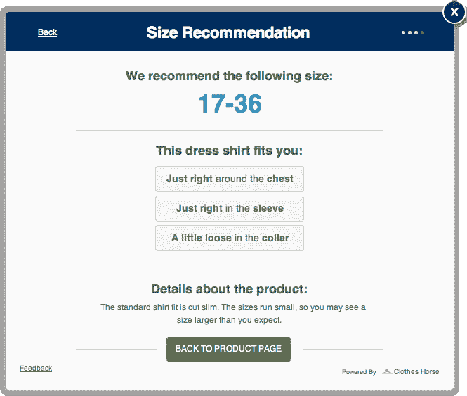

# 衣服马想要解决网上购物的最大问题:找到合适的衣服 

> 原文：<https://web.archive.org/web/https://techcrunch.com/2012/02/22/clothes-horse-wants-to-solve-the-biggest-problem-with-online-shopping-finding-clothes-that-fit/>

总部位于纽约的时尚科技公司“衣服之马”今天公开发布其平台，试图解决网上购物者面临的最大挑战之一:购买合身的衣服。通过使用商家添加到自己网站上的可定制小部件，衣服马可以在 30 秒内确定零售商的商品将如何适合任何顾客。我们的目标不仅是减少购物车废弃率，还包括因衣服不合身而导致的退货率。

网上购物的问题是顾客已经被他们过去的经历烧伤了。“与其为你将要购买的这件伟大的新东西感到兴奋，”衣服之马的联合创始人维克拉姆·文卡特拉曼解释说，“你不如想想你最后一次不得不退货的时候，或者你开始怀疑它是否真的会像照片上看起来那样好看。”

他说，正是这些犹豫点导致了 70%的购物车放弃。不仅如此，60%的顾客退货都是因为合身问题。

当然，零售商知道围绕合身的挑战——这就是为什么他们在网站上提供所有衣服的尺寸和尺码表。但是仅仅因为你可以拉上拉链，并不一定意味着它很适合*。为了解决这些问题，衣服马提供了一种快速、用户友好的产品，帮助在线购物者在大约 30 秒内确定某样东西是否真正适合现实生活。*

 *该产品是一个贴有白色标签的问答系统，使购物者能够根据他们对问题的回答建立一个档案，而不必涉及测量。尽管零售商可以定制该系统以满足他们的需求，但其想法是超越身高和体重等因素，了解客户的体型、偏好的品牌、给定品牌的舒适度等。

例如，一个男装网站可能会问“什么品牌的礼服衬衫最适合你？”购物者可以选择“拉尔夫·劳伦”、“卡尔文·克莱恩”、“DKNY”等。他们也可以描述这个品牌有多合适，回答“很完美”、“很合适”或“不太合适”

在回答了一些类似的问题后，衣服马小部件会告诉你买什么尺寸的，最重要的是，它会如何合身(例如，“胸部周围很紧”，“衣领刚刚好”)。

“现在你知道你必须做出什么样的取舍，如果有的话，”文卡特拉曼解释道。“考虑到你一生的购物经历，你知道会发生什么。它让你把你正在购买的新东西放在你习惯的环境中，所以你对它有一点了解，”他说。

在与测试客户 Bonobos.com 的早期测试中，新系统的使用带来了 13%的销售增长，零售商称这一结果令人鼓舞。见鬼，它甚至能帮你找到合适的牛仔裤！

在幕后，衣服马有一个大型的人体测量数据库，他们结合了来自大约 50 个品牌的测量数据，其中六个现在在网上直播(Bonobos，Modus Man，Duke & Winston，Five Four Jeans，Frank & Oak，以及一个未披露的客户)。这家初创公司还在与几家大型零售商进行谈判，据报道，这些零售商对该平台非常感兴趣。

找到合适的衣服只是“衣服之马”宏伟计划的第一步。接下来，它计划支持脸书整合，帮助用户根据他们“喜欢”的品牌和他们朋友喜欢的东西建立购物档案。此配置文件将作为一个便携标识，随您从一个站点移动到另一个站点。将线下购物与在线个人资料联系起来的移动体验也正在进行中。

除了曾是德勤顾问、企业家和作家的[文卡特拉曼](https://web.archive.org/web/20221001063818/http://www.crunchbase.com/person/vik-venkatraman)，另外两位联合创始人是 [V Bespoke](https://web.archive.org/web/20221001063818/http://www.vbespoke.com/) 联合创始人[戴夫·惠特莫尔](https://web.archive.org/web/20221001063818/http://www.crunchbase.com/person/david-whittemore)和软件工程师[威尔·查尔丘克](https://web.archive.org/web/20221001063818/http://www.crunchbase.com/person/will-charczuk)。该团队从 Contour Ventures 以及 Mark Wachen、Ben Ling、 [DreamIt](https://web.archive.org/web/20221001063818/https://beta.techcrunch.com/2011/05/09/dreamit-ventures-announces-its-first-batch-of-nyc-startups) 等人那里获得了未披露金额的种子资金。*