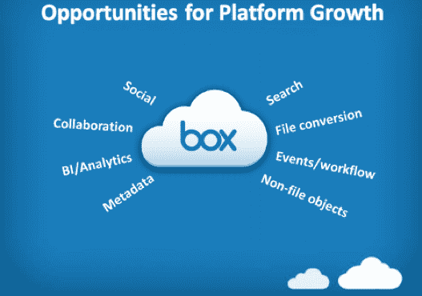

# 云存储平台盒子首次亮相开发者平台/Bin；$2M 基金投资企业 

> 原文：<https://web.archive.org/web/http://techcrunch.com/2011/11/17/cloud-storage-platform-box-debuts-developer-platform-bin-2m-fund-to-invest-in-the-enterprise/>

从包括 Salesforce、SAP Ventures、Bessemer Venture Partners、NEA、安德森·霍洛维茨和德雷珀·费希尔·朱韦森在内的全明星投资者那里筹集了高达 8100 万美元的资金后；Box.net[的云存储平台](https://web.archive.org/web/20230203160145/http://box.net/)正着眼于下一阶段——支持其开发者社区。该公司正在为开发者推出一个基于 Box 平台的新平台，名为 Box 创新网络(/bin)。此外，Box 还推出了一个 200 万美元的基金(自有资金)，用于投资基于 Box 平台的企业应用。

Box 拥有 800 万用户，存储超过 3 亿份文档，是一个面向企业的云存储平台，具有协作、社交和移动功能。Box 已经[发展](https://web.archive.org/web/20230203160145/https://techcrunch.com/2011/01/20/box-net-upgrades-cloud-storage-platform-with-new-ui-collaborative-features-and-more/)不仅仅是一个文件存储平台，而且已经成为一个成熟的协作应用程序，企业可以在其中实际交流文档更新、[远程同步文件](https://web.archive.org/web/20230203160145/http://www.techcrunchit.com/2010/06/10/box-net-moves-beyond-storage-in-the-cloud-adds-file-syncing-to-the-mix/)，甚至添加来自 Salesforce、Google Apps、NetSuite、Yammer 和其他公司的功能。

目前，该公司为 77%的财富 500 强企业提供存储解决方案，有 100，000 家企业使用 Box 的服务(每月有 250，000 名新用户加入)。

当然，首席执行官兼联合创始人亚伦·列维说，这种增长的核心部分是公司的开发者社区和生态系统。目前，Box 拥有 4，500 个 API 合作伙伴，每月有 2 亿次 API 调用。Levie 说，事实上，现在开发应用程序的开发者数量是一年前的四倍。具体来说，移动领域取得了巨大的增长，与 2010 年第 3 季度相比，2011 年第 3 季度末移动企业部署量增长了 30 倍。

该公司今年已经在许多企业大规模成功部署了许多 API，包括 Pabst Brewing Company、DOW Chemical 和 National Equity Fund。

作为一家更成熟的公司，Box 的下一步很大一部分是将开发人员聚集到 Box 社区，并帮助 API 开发人员创建更好的应用程序。“行动缓慢的企业软件巨头近年来几乎没有创新，他们封闭的生态系统使得外部参与者几乎不可能在遗留系统上为客户创造引人注目的体验，”Levie 说。

/bin 的推出创建了一个社区，支持开发人员基于 Box 平台构建企业级应用，以满足业务需求并帮助云存储转型。

在其核心，/bin 是围绕其直接合作伙伴和成员连接构建的。Box 正在与 Appcelerator、VMWare 的 Cloud Foundry、Heroku、Rackspace、SnapLogic 和 Twilio 合作，为构建 Box 平台的开发人员提供与托管、移动等相关的特殊服务。Levie 说，这些合作伙伴的愿景是，他们将为/bin 成员提供使用 Box APIs 构建健壮应用程序所需的工具和服务。

/bin 还将在 Box 平台上提供资源、新特性和功能。除了与平台合作伙伴合作，Box 还向/bin 会员投资高达 200 万美元的基金，以支持基于 Box 平台的未来企业应用的增长和发展。这些资金将用于股权投资、知识产权收购和企业产品的联合开发。

正如 Levie 告诉我的，“bin 和投资基金背后的总体想法是培养一个强大的社区和网络，让开发人员获得正确的资源和支持来构建企业应用程序。”

2011 年对 Box 来说是重要的一年。在几周前宣布大规模融资之前，Box 的收购目标是[5 亿美元](https://web.archive.org/web/20230203160145/http://venturebeat.com/2011/09/15/box-net-500m-offer/)(在最后一轮融资中，Box 的估值为 6 亿美元)。该公司推出了许多新产品创新，包括[首次推出与 Salesforce 的企业聊天社交网络的集成](https://web.archive.org/web/20230203160145/https://techcrunch.com/2011/09/28/box-net/)，以及新的[同步功能。](https://web.archive.org/web/20230203160145/https://techcrunch.com/2011/09/28/box-net/)

至于下一步，Levie 告诉我们，我们可以期待 Box 的企业版很快会有重大的产品更新。我们还将在移动领域和未来的移动产品开发中看到许多令人兴奋的合作伙伴关系。Box 还利用新融资进行国际扩张，并将在 2012 年开设第三个数据中心。

当然，Box 的未来可能包括公开上市。该公司的第一批投资者之一，DFJ 的董事总经理 Josh Stein 最近告诉我们“Box 绝对应该是一家上市公司”，并表示上市是该公司未来的计划之一。

至于这如何适应今天的新闻，创建一个充满活力的开发者生态系统是 Box 从一家初创公司成熟到 10 亿美元(可能是上市公司)的重要一步。吸引开发者肯定会帮助 Box 继续扩大其云存储平台的覆盖范围。

【YouTube http://www.youtube.com/watch?v=kAcJQN4B3u0&w=560&h=315]

