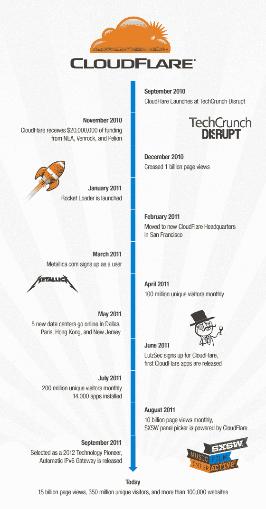

# CloudFlare 转一；推出 IPv6 网关，让网站免费“加入现代互联网”TechCrunch

> 原文：<https://web.archive.org/web/http://techcrunch.com/2011/09/27/cloudflare-turns-one-launches-ipv6-gateway-to-let-websites-join-the-modern-internet-for-free/>

在蛋糕上放一根又大又粗的蜡烛。一年前的今天，一家名为 [CloudFlare](https://web.archive.org/web/20230203152732/https://www.cloudflare.com/login.html) 的初创公司在旧金山的 TechCrunch Disrupt 上发布，该初创公司仅次于 Qwiki。([你可以在这里阅读我们最初的报道](https://web.archive.org/web/20230203152732/https://techcrunch.com/2010/09/27/cloudflare-wants-to-be-a-cdn-for-the-masses-and-takes-five-minutes-to-set-up/)。)对于那些不熟悉 CloudFlare 的人来说，这家初创公司提供了一项免费服务，不仅旨在提高公司网站的速度，还旨在保护网站免受那些恶意的网络威胁，这些威胁会阻碍加载时间，通常只会让 it 人员抱怨。不是一个性感的产品，而是一个必要的和不可或缺的成功的网络业务。

简单介绍一下这项服务对电子商务的吸引力:在推出 365 天后，CloudFlare 现在为超过 100，000 个网站提供支持，其中超过 5%的网站每月页面访问量超过 150 万次。从零流量到今天每月有 150 亿页面浏览量和超过 3.5 亿独立访问者的大量网站，CloudFlare 显然有相当重要的一线希望。

更重要的是，[初创公司在 11 月悄悄从 NEA、文洛克和佩利翁筹集了 2000 万美元](https://web.archive.org/web/20230203152732/https://techcrunch.com/2011/07/12/oh-by-the-way-cloudflare-raised-20-million-last-november/)(并在 6 个月内没有告诉任何媒体)，今年 6 月，这家初创公司看到国际虚张声势的黑客辛迪加 Lulzsec 的成员注册了它的服务。所有这些几乎没有停机时间。

由于 CloudFlare 旨在消除对大型和小型 web 属性的性能和安全性的威胁，因此在庆祝其第一个生日时，这家初创公司推出了一项对这两者都有影响的新功能。正如一些人所知，过去的互联网是建立在 IPv4 基础上的，IP v4 实际上是互联网协议发展的第四个版本(或修订版)，正是这种寻址和路由通信标准使互联网成为互联网。

根据 CloudFlare 首席执行官 Matthew Prince 的说法，IPv4 于 20 世纪 70 年代开发，于 1981 年标准化，目前仍在广泛部署，但它仅具有约 40 亿台设备连接到网络的容量。随着 IPv4 空间的耗尽，全球网络用户将被迫(大多在不知情的情况下)转向 IPv6，这是一个仍然年轻且与其前身不兼容的新标准。

普林斯说，这个解决方案是一个网关，但典型的网关解决方案是基于硬件的，由思科这样的公司出售，价格不菲。因此，今天，CloudFlare 推出了一个 IPv6 网关，它不需要站点所有者购买硬件、软件或更改他们现有的基础架构(即一行代码)。而且它对 CloudFlare 客户是免费的。

当然，这并不能让公司完全摆脱困境。企业在未来仍将不得不升级其基础设施以支持 IPv6，但 CloudFlare 的“网关”为他们赢得了时间，允许他们在预算允许的情况下按照自己的计划升级。

根据 Prince 的说法，超过 10，000 个网站参与了 CloudFlare 网关的私有测试，这实际上使通过 IPv6 可用的网站数量增加了一倍。首席执行官预计，凭借其 100，000 个网站的名册，其中许多公司将利用免费升级，潜在地将 IPv6 网站的总数增加十倍。CloudFlare 网关的推出可能会成为新标准的宝贵试验场，为未来不可避免的转变提供宝贵的见解。

听起来像一个典型的具有超大视野的创始人(毫无疑问是在开玩笑)，普林斯说，CloudFlare 团队感到欣慰的是，这家初创公司正在尽自己的一份力量“拯救互联网”。这仍有待观察，但 Lulzsec 是它的客户之一，我敢肯定很少有人会不同意。

要快速了解 CloudFlare 向“互联网保护者/超级英雄”的演变(需要保留意见)，请参见下面的信息图:

