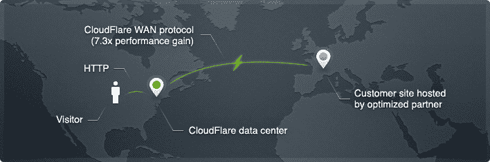

# CloudFlare 借助支持、SLA、DDoS 缓解和 Railgun 推出业务和企业客户 TechCrunch

> 原文：<https://web.archive.org/web/https://techcrunch.com/2012/06/06/cloudflares-business-enterprise-accounts/>

尽管上周发生了小小的安全事故，但最近,[的 CloudFlare](https://web.archive.org/web/20221208073155/http://cloudflare.com/) 一直表现不俗。该公司首席执行官马修·普林斯(Matthew Prince)喜欢称之为“运营即服务”(operations as a service)的这项服务为网站所有者提供类似的服务，目前已拥有超过 50 万名客户。CloudFlare 融合了加速网站加载速度的[内容交付网络](https://web.archive.org/web/20221208073155/http://www.cloudflare.com/features-cdn)和[在线安全服务](https://web.archive.org/web/20221208073155/http://www.cloudflare.com/features-security)。它目前被许多主要网站使用，甚至被各种美国和国际政府机构使用。对于这些大型企业客户，CloudFlare 现在提供了[两种新的服务计划](https://web.archive.org/web/20221208073155/http://www.cloudflare.com/plans)，超越了其当前的免费和每月 20 美元的服务。

企业客户现在可以订阅每月 200 美元的服务，为他们提供专门的客户支持和 DDoS 缓解服务，以及每月 20 美元的 pro 帐户中包含的所有功能(以及该公司本月早些时候发布的两个新的映像优化功能)。

企业公司、银行和政府机构等有额外需求的大型组织现在也可以订阅该公司的企业计划，起价约为每月 3，000 美元。这项服务配有专门的客户经理和 24/7 电话支持。

对于这两种服务，CloudFlare 还提供了服务级别协议(SLA ),将为付费用户的任何停机时间进行补偿。正如 Prince 本周早些时候告诉我的，企业用户将获得更慷慨的 SLA，基本上可以补偿他们遭受的 25 倍停机时间。

## 有人答应给我们轨道炮

另一个有趣的新功能是 CloudFlare 的“Railgun optimization”，我们可能会在未来撰写更多内容，该功能目前仅适用于业务和企业计划。

CloudFlare 目前在全球运营着 14 个数据中心。然而，随着它越来越接近最终用户，它的数据中心也越来越远离数据实际来源的服务器。为了加快和优化服务器和数据中心之间的数据传输，CloudFlare 开发了一种基本上可以替代 HTTP 的技术。然而，CloudFlare 说，HTTP“只允许有限的对象缓存，并给与服务器的通信增加了不必要的延迟。”

Railgun 的工作方式更像是用于流媒体在线视频的编解码器，因为它在数据中心缓存整个网站，并只查看和下载自上次 ping 服务器以来发生变化的几行代码。CloudFlare 表示，这“允许对在源服务器和 CloudFlare 全球网络之间传递的内容进行高达 99.6%的压缩，包括之前无法缓存的 web 对象，从而为网站访问者带来高达 730%的性能提升。”

普林斯告诉我，在服务器上安装 Railgun 并不简单，但该公司也向其长长的托管合作伙伴名单提供这项服务。

【T2

## 通过口头传播增长到每月 500 亿页面浏览量

普林斯告诉我，到目前为止，CloudFlare 一直在逐个提供这些服务，并与这些公司合作，以了解他们的需求，并收集有关其服务在不同业务领域的使用情况的数据。一些已经在使用 CloudFlare 的服务包括 StumbleUpon、StockTwits.com、Slideshare 和 Clicky。据 StockTwits 首席技术官 Chris Corriveau 称，他的公司决定订阅企业服务“以确保 StockTwits.com 遭受攻击时的安全”。我们在一小时内恢复了网络。自从加入 CloudFlare 以来，我们也看到了性能优势，并且将 CloudFlare 添加到了其他几个站点。”

有趣的是，CloudFlare 仍然没有任何专门的销售团队。相反，它的增长主要是基于口口相传。为了强调这一点，普林斯给我讲了一个有趣的轶事，涉及土耳其的三陪服务经常受到保守派黑客的网络攻击。在其中一家公司转而使用 CloudFlare 来缓解这些问题后，几乎整个行业都转而使用该公司的系统。之后，更多的土耳其电子商务网站和媒体网站，甚至土耳其政府的一些分支机构进行了转换。

今天，[于 2010 年 9 月在 TechCrunch Disrupt](https://web.archive.org/web/20221208073155/https://beta.techcrunch.com/2010/09/27/cloudflare-wants-to-be-a-cdn-for-the-masses-and-takes-five-minutes-to-set-up/) 上推出的 CloudFlare 拥有不到 50 万名客户，每月服务近 500 亿个页面。总体而言，每月约有 4.75 亿独立用户通过其网络。

## 还有新的:波兰和幻影

此外，CloudFlare 在过去两天为其所有付费客户推出了两项服务。经过[的润色](https://web.archive.org/web/20221208073155/http://blog.cloudflare.com/introducing-polish-automatic-image-optimizati)，CloudFlare 现在可以自动优化图像的文件大小。抛光有两种模式:无损和有损。如今，一个普通网站的大小几乎有一半是由图像组成的，因此通过有损设置将这些文件的大小减少 50%，在无损模式下减少约 21%，CloudFlare 能够显著加快其网络中站点的平均下载时间。

海市蜃楼，这些服务中的第二个，是[稍微复杂一点](https://web.archive.org/web/20221208073155/http://blog.cloudflare.com/introducing-mirage-intelligent-image-loading)。它不仅可以优化下载的图片，还可以针对下载图片的设备以及网络连接速度进行优化。此外，它会延迟加载当前不在浏览器窗口中的图像，这应该会加快页面首次出现在浏览器中的时间。