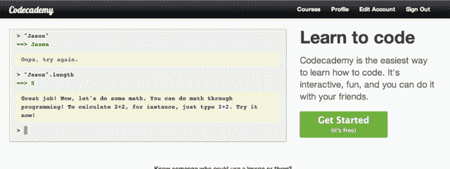

# Codecademy:教你如何编程的巧妙有趣的方法 

> 原文：<https://web.archive.org/web/https://techcrunch.com/2011/08/18/codecademy-a-slick-fun-way-to-teach-yourself-how-to-program/>

你看过黑客新闻上的励志帖子。您已经购买了推荐的书籍。您已将在线教程加入书签。你甚至花了 80 美元买了一套教学视频，向自己承诺这笔投资只会让你更有动力。而且因为某些原因，你*还*不知道怎么编程。

[Codecademy](https://web.archive.org/web/20230205030222/http://www.codecademy.com/) ，一个今晚早些时候上线的新网站，可能就是答案。

这是一个基于网络的交互式编程教程，它会牵着你的手，带你了解 JavaScript 的基础知识。在这一点上，它才刚刚开始——课程只进行到“While”循环——但它显然有很大的潜力，因为一个关键的原因:它实际上感觉到了*的乐趣*。

Codecademy 最初的注册过程非常聪明:至少在开始时没有。一旦你在 Codecademy.com 着陆，你将被提示完成第一课，包括打印并找出你名字的长度(以字母为单位)。直到你完成了一些课程，网站才会提示你创建一个用户帐户，当它提醒你如果不注册，你所有的进步都将丢失。那时你可能会注册。

课程本身非常简单。屏幕左侧的侧边栏将指导您完成一项任务，比如创建一个名为“myName”的新变量。您使用基于 web 的终端编辑代码，按下 return 键，代码就会被执行。该网站在告诉你具体要做什么和提示你重复使用你在以前的课程中学到的东西之间达到了良好的平衡，所以它不会感到令人沮丧的困难或无聊。

随着课程的进行，您将积累点数和奖杯，这些都会显示在您的个人资料中。朋友可以查看你的个人资料来了解你的进展，不难想象该网站会增加更多的社交功能，如排行榜和比赛。

该应用程序仍有一些缺陷，这并不令人惊讶——该公司的联合创始人扎克·西姆斯和瑞安·布宾斯基表示，他们一周半前才开始开发该应用程序。事实上，他们并没有准备好这个网站这么快就获得这么多关注(他们把它发布在 Hacker News 上，希望得到一些初步反馈，几个小时内就有了 1000 名并发用户)。

仍然有很多问题。创始人不确定他们是否会让社区创造新的课程，他们的盈利计划也不是一成不变的(尽管他们确实计划赚钱)。但是他们有了一个坚实的开端。

我只希望第一课包括“你好，世界”这个词。

