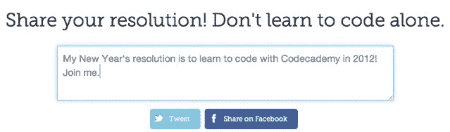

# Codecademy 的 CodeYear 在 48 小时内吸引了 100，000 名有抱负的程序员 

> 原文：<https://web.archive.org/web/https://techcrunch.com/2012/01/03/codecademys-codeyear-attracts-100000-aspiring-programmers-in-48-hours/>

# Codecademy 的 CodeYear 在 48 小时内吸引了 10 万名有抱负的程序员

谈谈如何让你的一年有个好的开始。

两天前，[Codecademy](https://web.archive.org/web/20221220071118/http://www.codecademy.com/)——一家致力于将编程带给大众的初创公司——发起了一项名为[代码年](https://web.archive.org/web/20221220071118/http://codeyear.com/)的绝妙计划。很简单:注册，每周你都会在邮箱里收到一些编程课程。

显然，有很多*人想要学习如何编码。Code Year 刚刚有了第 100，000 名用户注册——鉴于该网站刚刚上线 48 小时，这是一个了不起的里程碑。这个数字还在快速增长。*

Codecademy 的联合创始人扎克·西姆斯说，这种增长是由脸书和推特上的大量分享推动的。用户可以在注册前和输入信息后立即发微博和“赞”页面。这也有助于整个注册过程只需五秒钟——你只需输入你的电子邮件地址。

鉴于该网站的病毒性质，我要求西姆斯对哪些服务对其增长贡献最大进行分类。明确的领导者？推特。

西姆斯说，t.co 链接(使用 Twitter 的官方网址缩写)产生了该网站 33.59%的流量。脸书的税率为 16.18%。Google+的 2.37%要低得多(**更新**:正如评论中指出的，实际上没有将网站分享到 Google+的按钮，所以人们不得不手动分享——2.37%还不错)。

同样值得注意的是:自由设计师 Sacha Greif 详细描述了进入网站登陆页面的过程，这显然非常有效。他的文章概述了网站字体、图标(一个日历，而不是最初认为的灯泡)和块引号的选择。但最令人印象深刻的是所花的时间:一个小时。

Sims 说，这家初创公司希望代码年不仅仅是一个新年决心——他们正在与其他公司合作，促进编程素养。

