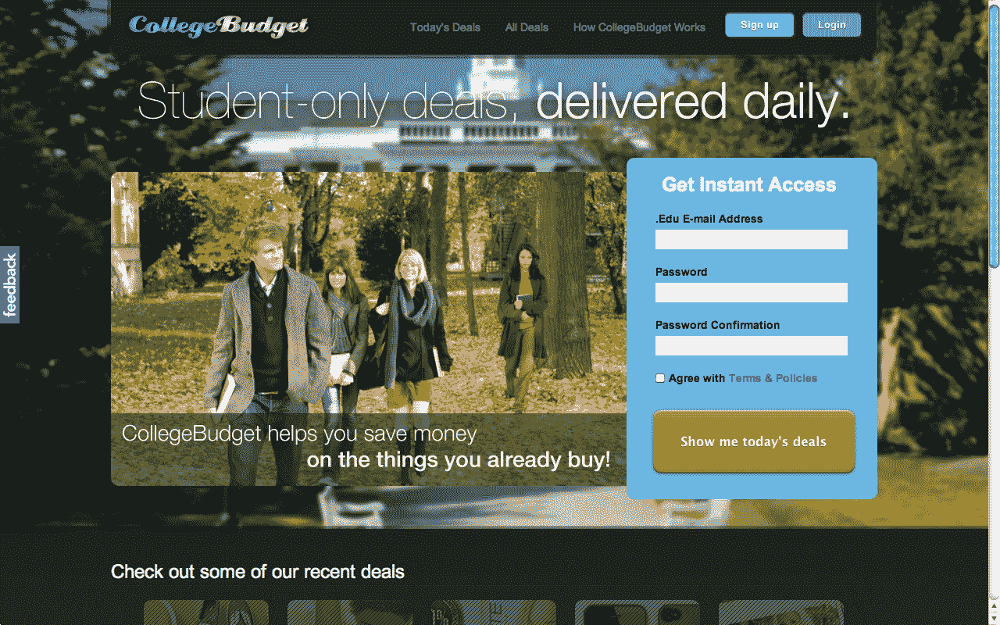

# CollegeBudget 将日常交易和团购带入校园 

> 原文：<https://web.archive.org/web/http://techcrunch.com/2011/08/01/collegebudget-brings-daily-deals-and-group-buying-to-campuses/>

我认为可以肯定地说，脸书是大学和高中社交网络的领导者。我希望那不会伤害任何人的感情。说到在大学里认识人，啤酒总是一个不错的选择，或者有脸书，或者有些人现在可能更喜欢小 T1。

虽然社交网络在任何校园都是必不可少的，但社交网络也可以整合一些工具，成为对学生更有用的资源。以 [CampusBuddy](https://web.archive.org/web/20230203143019/http://www.campusbuddy.com/) 为例，它为大学生提供了一个社交平台，在这里他们还可以访问官方成绩记录，查看关于教授、班级、院系和校园的综合评论。

对于那些想更深入了解他们正在考虑的大学的高中生来说，这是一个很好的资源，因为他们可以利用招生数据和学生对未来学校的真实反馈。或者，由于 CampusBuddy 拥有班级的官方成绩记录(该平台目前拥有来自数百家机构的超过 8000 万个成绩)，希望获得特定班级难度更多信息的学生只需点击几下鼠标即可查看成绩趋势数据。你可以在这里阅读我们对 CampusBuddy [的初步报道，在这里](https://web.archive.org/web/20230203143019/https://techcrunch.com/2008/10/17/campusbuddy-hands-over-campus-grading-records-to-students/)阅读后续报道[。](https://web.archive.org/web/20230203143019/https://techcrunch.com/2009/09/03/campusbuddy-gets-a-facelift-and-more-social-skills-in-time-for-the-new-school-year/)

自 2008 年推出以来，CampusBuddy 在美国各地的校园中受到了良好的影响。该初创公司的创始人兼首席执行官 Mike Moradian 告诉我，在其网站和脸书应用程序之间，CampusBuddy 的月活跃用户超过 20 万，总人数超过 150 万，收入在去年翻了两番。由于这种增长，CampusBuddy 正在推出一项名为 [CollegeBudget](https://web.archive.org/web/20230203143019/https://collegebudget.com/national/users/subscription) 的新计划，旨在将日常交易和团购带到全国各地的校园。Moradian 说，随着每日交易越来越受欢迎，这是一个不容错过的机会。但是，更重要的是，他认为这对学生来说是降低大学经历成本的好方法。

除了学生交易，CollegeBudget 还希望将社交购买引入校园体验的各个层面，包括教科书和学生贷款——将来有一天，可能还有学费。该公司正在以“返校狂欢”开始其公开发布，这将有 100 多家商家以 50%或更高的折扣提供交易。

[招生书上有交易](https://web.archive.org/web/20230203143019/http://collegebudget.com/national/deal/%2412-for-%2425-worth-of-grad-school,-med-school,-law-school,-and-business-school-admissions-ebooks-from)、[海报](https://web.archive.org/web/20230203143019/http://collegebudget.com/national/deal/%245-for-%2412-worth-of-movie,-sports-and-celebrity-posters-and-more-from-postergods.com-1)、 [iPhone 手机壳](https://web.archive.org/web/20230203143019/http://collegebudget.com/national/deal/%249-for-%2425-worth-of-custom-phone-covers-and-cases-2)等。但这只针对大学生；你必须有一个工作”。edu”邮箱地址报名。

自从 3 月份在私人测试中推出以来，CollegeBudget 已经从 CampusBuddy 平台上注册了 60 万名大学生，并且已经为大学生集体节省了超过 100 万美元。Moradian 告诉我，他认为 CollegeBudget 将会吸引那些希望进入令人垂涎的大学生群体的品牌。该平台还免费提供品牌社交媒体营销活动，以便注册提供学生交易的商家可以收到一个由大学生制作的 YouTube 推荐视频，以及向 CollegeBudget 的 13 万多名脸书粉丝和 Twitter 粉丝发送的社交媒体爆料。

CollegeBudget 还独特地向商家提供了一个完整的社交媒体营销活动，
没有前期成本。通过 CollegeBudget 注册提供学生交易的商家会收到一个由一名真正的大学生制作的
YouTube 推荐视频，社交媒体会向 CollegeBudget 的 13 万多名脸书粉丝和 3000 名推特粉丝爆料。[这里有一个包含在平台中的 YouTube 营销类型的例子](https://web.archive.org/web/20230203143019/http://www.collegebudget.com/national/deal/%2425-for-%2460-worth-of-custom-gourmet-chocolate-bars-from-chocbite.com)。

对于正在寻找在校所需物品定向折扣的大学生来说，这是一个很好的资源，对于品牌来说，他们有一个与学生的内在联系，对于主要通过教科书销售、订阅和广告赚钱的 CampusBuddy 来说，这将提供另一个收入来源。就 CollegeBudget 将从交易中抽取的分成而言，Moradian 告诉我，该网站正试图让商家尽可能轻松地获得体验，并将灵活调整分成，以适应不同的行业。但是，平均来说，它将为商家提供 60%的折扣。

创始人说，CampusBuddy 在这一点上完全是自举，并不急于筹集资金，因为他们是自举方法的“忠实信徒”。这是一股清新的空气。哦，还有一个附录:CollegeBudget 移动应用程序即将推出。

商家可以在这里注册提供学生折扣。

【T2