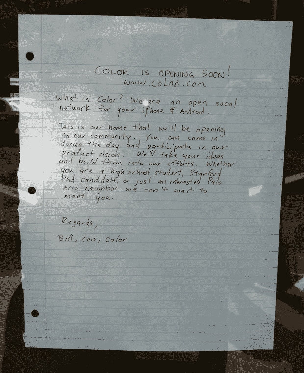
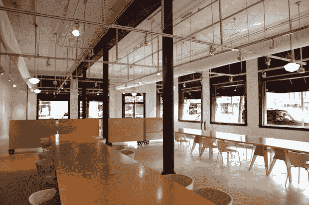

# Color 完全公开的照片交换服务有一个公共办公室来匹配 TechCrunch

> 原文：<https://web.archive.org/web/http://techcrunch.com/2011/03/25/colors-totally-public-photo-swapping-service-has-a-public-office-to-match/>

# Color 的完全公开的照片交换服务有一个公共办公室与之匹配

现在漫步在帕洛阿尔托市中心，你有可能会路过硅谷最热闹的初创公司之一: [Color](https://web.archive.org/web/20230203013125/http://www.color.com/) ，新的[照片交换服务](https://web.archive.org/web/20230203013125/https://techcrunch.com/2011/03/23/color-looks-to-reinvent-social-interaction-with-its-mobile-photo-app-and-41-million-in-funding/)，它在推出前筹集了 4100 万美元，并遇到了一波又一波的宣传和[反弹](https://web.archive.org/web/20230203013125/https://techcrunch.com/2011/03/25/color-backlash/)。从外面看，Color 的办公室很普通——除非你注意到挂在门上的手写便条。

Color 首席执行官比尔·阮(Bill Nguyen)在 2009 年将 Lala 出售给苹果，随后创办了 Color，他给路人写了一封信，邀请他们到办公室来看看——在那里他们实际上可以提交产品的想法。

以下是全文:

> “什么是颜色？我们是一个为你的 iPhone 和 Android 开放的社交网络。
> 
> 这是我们的家，我们将向我们的社区开放。你可以在白天来参加我们的产品愿景。我们将采纳您的想法，并将其融入我们的工作中。无论您是一名高中生、斯坦福大学的博士生，还是一名对帕洛阿尔托感兴趣的邻居，我们都迫不及待地想见到您。
> 
> 问候，
> 比尔，首席执行官，色

我们已经确认这封信确实是 Nguyen 写的，他不仅仅是对邻居说些空话——Color 完全有意向公众开放其部分办公室。

John Kuch 是该公司的营销和传播副总裁，他解释说，Color 已经在其办公室中留出了一个房间，用于举行会议、邀请嘉宾的公共活动、非正式聊天以及其他旨在解释和改进产品的活动。还会有关于颜色的“公共”视觉的真正含义的对话。我怀疑这是他们针对不可避免的隐私问题采取的先发制人的措施，我们将拭目以待这项服务是否会成功。

房间本身很大，看起来像一个餐厅，配有长长的木桌。外部有窗户，这样人们可以看到里面(同样，符合公共主题)。

至于那张手写的便条——它真的很符合阮玲玉不敬的个性。

感谢斯图尔特·汉密尔顿的提示。【T2