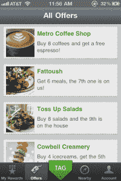
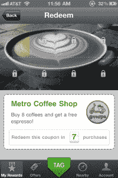

# 即将来到你附近的商店:Tagtile，一个类似正方形的移动忠诚度服务 TechCrunch

> 原文：<https://web.archive.org/web/http://techcrunch.com/2011/10/05/coming-soon-to-a-store-near-you-tagtile-a-square-like-mobile-loyalty-service/>

[Tagtile](https://web.archive.org/web/20230204201024/http://www.tagtile.com/index.php) 是一家新公司(也是最近 TechCrunch Disrupt Startup Alley 的参与者)，它正在使用涉及免费硬件的[广场](https://web.archive.org/web/20230204201024/https://squareup.com/)模式来解决实体商家的客户忠诚度、管理和奖励问题。

像移动支付服务 [Square](https://web.archive.org/web/20230204201024/https://squareup.com/) 一样，Tagtile 也为其商家提供免费的硬件设备——在这种情况下，是一个白色的立方体，供顾客在结账时用手机点击。

这个立方体是用来作为权宜之计的，直到 NFC(近场通信)在移动领域真正起飞。Tagtile 的联合创始人兼首席执行官 Abheek Anand 解释说:“尽管它充满希望，但 NFC 一直是一项需要 3 年时间才能实现的技术……我们只想专注于一件事——改变消费者行为。”

*(商店里的设备—[这是现在的东西](https://web.archive.org/web/20230204201024/https://techcrunch.com/2011/10/05/bringing-punch-cards-online-perka-launches-a-nifty-loyalty-platform-for-small-businesses/)！另见:基于 iPod 的 Perka，[今天发布](https://web.archive.org/web/20230204201024/https://techcrunch.com/2011/10/05/bringing-punch-cards-online-perka-launches-a-nifty-loyalty-platform-for-small-businesses/)。*

[tag tile](https://web.archive.org/web/20230204201024/http://www.tagtile.com/index.php)提供的是一种简单的方法，让客户注册访问参与的商家，以换取积分、优惠券、折扣或商家想要分发的任何其他忠诚度奖励。顾客只需在他们的智能手机(iPhone 或 Android，不久将是黑莓)上启动一个应用程序，在结账时点击立方体就可以获得奖励。他们还可以通过应用程序在 Foursquare 或脸书上签到，或者(很快)在推特上发布他们的访问。

这种体验非常类似于支持 NFC 的解决方案所能提供的——只是不使用 NFC。相反，Tagtile 利用当今移动电话常见的传感器来建立连接，但 Anand 不想公开讨论哪些传感器或 Tagtile 如何使用它们。

在商家方面，cube 可以通过 USB 接入 PC，与任何现有的提供 SDK(软件开发工具包)的销售点系统集成。对于那些没有 USB 选项的商家，Tagtile 可以直接插入墙壁插座。在这种情况下，cube 借用用户智能手机上的数据连接将数据发送回 Tagtile 服务器。

对于有隐私顾虑的消费者来说， [Tagtile](https://web.archive.org/web/20230204201024/http://www.tagtile.com/index.php) 很清楚，个人身份信息不会与商家共享，只会与 Tagtile 本身共享。Tagtile 在 T2 的另一位创始人 Soham Mazumdar 专注于这些数据的安全性，他在谷歌工作了六年，从事谷歌搜索的基础设施和数据挖掘工作。与此同时，Anand 之前在 Engine Yard 从事产品管理工作，是 Lightspeed Venture Partners 的投资者，也是 VMware 的早期工程师。

Tagtile 商家可以通过服务超越基本的“打卡”奖励系统，获得更类似于他们商店的“谷歌分析”的东西。谁在那里购物，多久一次，什么时候，等等。显示在类似仪表板的界面中。商家还可以通过营销活动来锁定目标顾客，例如“过去两个月内没有再去过商店的所有人。”Tagtile 充当中间人，将信息从商家传递给购物者。

目前，该公司有 35 家不同垂直行业的商户在旧金山、纽约、佛罗里达和马里兰/新泽西地区测试该服务。Tagtile 还有几周就要完成第一轮种子融资，预计融资额约为 100 万美元。这一轮也可能与它的公开发行同时进行，也是一个月后。

同时，感兴趣的商家可以在这里报名[。](https://web.archive.org/web/20230204201024/http://www.tagtile.com/signup.php)

