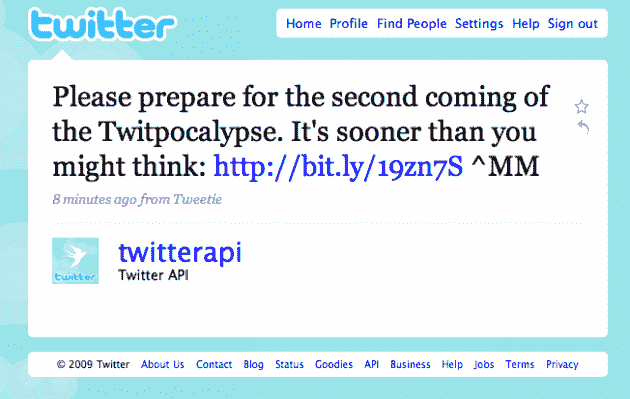

# 今年九月即将发布:Twitpocalypse Now Redux！

> 原文：<https://web.archive.org/web/https://techcrunch.com/2009/07/31/coming-this-september-twitpocalypse-now-redux/>

第一个推特启示录是你将来会告诉你的孩子的事件之一。我记得当它来袭时我在哪里:在我和一些朋友去纳帕谷的路上，我们听到警笛呼啸而过，这可能标志着我们所知的 Twitter 世界的终结。

好吧，事情最终并没有[那么糟糕](https://web.archive.org/web/20230403232711/https://techcrunch.com/2009/06/12/twitpocalypse-not-now-crisis-averted/)。但对于许多第三方开发者来说，这仍然是一件痛苦的事情，尤其是 iPhone Twitter 应用开发者，他们不得不像其他人一样在应用商店排队等待他们的修复程序通过。现在一切又要重演了！

TwitterAPIAPI 账户今天发布的一条推文警告说，第二次 Twitter 启示录比人们想象的要近。好吧，大多数人可能没有意识到它可能会再次发生，但它可以，而且它会，而且它正在快速接近。

API 团队目前的估计是，它将在未来 60 天内的某个时候发生，可能是在 9 月底。他们警告说，这可能会发生得更快。

这意味着什么，为什么会这样？好吧，对于那些不记得的人来说，当推文的唯一标识符达到 2147483647——32 位[有符号整数](https://web.archive.org/web/20230403232711/http://en.wikipedia.org/wiki/Integer_%28computer_science%29)的限制时，第一次 Twitter 启示出现了。这个数字导致一些第三方应用程序开始将推文标识符计算为负数，从而搞砸了它们。这个新的 Twitpocalpyse 是类似的，只是它用于 32 位*无符号*整数值 4，294，967，295。

如果你还没有意识到的话，这两个数字之间的鸿沟如此之快地被跨越的事实再次表明 Twitter 正在非常迅速地增长。尽管 tweet 与唯一 ID 的比例不是 1 比 1，但这个数字在短短几个月内就翻了一番(增加了 20 多亿)，这是非常巨大的。

那么你能做些什么来准备自己呢？Twitter API 团队建议开发使用 64 位整数的应用程序，这样在应用程序遇到这些整数之前，可以识别的 tweets 数量就会越来越多。

还有，把女人和孩子锁起来。

