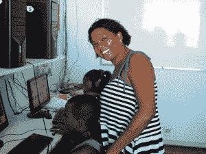
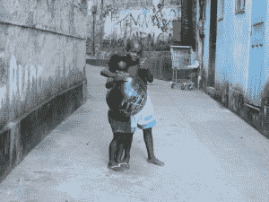
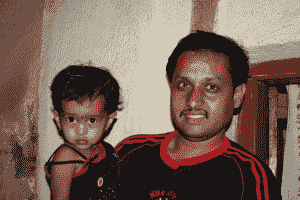

# 来自贫民窟的消息:巴西的贫民窟企业家 

> 原文：<https://web.archive.org/web/https://techcrunch.com/2010/05/12/coming-up-from-the-favelas-brazils-slumdog-entrepreneurs/>

 在我最后一次去巴西的前夕，我在看《犯罪现场调查:迈阿密》中的一集，大卫·卡罗素在里约追踪一名暴力毒枭。每当他们提到 favelas——拥挤在里约山上的臭名昭著的贫民窟——他的搭档就气喘吁吁地说，“这个城市最危险的地方。”

可悲的是——与《T4 犯罪现场调查》系列中几乎所有其他的东西不同——对贫民窟的描绘并不夸张。这实际上是毒枭和腐败警察之间的战争地带，许多里约的常住居民从未进入过。根据贾尼斯·帕尔曼在优秀著作[“民主巴西再访”中的研究，生活在里约贫民窟的五分之一的人在毒品战争中失去了一名家庭成员——几乎和他们一样多的人指责警察和毒贩](https://web.archive.org/web/20221209101933/http://www.amazon.com/Democratic-Brazil-Revisited-American-Studies/dp/0822960044)

这是新兴世界不同类型的贫困中令人震惊的一课。虽然很难与印度贫民窟缺乏水和污水系统等基础设施相提并论，但几乎没有什么可以与里约贫民窟的暴力相提并论。所以这是可以理解的，当我几周前进入里约贫民窟时，我的导游一直给我留下深刻印象，一年前我在任何情况下都不能来这里。一年前，出租车不会带我来这里。一年前，这里甚至没有人会送披萨。

一年有什么变化？具体来说，该市正在采取措施解决这一问题，着手实施一项“安抚”项目。正如有人向我解释的那样，新训练的特警式警察会采取一切必要的手段，夺回每个贫民区，赶走毒贩，因为他们认识到这种情况不仅仅是一个糟糕的社区，而是一个城市战区。作为警察部队的新人，这些警察与贫民窟的居民有着清白的历史，因此能够继续保护贫民窟，维持和平。到目前为止，已经平定了八个贫民区。我采访过的居民谈到了从日常暴力中解脱出来的感觉:突然间，他们可以成为城市的一部分了。但是许多人仍然保持警惕。“这是我很长时间以来看到的最好的社区，但我仍然很害怕，”平定的贫民窟 Babilonia 的妮维雅·门德斯说。“很少有人信任政府。他们只是出来参加选举。我还是持怀疑态度。”换句话说，即使他们实际上不在了，毒贩在这些社区仍然有势力——目前如此。

安抚还有另一个我从未想到的战术问题:  撇开暴力不谈，这一举动基本上将最富有的人——罪犯——挤出了贫民窟，为这些社区的商人和生存水平的企业家(比如你右边的男孩和他的家人)创造了新的谋生手段。这就是技术的用武之地。

十多年来，一个名为 [CDI](https://web.archive.org/web/20221209101933/http://cdiglobal.org/) 的非营利组织一直在给贫民窟居民一种不同的自由，建立计算机实验室并提供从基本计算机服务到 it 技能的一切培训。CDI 在 13 个国家建立了 800 多个社区中心，为 130 多万人提供上网服务，其中大部分在巴西，许多人是第一次上网。这里强调可持续性——每个社区中心都对网络接入和课程收费，但即使是最贫穷的巴西人也负担得起，每门课程只需几美元。还有一个对个人可持续性的强调，大多数人利用实验室学习市场技能，写简历和找工作。(门德斯在巴比洛尼亚经营计算机中心；她的照片在帖子的顶部。)

实验室由社区中的某个人管理，每个班级都需要利用技术和网络进行一个公民项目。一个贫民窟有老鼠的问题，所以一些  的青少年上课录下了鼠患，编辑了片段并展示给市政府，他们通常不会冒险进入贫民窟查看情况。垃圾被清理了，老鼠走了，婴儿不再因为被咬和抓伤而生病。在硅谷，我们谈论互联网极大地改变了世界，但它也改变了很多人的生活。

令人兴奋的是与创业和这些实验室的相关性。这不仅仅是他们学到的技能，这是一种来自技术的授权感。当我第一次开始为这本书而旅行时，我期望能找到很多在贫民窟长大的企业家，但在大多数国家，情况并非如此。当然，在最纯粹的维持生计的形式中，有很多“企业家精神”的例子——商人、皮条客、司机、轮胎店等等。但居民们告诉我，日复一日的生活压力如此之大，以至于创办一家高增长公司的想法无异于在月球上殖民。

然而，在巴西，我遇到了几个来自贫民窟的企业家，其中两个我在[本帖](https://web.archive.org/web/20221209101933/https://beta.techcrunch.com/2010/05/02/inside-brazils-advertising-startup-boom/)中提到过，另一个在[本帖](https://web.archive.org/web/20221209101933/https://beta.techcrunch.com/2010/05/08/making-lemonade-out-of-bureaucratic-brazilian-lemons/)中提到过。像任何地方的伟大企业家一样，这些人是例外。但是很明显，即使是在巴西最艰苦的生活中，也有一些东西让人们有远大的梦想。而且，像 CDI 这样的技术和公司越来越多地在这方面发挥重要作用。这些企业家中的每一位都将自己公司的早期追溯到修补和，本质上，黑客；一个是电脑，一个是飞机和广告，一个是官僚机构。电脑、手机和互联网是黑客攻击的最佳画布，让黑客攻击产生更大的影响。

我已经写了这种电脑在印度贫民窟的普及，以及 NIIT 的“墙洞”项目和 T2 的移动电话和 T4 的服务的普及，我还写了卢旺达在把技术带给最贫穷的公民方面所做的重大投资。但是很多人怀疑这对那些表面上有更大问题的人有多少好处。我最近读完了一本书，名为[《尽管有神:现代印度的崛起》](https://web.archive.org/web/20221209101933/http://www.amazon.com/Spite-Gods-Rise-Modern-India/dp/1400079772)，这本书相当讽刺地嘲笑了这样一种观点，即新兴市场应该在贫困地区投资技术，而那里有更迫切的需求，如食物、水和就业。

作者爱德华·卢斯在印度生活过，不可否认，他在那里呆的时间比我长得多。但是我们清楚地看到不同的国家。上一次我在印度的时候，我和手机新闻公司 SMSOne 一起去了几个村庄和贫民窟，我在 2009 年 11 月写了一篇文章。在浦那郊外的一个半城市贫民窟，我遇到了一个女人，她在一条肮脏的河边黑暗的街道上卖菜。(图为她在你左边的家。)在 SMSOne 在那个社区推出的前夕，她对自己的经济状况感到非常沮丧，因此服毒自杀。SMSOne 的移动记者听说了这件事，急忙将她几乎没有生命的身体送往医院——但他们两人都负担不起任何医疗费用。

他的第一个 140 字的故事是关于她的情况和社区——通常陷入他们自己的日常斗争——团结在她周围，支付她的医疗费用，让她相信她的生命是重要的。她通过一名翻译说，现在情况有所好转，在她一个房间的家里，有婴儿在哭。

这个社区有几十个这样的故事:一个患有血癌并需要捐献者的女人，一个天生心脏有洞的小女孩，她的父母负担不起  手术(见右图)，还有一个社区，所有人都参与进来，用 140 个字符的短信群发阅读这些故事。我从轮胎店到当地的寺庙，再到附近蜿蜒的街道，SMSOne 记者一遍又一遍地从住在那里的人那里听到这些故事。在 SMSOne 之前的人们感觉不像一个真正的社区，尽管他们分享着印度拥挤的土地。令人惊讶的是，每个故事开始变得如此相似，因为每个故事本身都是如此富有戏剧性。

坦率地说，卢斯的态度就是为什么富人不应该是决定穷人需要什么的人。认为技术是特权阶层的专利，或者生活在截然不同环境中的人们也以同样的方式使用技术是傲慢的。互联网给了人们发言权，当你富有时，你可能会认为这是理所当然的。但是在巴西和印度的贫民窟，我亲眼目睹了它拯救生命。