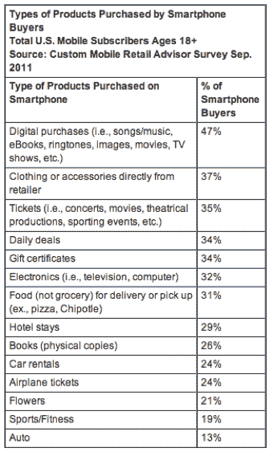

# comScore:38%的智能手机用户使用移动设备进行购物 

> 原文：<https://web.archive.org/web/https://techcrunch.com/2011/12/05/comscore-38-percent-of-smartphone-owners-have-used-a-mobile-device-to-make-a-purchase/>

# comScore:38%的智能手机用户使用移动设备进行购物

毫无疑问，移动购物正在兴起，今天 comScore 发布了新的数据来加强这一持续的趋势。根据数据研究和分析公司的数据，38%的智能手机用户在拥有手机的过程中至少使用过一次手机购物。

9 月份智能手机上购买的最受欢迎的产品包括数码商品、服装/配饰、门票和日常交易。9 月，三分之二的智能手机用户在手机上进行某种购物活动，包括比较产品和价格、搜索优惠券、拍摄产品照片或定位零售店。

9 月，数字内容购买，如音乐、电子书、电视剧和电影，是最受欢迎的移动购买，占 47%的份额；37%的人直接从零售商处购买服装或配饰，35%的购买者购买活动门票。9 月份，略多于三分之一的手机购买者在他们的设备上购买了日常交易和礼券。

就购物者通过手机购物的地点而言，56%的人在家购物，而 42%的消费者在外出或工作时购物。37%的远程购物者是在旅行或通勤时进行的。略多于三分之一的购买者在商店里使用智能手机购物。

超过 30%的购买者在商店使用智能手机购买产品的事实很有趣，因为许多人可能会将他们的手机作为实时价格和产品比较的工具。这个假日购物季预计将是移动年，因此我们将看到消费者是否会以创纪录的数量使用他们的手机进行零售购物。

