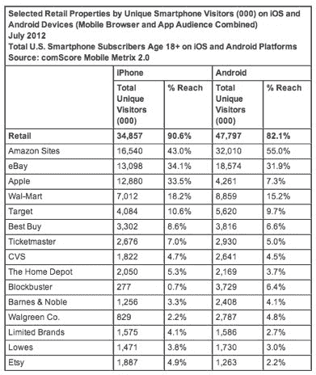
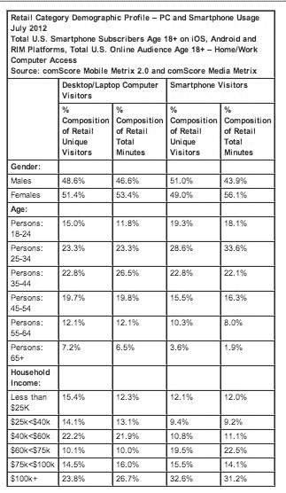

# comScore:五分之四的智能手机用户使用手机购物；亚马逊是最受欢迎的移动零售商 

> 原文：<https://web.archive.org/web/https://techcrunch.com/2012/09/19/comscore-4-out-of-5-smartphone-owners-use-device-to-shop-amazon-most-popular-mobile-retailer/>

# comScore:五分之四的智能手机用户使用手机购物；亚马逊是最受欢迎的手机零售商

今天，comScore [发布了一项关于美国智能手机在零售和购物方面行为的研究](https://web.archive.org/web/20221209215533/http://www.comscore.com/Press_Events/Press_Releases/2012/9/Retailers_Carving_Out_Space_in_the_M-Commerce_Market)。该研究发现，7 月份，每 5 个智能手机用户中就有 4 个在他们的设备上访问零售内容，这代表了 8590 万美国用户。亚马逊是最大的零售商，有 4960 万访客，其次是易贝(3260 万访客)，苹果(1770 万访客)，沃尔玛(1630 万访客)，塔吉特(1000 万访客)和百思买(720 万访客)。

除了传统零售商，Ticketmaster 还吸引了 570 万游客，因为夏季音乐会和表演让粉丝们转向智能手机获取门票和信息。家得宝(440 万游客)和竞争对手洛斯(320 万游客)也看到了流量。根据 comScore 的数据，基于位置的购物奖励应用 Shopkick 的移动受众在 7 月份达到了 400 多万人。

在 iPhone 和 Android 用户中，亚马逊都是最大的零售商，iPhone 用户中的覆盖率为 43%，Android 用户中的覆盖率为 55%，Android 用户中访问亚马逊应用商店的比例较高。相比之下，苹果在 iPhone 用户中的普及率为 33.5%，而在 Android 用户中的普及率为 7.3%。在大多数选定的零售商中，comScore 报告称，与 Android 相比，iPhone 的渗透率更高，而在大多数情况下，Android 设备的受众更多，因为该平台的整体市场渗透率更高。

comScore 还分析了移动购物者的人口统计数据。在智能手机和台式电脑中，男性和女性在零售类访客中所占的比例几乎相等。然而，女性在零售目的地花费的时间比例更高，在台式电脑上占 53.4%，在智能手机上占 56.1%。

智能手机购物者也更有可能比台式机购物者年轻，70.7%的智能手机零售访客年龄在 45 岁以下，而台式机用户的比例为 61.1%。这些受众的参与度显示出更大的差异，45 岁以下的访客通过智能手机在零售内容上花费的时间接近每 4 分钟 3 分钟，相比之下，台式电脑上的零售时间为 61.6%。

在访问零售目的地的智能手机受众中，近三分之一的家庭收入达到或超过 10 万美元，这一收入群体在零售网站和应用上花费的时间占总时间的 31.2%。

