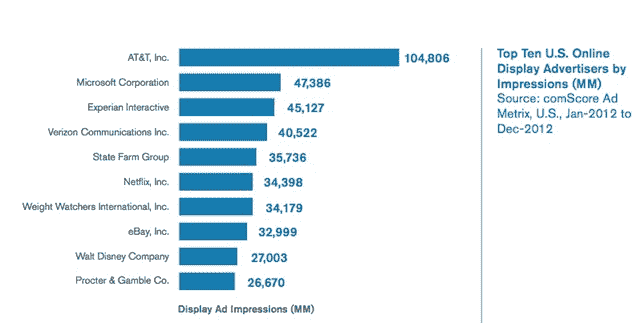

# ComScore 称 2012 年显示了 5.3 万亿条广告，但 10 条中有 3 条从未被看过——

> 原文：<https://web.archive.org/web/https://techcrunch.com/2013/02/14/comscore-digital-future-2013/>

# ComScore 表示，2012 年显示了 5.3 万亿条广告，但 10 条中有 3 条从未出现过

comScore 刚刚发布了 2013 年【聚焦 数字未来报告，提供了社交网络、搜索和移动等领域的大量数据。但最有趣的发现，至少对我来说，涉及到显示广告——在美国提供了 5.3 万亿次展示，但十分之三从未真正呈现在视图中。

这与 comScore 在去年的报告中所说的一致，当时它发现[31%的广告印象从未被消费者看过](https://web.archive.org/web/20220830104411/https://beta.techcrunch.com/2012/02/09/comscore-digital-future-advertising/)。尽管这是一个持续的问题，但报告称，我们应该“期待广告商要求更多的责任，出版商重新配置他们的网站设计和广告库存，以提高来年的业绩。”

comScore 说，更广泛地说，大型广告客户在广告购买方面变得越来越聪明，使用[程序化购买](https://web.archive.org/web/20220830104411/http://www.adexchanger.com/online-advertising/define-programmatic-buying/)和改进的目标定位，因此他们不需要像过去那样增加广告购买。例如，2012 年第四季度有 144 家广告主投放了超过 10 亿次广告，与 2011 年同期的 145 家相比相当稳定。

这些大型广告商是谁？嗯，印象广告中排名第一的是美国电话电报公司，其次是微软、益百利、威瑞森和州立农场。(美国电话电报公司也是去年最大的广告客户。)最大的广告客户类别是在线媒体，其次是零售和金融。

comScore 仔细研究了这 5.3 万亿次广告投放，称第四季度服务了 1.4 万亿次，同比增长 6%。这些广告中有八分之一是“社交化的”，这意味着它们引导观众“喜欢”或“追随”广告商。

至于 2013 年将会发生什么，该报告预测，出版商将会抵制由程序化购买导致的 CPMs(每千次广告展示支付的金额)下降。为了反击，他们将广告库存放在私人交易所，使用数据来证明广告的可视性和参与度，并进一步证明广告推动了线下行为，如店内销售。是的，我们可以期待看到更多的“本土”广告:

> 某些大型优质出版商也开始尝试和实施基于原生广告的模式，以大规模提供独特的品牌内容。脸书和 Twitter 已经成功实现了这种广告单元，利用了他们平台的独特价值，其额外的好处是这些单元在移动设备上和在台式电脑上一样好用。寻找其他人效仿，作为一种提高其平台价值、增加其库存价值和改善其内容可扩展性的手段。

除了广告，报告中还有很多内容。首先，如果你对整体数字流行度竞赛感兴趣，comScore 表示，谷歌拥有最独特的美国访客(12 月为 1.914 亿)，而脸书是花费时间最多的，占在线时间的 10.8%。

你可以[在这里](https://web.archive.org/web/20220830104411/http://www.comscore.com/Insights/Presentations_and_Whitepapers/2013/2013_US_Digital_Future_in_Focus)下载完整的报告。