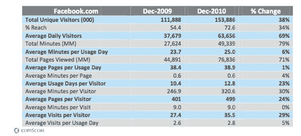
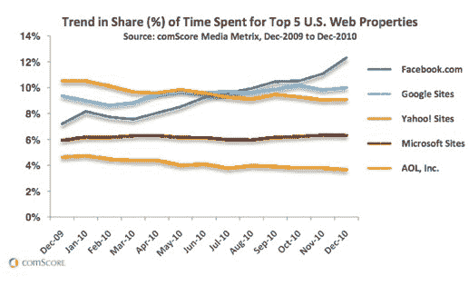

# comScore:脸书一直在吞噬人们的时间

> 原文：<https://web.archive.org/web/http://techcrunch.com/2011/02/07/comscore-facebook-keeps-gobbling-peoples-time/>

# comScore:脸书一直在吞噬人们的时间

拥有 [6 亿用户](https://web.archive.org/web/20230204140119/https://techcrunch.com/2011/01/13/facebook-nearing-600-million-users/)，脸书[统治社交网络](https://web.archive.org/web/20230204140119/https://techcrunch.com/2011/02/01/facebook-averaged-almost-8-new-registrations-per-second-in-2010/)已经不是什么秘密了。最近的 comScore 数据只是加强了社交网络的惊人增长。例如，2010 年，脸书占美国页面浏览量的 10 %,而十分之三的互联网会话包含对该网站的访问。

去年 12 月，脸书在美国的观众人数增长到 1.539 亿，比 2009 年同期增长了 38%，这个社交网络成为第四大访问量最大的网络资产。与 2009 年 12 月相比，2010 年 12 月花在脸书上的总时间飙升了 79%，达到 494 亿分钟。总页面浏览量增长了 71%，达到 768 亿。

就独立访问者而言，MySpace 在 12 月份排名第二，但其受众下降了 27%，在该网站上停留的总时间下降了 50%。职业社交网络 LinkedIn 在 2010 年 12 月以 2660 万的访问量成为该类别的第三大网站，比前一年增长了 30%。Twitter 在 12 月份有 2360 万独立访客，比 2009 年增长了 18%。Tumblr.com 的月访问量激增 168 %,达到 670 万
。

根据 comScore 的数据，脸书在每个网站上花费的时间甚至超过了谷歌、雅虎和微软。Hitwise 的数据[还显示](https://web.archive.org/web/20230204140119/https://techcrunch.com/2010/12/29/hitwise-facebook-overtakes-google-to-become-most-visited-website-in-2010/)脸书是 2010 年美国访问量最大的网站，击败了谷歌和其他网站。

尽管这些数据并不令人惊讶，但脸书对互联网用户上网时间的掌控令人印象深刻。难怪广告商纷纷涌向社交网络来接触用户。

