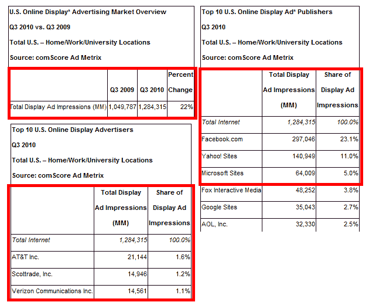

# comScore:脸书现在占了美国近四分之一的展示广告

> 原文：<https://web.archive.org/web/https://techcrunch.com/2010/11/08/comscore-facebook-now-accounts-for-nearly-1-in-4-display-ads-in-the-u-s/>

# comScore:脸书现在占了美国近四分之一的展示广告

根据受众调查公司 comScore(T2)的数据，美国在线展示广告市场正在像野草一样疯长。来自该公司 [Ad Metrix](https://web.archive.org/web/20221209061113/http://www.comscore.com/Products_Services/Product_Index/Ad_Metrix) 在线广告情报服务的数据表明[在 2010 年第三季度向美国互联网用户发送了近 1.3 万亿展示广告](https://web.archive.org/web/20221209061113/http://www.prnewswire.com/news-releases/us-online-display-advertising-market-delivers-22-percent-increase-in-impressions-vs-year-ago-106889843.html)，与去年同期相比增长了 22%。

在本季度，美国互联网用户平均收到超过 6000 个展示广告。不出意外的话[也许就是](https://web.archive.org/web/20221209061113/https://beta.techcrunch.com/2010/04/25/the-age-of-facebook/)、[脸书](https://web.archive.org/web/20221209061113/http://www.crunchbase.com/company/facebook)。

根据 comScore 的数据，社交网络在第三季度以不低于 2970 亿的展示广告展示量领先于所有在线出版商，占 23.1%的市场份额。

你是对的，蒂姆·阿姆斯特朗(也就是我的新老板)，关于谷歌(也就是他的前雇主)和脸书从美国在线蚕食展示广告份额的问题，当然还有其他人。

值得一提的是，comScore 的数据与我们最近从许多脸书员工那里听到的一些事情是一致的，其中一些是高层:该公司今年有望实现 20 亿美元的收入，其中大部分来自展示广告。

需要说明的是，comScore 显示广告单元的数据包括静态和富媒体广告，但不包括视频广告、室内广告和微型广告(尺寸小于 2500 像素)。

根据 comScore 的数据，脸书的市场份额从 2009 年第三季度的 9.2%增长了 13.9 个百分点。雅虎！网站在 2010 年第三季度以 1400 亿次展示(11%)排名第二，其次是微软网站，640 亿次展示(5%)和福克斯互动媒体，480 亿次展示(3.8%)。

美国电话电报公司在第三季度以 211 亿次展示排名第一，占展示广告的 1.6%。史考特以 149 亿次(1.2%)排名第二，威瑞森以 146 亿次(1.1%)紧随其后。

排在前十位的公司还有:网飞(1.0%)、通用汽车(0.8%)、华特·迪士尼(0.8%)、丰田(0.7%)和宝洁(0.6%)。

