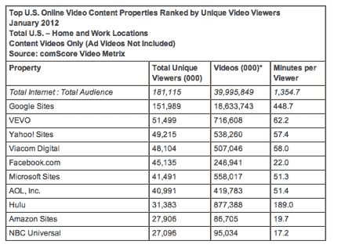
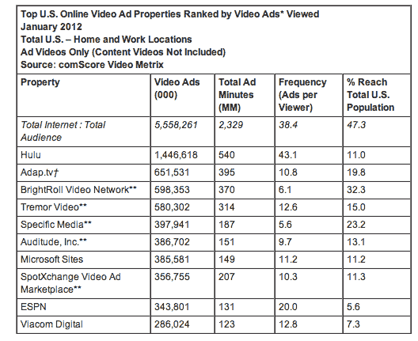
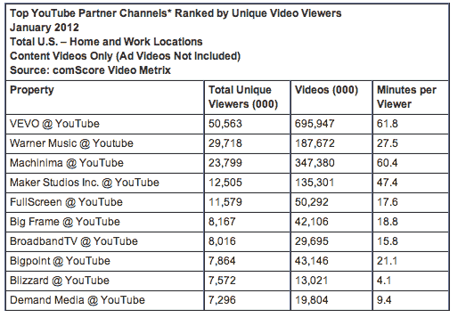

# comScore:一月份长篇视频内容浏览量上升 

> 原文：<https://web.archive.org/web/https://techcrunch.com/2012/02/20/comscore-long-form-video-content-views-on-the-rise-in-january/>

# comScore:一月份长篇视频内容浏览量上升

comScore 刚刚发布了其月度美国在线视频数据，虽然 2012 年 1 月(从 12 月开始)收视率略有下降，但长格式视频内容的浏览量却在上升。根据 comScore 的数据，1 月，1.81 亿美国互联网用户观看了近 400 亿段在线视频内容，相比之下[12 月有 1.82 亿用户观看了 435 亿段视频](https://web.archive.org/web/20221006075054/https://beta.techcrunch.com/2012/01/17/comscore-publishes-december-2011-u-s-online-video-rankings-facebook-slips/)。1 月份，84.4%的美国互联网观众观看了在线视频。在线内容视频的平均时长为 6.1 分钟(高于去年 12 月的 5.8 分钟)，而在线视频广告的平均时长为 0.4 分钟。

今年 1 月，YouTube 以 1.52 亿的独立观看人数再次成为最大的在线视频内容资产，其次是 VEVO(5150 万)、雅虎网站(4920 万)、维亚康姆数字(4810 万)和 Facebook.com(4510 万)。谷歌网站(YouTube)的浏览量最高，为 186 亿，其次是 Hulu，为 8.77 亿，VEVO 为 7.17 亿。普通观众观看在线视频内容的时间为 22.6 小时，YouTube (7.5 小时)和 Hulu (3.2 小时)的平均参与度最高。

特别是在 YouTube 上，视频音乐频道 VEVO(5060 万观众)和华纳音乐(2970 万观众)是最受观众欢迎的。游戏频道 Machinima 以 2380 万观众排名第三，其次是 Maker Studios，1250 万，FullScreen，1160 万，Big Frame，820 万。在前 10 大 YouTube 合作伙伴中，VEVO 展示了最高的参与度(每个观众 62 分钟)和最高的视频观看量(6.96 亿)，而 Machinima 展示了第二高的参与度(每个观众 60 分钟)和视频观看量(3.47 亿)。

美国人在 1 月份观看了 56 亿次视频广告，其中 Hulu 的视频广告展示次数最高，为 14 亿次。Adap.tv 以 6.52 亿的广告浏览量排名第二(也是视频广告交易/网络中最高的)，其次是 bright roll Video Network(5.98 亿)，震颤视频(5.8 亿)和 Specific Media(3.98 亿)。

本月观看视频广告的时间总计超过 23 亿分钟，其中 Hulu 提供的视频广告时长最高，为 5.4 亿分钟。这个月，视频广告平均 38 次触及 47%的美国人口。Hulu 向其观众投放视频广告的频率最高，平均为 43 个，而 ESPN 向每个观众投放的广告平均为 20 个。视频广告占所有观看视频的 12.2%，占在线观看视频总时长的 0.9%。

