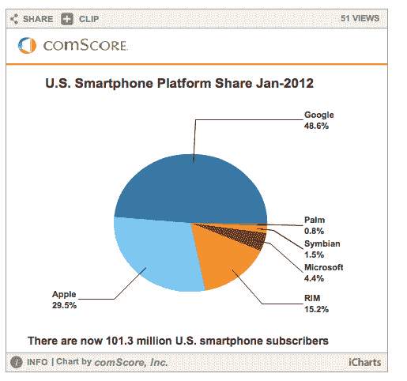

# comScore:超过 1 亿美国移动用户现在使用智能手机；Android 和 iOS 市场份额上升 

> 原文：<https://web.archive.org/web/https://techcrunch.com/2012/03/06/comscore-more-than-100m-u-s-mobile-subscribers-now-use-smartphones-android-and-ios-market-share-up/>

# comScore:超过 1 亿美国移动用户现在使用智能手机；Android 和 iOS 市场份额上升

在线和移动数据研究公司 comScore 刚刚发布了其 MobiLens 服务的月度移动使用数据，该数据报告了截至 2012 年 1 月的三个月平均期间的移动使用统计数据。该报告中一个值得注意的数据是，超过 1 亿美国移动用户(准确地说是 1.013 亿)正在使用智能手机，高于上一时期的 9790 万。自 2011 年 10 月以来增长了 13%。截至 2012 年 1 月，2.34 亿 13 岁及以上的美国人普遍使用移动设备。

与上个月的调查结果类似，谷歌的 Android 操作系统在智能手机市场的份额继续增长，占智能手机用户的 48.6%(增长 2.3 个百分点)，其次是苹果，占 29.5%的市场份额(增长 1.4 个百分点)。RIM 以 15.2%的份额排名第三，其次是微软(4.4%)和 Symbian(1.5%)。

在设备制造商方面，三星以 25.4%的美国移动用户份额排名第一，其次是 LG 和摩托罗拉，分别占 19.7%和 13.2%。苹果的份额占总移动用户的 12.8%(上升了 2 个百分点)，而 RIM 以 6.6%的份额位居第五。三星、LG 和摩托罗拉在此期间的份额均有所下降，而苹果是唯一一家份额有所上升的制造商。

随着手机使用的增加和智能手机的普及，越来越多的消费者实际上将手机用于通话以外的功能。1 月份，74.6%的美国移动用户在他们的移动设备上使用短信，上升了 2.8 个百分点。48.6%的用户使用下载应用程序(上升 4.8 个百分点)，48.5%的用户使用浏览器(上升 4.5 个百分点)。

更多的用户访问社交网站或博客，行为上升了 3.4 个百分点，占移动用户的 35.7%。31.8%的移动观众在手机上玩游戏(上升 2.6 个百分点)，而 24.5%的人在手机上听音乐(上升 3.3 个百分点)。

很明显，智能手机在美国的使用正在飞速增长，正如我们上周听到的，皮尤[报告](https://web.archive.org/web/20221205124855/https://beta.techcrunch.com/2012/03/01/tipping-point-smartphone-owners-now-outnumber-other-mobile-users-in-the-u-s/)称，智能手机用户数量超过了低端设备用户。尼尔森[透露](https://web.archive.org/web/20221205124855/http://tech.fortune.cnn.com/2012/02/20/nielsen-66-of-americans-ages-24-35-own-a-smartphone/)24-35 岁的美国人中有 66%拥有智能手机。

