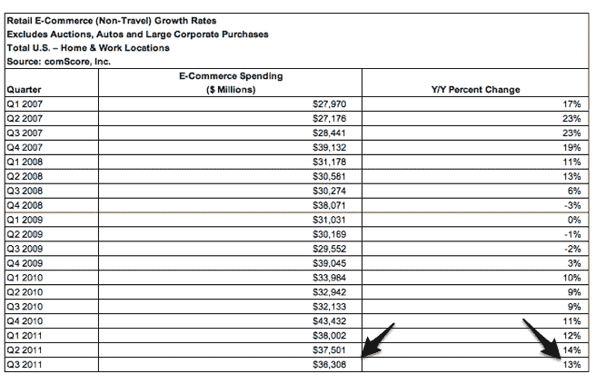

# comScore:美国第三季度电子商务支出增长 13%，至 363 亿美元 

> 原文：<https://web.archive.org/web/https://techcrunch.com/2011/11/09/comscore-u-s-e-commerce-spending-up-13-percent-in-q3-to-36-3-billion/>

# comScore:美国第三季度电子商务支出增长 13%，达到 363 亿美元

随着越来越多的消费者转向在线零售渠道购买商品，电子商务支出持续上升。comScore 刚刚发布了 2011 年第三季度的在线零售数据，这一季度美国在线零售支出达到 363 亿美元，同比增长 13%。

这是电子商务连续第八个季度同比增长，也是连续第四个季度两位数的增长率。今年在 Q2，支出比去年增长了 14%。

表现最好的在线产品类别是数字内容和订阅、活动门票、珠宝和手表、消费电子产品和计算机软件。与一年前相比，每个类别的支出至少增长了 15%。

comScore 表示，本季度总支出的增长是由于买家数量的增加，增加了 22%。根据该报告，74%的互联网用户在本季度至少进行了一次网上购物。这比今年 Q2 的 70%有所上升。

40%的电子商务交易包含免费送货。当然，这比 2010 年第四季度 49%的峰值有所下降，但免费送货服务往往在假期达到高峰。

尽管金融市场动荡不安，但 comScore 仍然相信假日购物季会持续健康。尤其是随着越来越多的消费者依赖于网上购物交易、免费送货、比较定价产品等，网上购物在 2011 年第四季度可能会继续保持强劲势头。

当然，我们将开始看到假日消费是否会很快上升的迹象。现在离感恩节、黑色星期五和网络星期一还有几周，看看当前的经济状况对今年的消费有没有影响将会很有趣。

