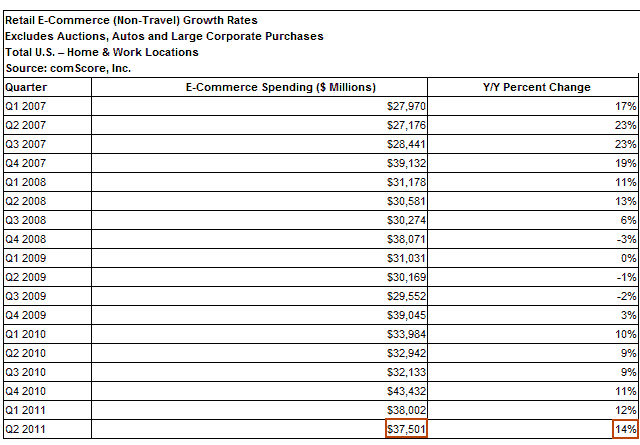

# comScore:由于买家增加，美国零售电子商务支出增长 14%

> 原文：<https://web.archive.org/web/http://techcrunch.com/2011/08/08/comscore-u-s-retail-e-commerce-spending-up-14-percent-thanks-to-an-increase-in-buyers/>

# comScore:由于买家增加，美国零售电子商务支出增长 14%

根据受众测量和跟踪公司 comScore 的数据，与去年同期相比，今年第二季度美国零售电子商务支出[增长了 14%](https://web.archive.org/web/20230203043817/http://www.prnewswire.com/news-releases/comscore-reports-375-billion-in-q2-2011-us-retail-e-commerce-spending-up-14-percent-vs-year-ago-127237503.html)。本季度在线零售支出达到 375 亿美元，主要是由于买家数量的增加(增长 16%)，70%的互联网用户在本季度至少进行了一次在线购买。

我们应该注意到，支出低于今年第一季度，当时 comScore [追踪到美国电子商务零售销售额为 380 亿美元](https://web.archive.org/web/20230203043817/https://techcrunch.com/2011/05/10/q1-online-retail-spending-up-12-percent-to-38-billion-number-of-buyers-up-7-percent/)。虽然，你可以在下面的图表中看到，情况总是如此，就像一年的第四季度总是因为年底的假期而支出最高。

与去年相比，14%的增幅代表着连续第七个季度的同比正增长和连续第三个季度的两位数增长率。

根据 comScore 的数据，前 25 大在线零售商占在线支出的 66.4%，低于一年前的 67.7%，也低于 2010 年第三季度 69.9%的峰值。

comScore 主席吉安·富尔戈尼(Gian Fulgoni)认为，现在美国每 10 美元的可自由支配支出中，就有近 1 美元发生在网上。

