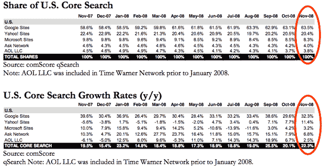

# ComScore: YouTube 现在占所有谷歌搜索的 25% 

> 原文：<https://web.archive.org/web/https://techcrunch.com/2008/12/18/comscore-youtube-now-25-percent-of-all-google-searches/>

# ComScore: YouTube 现在占所有谷歌搜索的 25%

根据 comScore 的最新搜索引擎数据，YouTube 上的视频搜索占美国所有谷歌搜索查询的四分之一。周四晚发布的月度 qSearch 报告公布了 YouTube 上的搜索次数。如果它是一个独立的网站，YouTube 将成为仅次于谷歌的第二大搜索引擎。过去几个月，通过 YouTube 进行的搜索比通过雅虎进行的搜索多。

Thomas Weisel Partners 的分析师克里斯塔·夸尔斯(Christa Quarles)在一份报告中写道:

> *YouTube 仍然是谷歌的突出贡献者，在美国产生了 27.3 亿次搜索，比上个月的 25.2 亿次增长 8.5%，比 2007 年 11 月的 12.8 亿次增长 114%。与 2007 年 11 月的 17.4%相比，YouTube 目前占美国谷歌网站搜索量的 25.4%，根据 11 月份美国总查询量计算，YouTube 超过了雅虎的总和。*

comScore 的数据显示，核心搜索活动也在健康增长(剔除视频搜索、地图搜索等)，尤其是谷歌。谷歌普通搜索的年增长率为 32.3%，而 10 月份的增长率为 29.6%。也许所有的假日廉价购物都有所帮助。

谷歌的核心搜索市场份额(不包括 YouTube)从 10 月的[小幅上升 0.4%，达到 63.5%(同比增长 5.9%)。](https://web.archive.org/web/20221011113806/http://www.beta.techcrunch.com/2008/11/25/google-gains-us-search-market-share-in-october-but-growth-slows/)

雅虎核心搜索查询的市场份额为 20.4%(比 10 月份下降 0.1%，同比下降 2%)，微软为 8.3%(环比下降 0.2%，同比下降 1.5%)。请参见下表。

