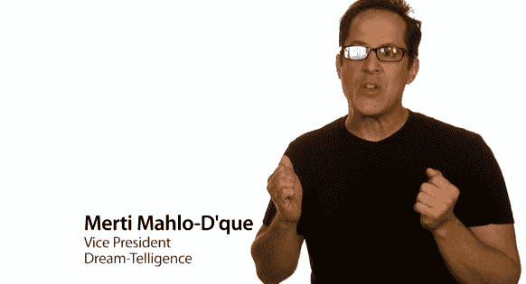

# 柯南烤 iPad 2:不管我们说什么你都会买[视频 TechCrunch

> 原文：<https://web.archive.org/web/http://techcrunch.com/2011/03/03/conan-ipad-2-video/>

# 柯南烤 iPad 2:不管我们说什么你都会买[视频]

随着每一次苹果新产品的发布，现在有一种期望，我们会得到一个苹果制作的视频来帮助解释产品。你知道的。照片中，苹果公司的高管(奇怪的是，从来没有首席执行官史蒂夫·乔布斯)以白色为背景，告诉我们这款产品有多么伟大，多么具有革命性。他们才华横溢，卓有成效。但他们肯定也把自己看得太重了。这就是为什么他们是模仿的完美目标。

我们已经看到许多人/团体在网上嘲笑这些。现在专业人士也参与进来了。在今晚的 TBS 节目中，柯南·奥布莱恩决定放手一搏。和乔布斯一样，奥布莱恩并没有出现在真实的视频中。相反，他建立了它，并让他的爪牙做工作。“*我个人认为苹果公司的人开始变得有点自大了，*”奥布莱恩说，以此来阐述他对 iPad 2 的看法([这是苹果的真实视频](https://web.archive.org/web/20230203154524/http://www.apple.com/ipad/#video))。

下面欣赏。我个人很欣赏“梦讯”的副总裁。