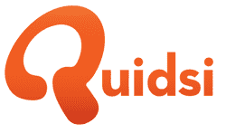

# 证实:亚马逊斥资 5.45 亿美元收购 Diapers.com 母公司 Quidsi TechCrunch

> 原文：<https://web.archive.org/web/https://techcrunch.com/2010/11/08/confirmed-amazon-spends-545-million-on-diapers-com-parent-quidsi/>

# 证实:亚马逊斥资 5.45 亿美元收购 Diapers.com 母公司 Quidsi

[Amazon.com](https://web.archive.org/web/20230213161713/http://www.crunchbase.com/company/amazon)刚刚[宣布](https://web.archive.org/web/20230213161713/http://www.businesswire.com/news/home/20101108005786/en/Amazon.com-Acquire-Diapers.com-Soap.com)已经达成收购 [Quidsi](https://web.archive.org/web/20230213161713/http://www.crunchbase.com/company/quidsi) 的协议，Quidsi 运营电子商务网站[Diapers.com](https://web.archive.org/web/20230213161713/http://www.crunchbase.com/product/diapers-com)、[Soap.com](https://web.archive.org/web/20230213161713/http://www.crunchbase.com/product/soap-com)和[BeautyBar.com](https://web.archive.org/web/20230213161713/http://beautybar.com/)。《财富》杂志(Fortune)的丹·普里马克(Dan Primack)在周末首次披露了这一收购消息，他将收购价格定为 5.4 亿美元。

Primack 并没有走得太远——亚马逊表示，它将以大约 5 亿美元的现金收购 Quidsi 的所有流通股。

这家电子商务巨头还将承担约 4500 万美元的债务和类似义务，使总收购价格达到 5.45 亿美元。

我们已经向该公司证实，Quidsi 今年的运营收入约为 3 亿美元。

此次收购预计将于年底完成。收购完成后，Quidsi 将在目前的领导团队下继续独立运营。

由 [Vinit Bharara](https://web.archive.org/web/20230213161713/http://www.crunchbase.com/person/vinit-bharara) 和 [Marc Lore](https://web.archive.org/web/20230213161713/http://www.crunchbase.com/person/marc-lore) 创立的 Quidsi 已经总共筹集了[7850 万美元](https://web.archive.org/web/20230213161713/http://www.crunchbase.com/company/quidsi)。它最近的融资是去年 4 月的一轮 2000 万美元的债务融资，投资者包括 Accel、Bessemer Venture Partners、MentorTech 和 New Enterprise Associates。

Quidsi 的交易类似于一年前亚马逊以 12 亿美元收购 T2 的在线鞋类零售商 Zappos 的交易。去年六月，T4 以 1 . 1 亿美元的价格收购了 Woot。

【YouTube = http://www . YouTube . com/watch？v=6zXOW6v0c8s&w=630&h=480]