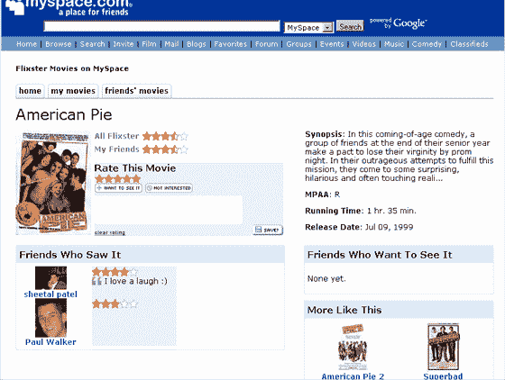
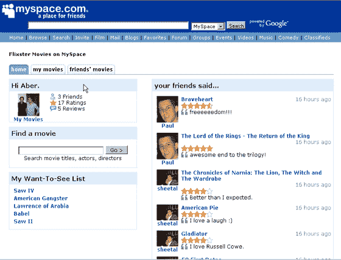
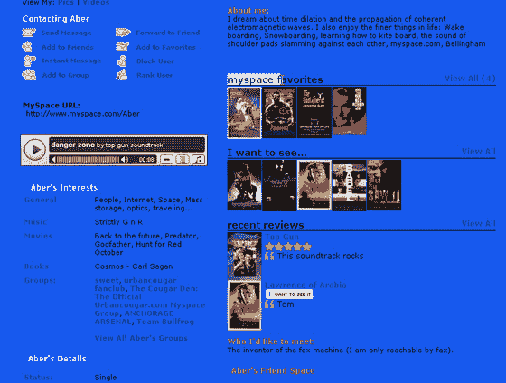

# 将军会？MySpace、Bebo 和 SixApart 将加入谷歌 OpenSocial(已确认)

> 原文：<https://web.archive.org/web/https://techcrunch.com/2007/11/01/confirmed-myspace-to-join-google-opensocial/>

谷歌可能突然冒出来，在社交网络权力斗争中将死于脸书。

MySpace 和 Six Apart 将宣布加入谷歌的 [OpenSocial](https://web.archive.org/web/20230228044243/https://techcrunch.com/2007/10/30/details-revealed-google-opensocial-to-be-common-apis-for-building-social-apps/) 计划。硅巷内部人士[今天早些时候报道了](https://web.archive.org/web/20230228044243/http://www.alleyinsider.com/2007/11/myspace-joining-google-coalition.html)MySpace 的谣言。我们已经从一个独立的来源证实了这一点，以及六分之二加入的事实。根据下面的更新，谷歌也确认 Bebo 将加入。

谷歌将于今天发布公告。MySpace 和 Six Apart 与 Orkut、Salesforce、LinkedIn、Ning、Hi5、Plaxo、Friendster、Viadeo 和 Oracle 一起宣布成为谷歌的合作伙伴。没有消息表明 MySpace 是否会继续努力完成其最近发布的平台，但答案可能是肯定的。他们很可能简单地两者都做(**更新:**见下文)。

突然，就在过去的几天里，整个社交网络世界宣布，他们正在联手对付脸书，谷歌是他们在这场大游戏中的四分卫。

**更新(太平洋标准时间 12:30):**在 Google now 的新闻发布会上。这是太平洋标准时间下午 5:30 禁止的，但他们已经将时间提前到太平洋标准时间 12:30(现在)。新闻稿将于今晚晚些时候发布。我的笔记:

在电话会议上，谷歌首席执行官埃里克·施密特说“我们已经与 MySpace 秘密合作了一年多”(很可能对应于他们一年前宣布的[广告交易](https://web.archive.org/web/20230228044243/https://techcrunch.com/2006/08/07/google-pegged-to-search-myspace/))。

MySpace 表示，他们的新平台努力将完全集中在 OpenSocial 上。

新闻稿中提到、Friendster、hi5、Hyves、imeem、LinkedIn、Ning、Oracle、orkut、Plaxo、、Six Apart、Tianji、Viadeo 和 XING 是 OpenSocial 目前的合作伙伴。

我们现在通过 OpenSocial APIs 在 MySpace 上看到了一个 Flixster 应用程序。Flixster 表示，他们花了不到一天的时间就完成了这个项目。我会在下面添加截屏。

这里有一个大问题——脸书现在会被迫加入 OpenSocial 吗？谷歌表示，他们正在与“每个人”交谈。这对脸书来说是一个重大的战略决策，他们可能别无选择，只能加入这个联盟。

Bebo 也加入了 OpenSocial。

Flixster/MySpace 屏幕截图:

T3T5