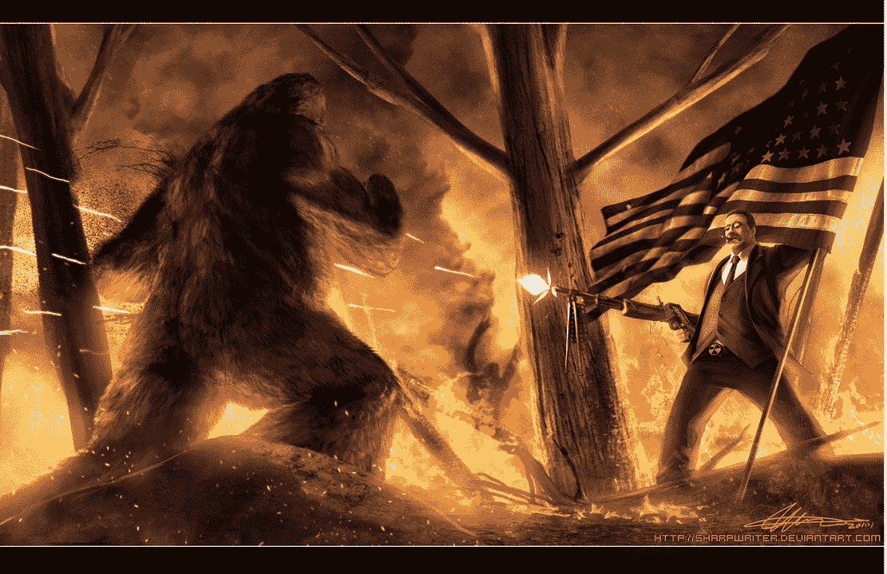

# 国会议员达雷尔·伊萨签署互联网自由宣言

> 原文：<https://web.archive.org/web/https://techcrunch.com/2012/07/09/congressman-darrell-issa-signs-declaration-of-internet-freedom/>

# 国会议员达雷尔·伊萨签署互联网自由宣言

众议员达雷尔·伊萨(49 岁)签署了互联网自由宣言，这是一份广泛的在线文件，旨在保持互联网的自由和开放。众议院监督和政府改革委员会主席伊萨是第一个签署该法案的民选官员。

国际社会保障协会一直直言不讳地反对《制止在线盗版法案》(SOPA)。上个月，他[起草了](https://web.archive.org/web/20230402124255/http://www.keepthewebopen.com/)“数字公民权利法案”

> 数字公民的权利法案
> 
> 我认为个人拥有某些基本权利。政府应该保护这些权利免受侵犯。这是美国独立宣言和美国宪法的核心革命原则。任何人都不应践踏我们的生命权、自由权和追求幸福的权利。这就是为什么《权利法案》是美国公民对抗一切形式暴政的第一道防线。
> 
> 但是，一个数字公民可以从哪里寻求保护来对抗强权呢？这个问题是阻止 SOPA 和 PIPA 并保持网络开放的斗争的核心。虽然我没有所有的答案，但我们见证的在捍卫开放互联网方面的非凡合作让我明白了三件事。首先，政府盲目干预和监管，甚至连最基本的都不了解。其次，我们有一个难得的机会，就如何对待互联网、使用互联网的人以及互联网支持的创新向政府下逐客令。第三，我们必须立即开始工作，因为我们的对手没有放弃。
> 
> 我们需要构建一个数字权利法案。这是我的初稿。我需要你们的帮助来做好这件事，所以我把它发表在麦迪逊这里，供大家评论、批评和合作。我期待收到您的来信，并继续共同努力保持网站的开放。

*代表 Issa 表明他对互联网自由的立场。*

[SOPA](https://web.archive.org/web/20230402124255/https://techcrunch.com/tag/sopa/) 没有在美国众议院达成投票，保护知识产权法案( [PIPA](https://web.archive.org/web/20230402124255/https://techcrunch.com/tag/pipa/) )没有在美国参议院通过，欧洲议会[否决了](https://web.archive.org/web/20230402124255/https://techcrunch.com/2012/07/04/happy-independence-day-sopas-cousin-acta-fails-to-make-the-vote-in-europe-but-is-this-really-the-end/)反假冒贸易协议( [ACTA](https://web.archive.org/web/20230402124255/https://techcrunch.com/tag/acta/) )。然而，这并不意味着这些计划，或者它们的未来版本，已经死亡。这就是[声明](https://web.archive.org/web/20230402124255/http://www.internetdeclaration.org/freedom)的用武之地。

> 申报
> 
> 我们支持自由开放的互联网。
> 
> 我们支持制定互联网政策的透明和参与性流程，并支持确立五项基本原则:
> 
> 表情:不要审查互联网。
> 
> 接入:促进快速和负担得起的网络的普及。
> 
> 开放性:保持互联网是一个开放的网络，每个人都可以自由地连接、交流、写作、阅读、观看、说话、倾听、学习、创造和创新。
> 
> 创新:保护未经许可的创新和创造的自由。不要封锁新技术，不要因为用户的行为而惩罚创新者。
> 
> 隐私:保护隐私，捍卫每个人控制其数据和设备使用方式的能力。

从美国公民自由联盟，Mozilla，Y Combinator 和 reddit 到 Cheezburger，Inc .和哈利波特联盟的支持者，该宣言拥有一个不拘一格但令人印象深刻的签名群。这份文件非常宽泛和模糊，很可能是有意为之。正如《大西洋电讯报》指出的那样，这种语言使得支持宣言的政府和公民很难达成解决方案。也许让一名政府官员越过边界签署声明会有助于事情的进展。

(图片来自越轨艺术/ [杰森·赫斯](https://web.archive.org/web/20230402124255/http://sharpwriter.deviantart.com/)