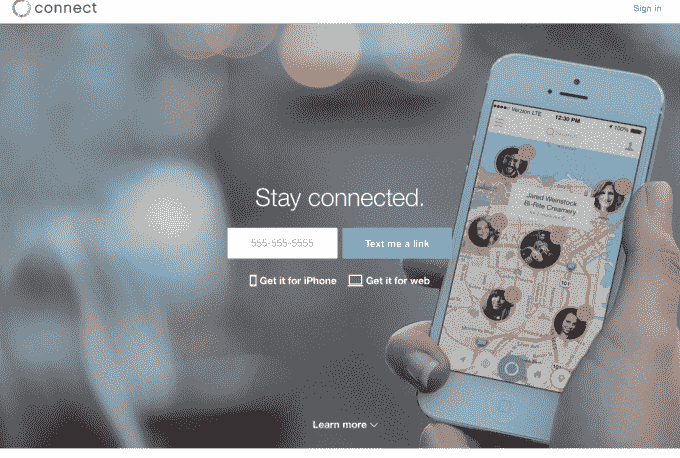
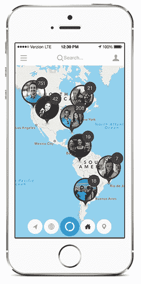
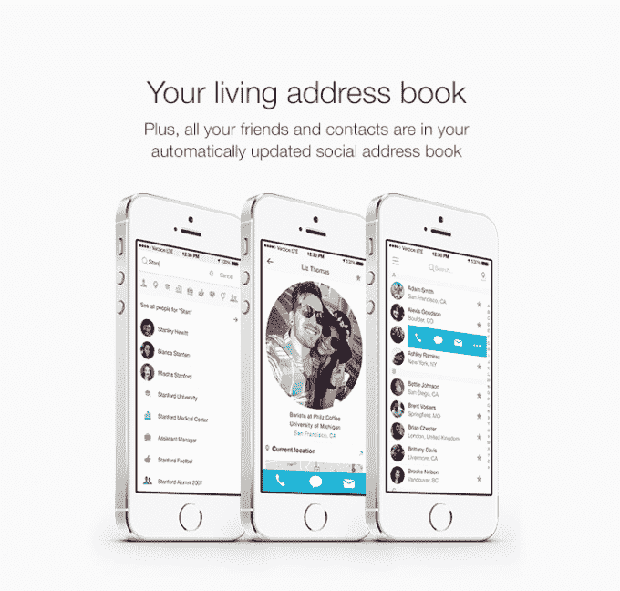

# Connect 推出了一个“活的”地址簿，可以为您附近的朋友绘制地图 

> 原文：<https://web.archive.org/web/https://techcrunch.com/2014/02/25/connect-debuts-a-living-address-book-that-maps-your-nearby-friends/>

Connect 是一个新的基于位置的地址簿和朋友查找工具，今天在网络和 iPhone 上发布，它会告诉你谁在附近，允许更多的“偶然”相遇。如果这个想法听起来有点熟悉，那是因为一批基于位置的社交应用程序，包括 Highlight、Banjo、Glassmap 和 [others](https://web.archive.org/web/20230128054302/https://techcrunch.com/2012/03/06/all-the-location-apps-you-have-to-use-at-the-sxsw-royal-rumble/) ，在 2012 年奥斯汀 SXSW 大会期间引起了科技界的注意。但 Connect 正从一个不同的角度出发:它不是通过 GPS 跟踪用户，联合创始人瑞安·阿里斯说这可能有点“令人毛骨悚然”，而是从社交网络聚合数据，向你实时显示朋友的位置。

或许更重要的是，Connect 可以服务于一个更大的目的，而不仅仅是告诉你谁在附近——它也是一个相当智能的通讯录，因为该应用程序允许你通过多个领域搜索联系人，不仅包括他们的姓名，还包括他们的公司、职位、学校、兴趣、关系状态、性别、城市等等。

为了开始使用 Connect，用户需要添加他们的 iOS 地址簿(在移动设备上)，加上他们的脸书账户，以及他们的谷歌地址簿和其他社交网络，例如 LinkedIn、Instagram、Foursquare 和 Twitter。这样做之后，该应用程序将根据他们的签到(如在脸书或 Foursquare 上)或地理标签帖子(如在 Twitter 或 Instagram 上)，在地图上显示你附近的联系。地图视图可以在“所有”视图(所有最近的签到)和“现在”视图之间切换，以仅显示那些刚刚发生的事件。

然而，要访问智能地址簿部分，你必须点击主屏幕右上角的小“人”图标，然后点击搜索框以显示过滤选项。虽然这项功能对于 Connect 连接附近用户的更大使命来说并不重要，但对于那些不再迷恋基于位置的签到服务的人来说，它无疑是更实用的功能。

通过各种设置，您可以配置和控制 Connect 如何提醒您附近的朋友，这为您选择如何使用该应用程序提供了一定的灵活性。例如，您可以打开一个设置，当外地朋友在您所在的区域、朋友在旅行、朋友在附近等情况时，它会向您发送 pings。您甚至可以拖移滑块来指定您的“附近”提醒应该距离城镇中心多少英里，或者将某些联系人指定为收藏夹来限制您的提醒。

这使得 Connect 成为一个强大的实用工具，可以根据您的特定需求进行精细调整，但它也可能使用户很难理解 Connect 的功能，因为它提供了如此多的不同用例，从专业网络到约会可能性以及介于两者之间的一切。

**环境定位应用 2.0？**

我个人对这款应用的兴趣在于联系人搜索和过滤，而不是实时定位元素。后一项是我可以在突发事件中使用的东西，比如在会议上或在外地旅行时。但是，虽然它肯定会很方便，但这是一个更有限的用例，因为我通常不会在外出办事时试图“偶遇”人们(尽管您的里程数可能会有所不同)。

同样值得注意的是，许多在 SXSW 2012 期间宣传类似“意外发现”连接的应用后来都失败了；活动结束后，许多人意识到每天只需要做这么多“实时交流”。(嗯，还有一些人因为过度使用 GPS 而成为电池消耗大户。哦，我们现在有引火物和研磨机，所以我们，嗯，很好。)

但是智能地址簿元素可能会看到 Connect 与其他实用程序的竞争，如 [Brewster](https://web.archive.org/web/20230128054302/https://www.brewster.com/) 、[最近收购的 Cobook](https://web.archive.org/web/20230128054302/https://techcrunch.com/2014/01/15/fullcontact-acquires-cobook-to-build-a-better-universal-address-book/) ，甚至 LinkedIn 自己的[联系人应用程序](https://web.archive.org/web/20230128054302/https://techcrunch.com/2013/04/25/linkedin-turns-its-contacts-section-into-a-personal-assistant-with-google-yahoo-evernote-outlook-apps-integration-and-a-standalone-iphone-app/)，它也可以让你从各种来源聚集你的联系。

Connect 在过去的 18 个月里一直在开发中，并在秋季与大约 16，000 名测试人员进行了测试，他们鼓励该公司增加跨平台的签到功能——这是过去的又一次爆炸，让人想起像 [Check.in](https://web.archive.org/web/20230128054302/https://techcrunch.com/2010/03/25/check-in/) 或 [Footfeed](https://web.archive.org/web/20230128054302/https://techcrunch.com/2010/09/15/demo-best-startups/) 这样的旧服务。(Connect 的麻花？您可以包含持续时间。)

**车队**

除了联合创始人 [Ryan Allis](https://web.archive.org/web/20230128054302/http://www.crunchbase.com/person/ryan-allis) 之前[以 1 . 7 亿美元的价格将他的电子邮件营销服务 iContact](https://web.archive.org/web/20230128054302/https://techcrunch.com/2012/02/28/vocus-buys-email-marketing-company-icontact-for-169-million/) 出售给 Vocus 之外，创始团队还包括 [Anima Sarah LaVoy](https://web.archive.org/web/20230128054302/http://www.crunchbase.com/person/anima-sarah-lavoy) ，她是牛津大学的 MBA，对人员跟踪的兴趣源于她对政治组织的热情；扎克·梅拉梅德，之前在 LaunchRock 莉莉娅·塔姆，之前在奇点大学。

LaVoy 解释说，她在遇到 Ryan 之前就有了 Connect 这样的想法。“我有来自四五个不同领域和兴趣的联系人，”她引用了那些她从大学、她的城市、她的政治工作中认识的人，等等。“我意识到这些关系是我必须跟踪的最重要的事情……我没有任何办法做到这一点，”她说。她说，有了 Connect，这一切都变了。

艾里斯补充道，这款应用不仅限于你的联系人，或者你在 LinkedIn 上认识的人——它的覆盖范围更广。“其他应用程序，如 Foursquare 或 Highlight，存在‘空房间’问题，”他说。也就是说，在你的大量朋友加入之前，它们并不那么有价值。Connect 在发布时能够找到你所有的朋友，前提是他们使用某种社交网络。

而且，如果你的朋友在社交上不太活跃，它仍然可以成为一个方便的通讯录。

由于 iContact 的出售，这家总部位于旧金山的八人公司自筹资金，个人投资 250 万美元。感兴趣的用户可以在这里报名[，或者从](https://web.archive.org/web/20230128054302/http://connect.com/) [iTunes](https://web.archive.org/web/20230128054302/https://itunes.apple.com/us/app/connect-map-your-friends-check/id688695759?mt=8) 抓取 app。Android 版本将于今年春天晚些时候推出。