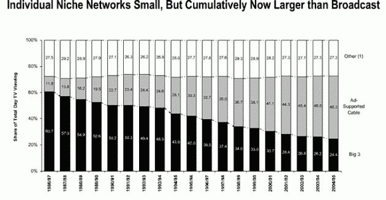
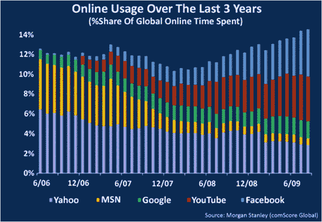
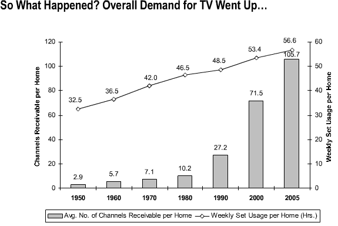
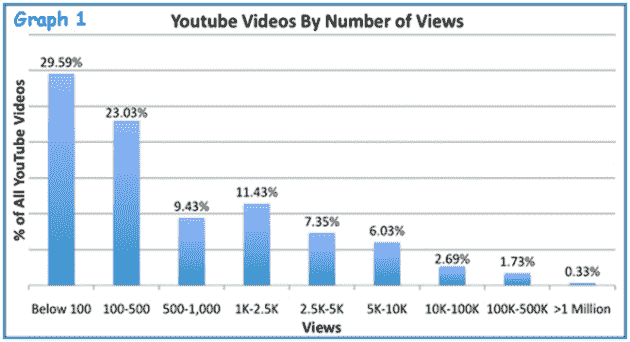
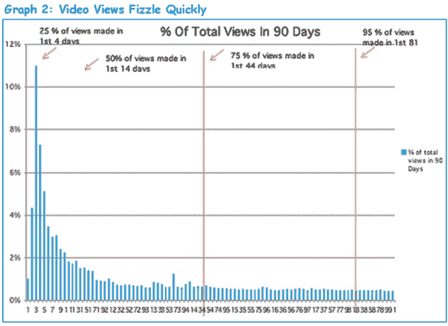
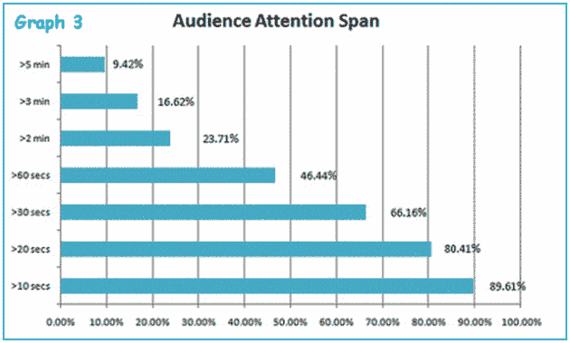
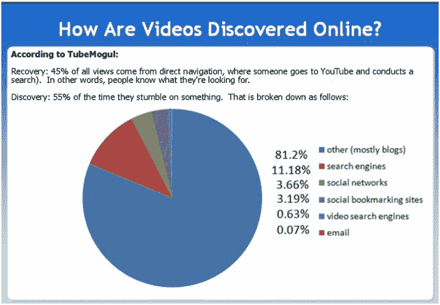
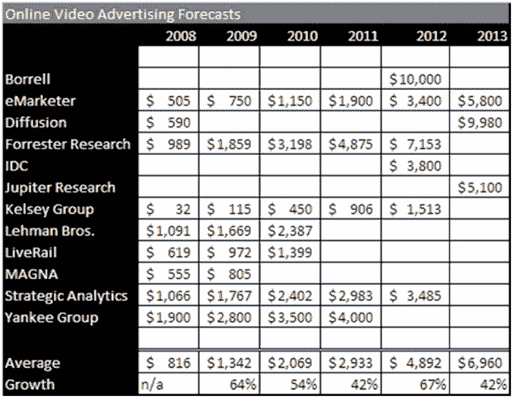
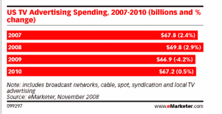

# 上下文为王:如何在线查找和消费视频 TechCrunch

> 原文：<https://web.archive.org/web/https://techcrunch.com/2010/01/30/context-is-king-how-videos-found/>

***编者按**:这是客座作家**[Ashkan Karbasfrooshan](https://web.archive.org/web/20230204115902/http://www.crunchbase.com/person/ashkan-karbasfrooshan)系列帖子的第三篇。* *此前，他写过关于网络视频* *的* [*状态，以及*](https://web.archive.org/web/20230204115902/https://techcrunch.com/2010/01/11/state-online-video-getting-paid/) [*12 个令人吃惊的事情牵制着网络视频广告*](https://web.archive.org/web/20230204115902/https://techcrunch.com/2010/01/16/12-things-holding-back-online-video-advertising/) *。在今天的第 3 部分中，他研究了在线视频是如何被发现和消费的。* *Karbasfrooshan 是*[*WatchMojo***的创始人兼 CEO，是一个优质、资讯性、娱乐性的视频内容制作人。自 2006 年以来，该公司的 5000 个视频目录已经产生了超过 1.1 亿个视频流。*T32*](https://web.archive.org/web/20230204115902/http://www.watchmojo.com/)

 *为了理解——更不用说猜测——视频广告的未来，我们需要从过去几十年来媒体的最大趋势开始。2006 年 11 月，贝尔斯登有线电视和卫星电视分析师·王发表了一篇名为“为什么娱乐行业以内容为王”的研究报告。虽然贝尔斯登已经被摩根大通收购，现在只是商业书籍中的一个脚注，但这项研究的发现比以往任何时候都更有意义。让我们来看看在线视频消费背后的 8 个关键因素

**因素 1:介质正在碎裂**

根据最近纽约时报的一篇文章，根据尼尔森的数据，在 1952-53 赛季，超过 30%的美国家庭在黄金时间观看 T2 NBC T3。事实上，直到 20 年前，你还可以在哥伦比亚广播公司、全国广播公司或美国广播公司购买一个 30 秒钟的插播广告，覆盖“所有人”。如今，NBC 的黄金时段收视率为 5%。当然，NBC 落后于 CBS 和 ABC，但无论是蒂芙尼网络还是迪士尼的同行都没有好到哪里去。秘密已经暴露:看电视的人越来越少，青少年把醒着的每一分钟都用来上网，越来越多地通过移动网络。

**因素 2:驱逐出境将持续存在**

随着媒体世界变得支离破碎，消费者转向网络，网络也走上了类似的道路，被称为[驱逐化](https://web.archive.org/web/20230204115902/http://www.avc.com/a_vc/2006/12/the_deportaliza.html):随着社交网络[获得巨大的追随者，垂直利基网站获得更小但更忠诚的追随者，远离旧的主流门户。](https://web.archive.org/web/20230204115902/http://www.readwriteweb.com/archives/it_was_a_facebook_christmas.php)

10 年前，你可以在 MSN、AOL 或 Yahoo 上购买一个横幅，并接触到网络上的“每个人”。五年前，你可以通过 AdWords 购买一个文本链接，并接触到直接在 Google.com 搜索或通过 AdSense 在谷歌出版商网络的无数网站上冲浪的消费者，从而获得同样的结果。

可以说，时代变了。事实上，越来越少的消费者甚至通过实际访问某个网站来寻找内容。套用杰夫·贾维斯的话来说，如果某件事很重要，它会找到我，不管是通过时事通讯、[【脸书】](https://web.archive.org/web/20230204115902/http://www.facebook.com/watchmojo)、[推特](https://web.archive.org/web/20230204115902/http://www.twitter.com/watchmojo)还是电子邮件中的共享链接。事实上，脸书很可能是最后一个巨大的网络资产，当它推出脸书连接时，它也开始将触角伸向网络。Twitter 的增长保持了 T7，这得益于它的非现场(API)增长，而 YouTube 从一开始就因其开放的可嵌入性而爆炸式增长。

然而，在 YouTube 以 16.5 亿美元的价格出售给谷歌(Google)后，该网站的总流量飙升，一些视频制作人试图找到一种在 YouTube 之外创造观众和收入的方法，以建立一个合法的业务。换句话说，媒体正变得支离破碎，网络正变得被驱逐，而这一切的第一线是在线视频。

**因素三:内容不是零和游戏**

如果我们回到电视，值得注意的是，随着有线电视的出现，随着频道数量的增加，整体内容消费也在增加。

类似地，随着在线内容制作者和分发点的数量增加，消费也呈指数增长。为了证明这一点，看看最近的 comScore 数据就知道了，2009 年 11 月有超过 310 亿的视频被观看。

**因素四:内容为王？**

事实上，套用维亚康姆董事长萨姆纳·雷德斯通的话:内容变得比分发机制更重要；随着新的分销渠道悄然兴起，内容永远是必不可少的，因此有了“内容为王”的谚语。如果你快进到 2010 年，确实有了所有这些社交媒体聚合和分发工具，你会看到[媒体浮出水面](https://web.archive.org/web/20230204115902/http://news.cnet.com/8301-13577_3-10440209-36.html)。毕竟，没有人关心管道；重要的是流经管道的是什么。人们接触和消费媒体的环境——脸书、推特、电子邮件——正变得比内容本身更重要。内容不再是王道，语境才是。

**因素 5:内容需求有弹性，资金供给无弹性**

正如你所想象的，问题在于，尽管全球广告的增长看似完全合理，但它的增长速度不足以养活创意桌上的所有人。随着“消费者接触点”的增加，每条内容在发布/广播时接触的人数会变少，但随着时间的推移会增加。总之，理论上是这样的。

这是一个双重打击的趋势。这是负面的，因为某些东西的观众(以及相应的收入)将少于电视上最受欢迎的事件，这部分解释了电视仍然比其在线兄弟有声望。

但这也是一个积极的趋势，因为作为内容所有者，你将能够在内容的保质期内获得更多收入。不要误解我的意思，电视上的联合组织是一个巨大的收入流，但这不是所有节目的选择，而在线上，从技术上来说，任何东西都有机会建立观众群，并有某种剩余的收入流。问题是没有在线审查过程*本身*，所以最小公分母可以是零。

**因素 6:追逐点击率被证明是徒劳的**

最终，媒体的总体消费将会增加，但点击率会降低，每次点击率会变得更加小众。统计数据支持这一假设，尽管 YouTube 的总规模和宏观层面的成功，每个剪辑的平均收视率显示，无论视频是用户生成的，优质还是超优质(关于差异的定义，请单击[此处](https://web.archive.org/web/20230204115902/http://www.watchmojo.com/blog/business/2009/04/06/online-video-aggregators-the-fight-to-avoid-obsolescence-is-on/))，平均而言:

*   随着时间的推移，它将获得 500 次浏览
*   25%的浏览量会在头四天出现
*   总的来说，只有前 30 到 60 秒会被观看。

你怎么能以此为基础做生意呢？

**因素 7:发现与恢复**

令人恼火的是内容是如何被挖掘出来的。借用约翰·巴特利对搜索的分类:视频是通过恢复和发现找到的。

统计数据显示:

*   45%的浏览量来自直接导航，即用户访问 YouTube 并搜索以“恢复”他们已经看过或正在积极寻找的内容。当然，YouTube 是世界第二大搜索引擎，大多数搜索现在是在 YouTube.com 进行的，这加强了 YouTube 现在是有史以来最好的互联网并购的论点。
*   其余 55%的时间，用户偶然发现一个视频并“发现”它。没错，超过一半的时间，用户随机地登陆某个东西。

换句话说，虽然传统媒体认为网络是盗版者窃取版权的地方，但事实是，所有消费的内容中只有一半是真正被搜索到的，另一半是偶然发现的，这意味着你实际上必须足够广泛地分发它，以增加人们甚至注意到它的可能性，更不用说给予谴责了！

这就是为什么你需要大量的内容和多样性。事实上，Time.com 前执行主编 Josh Tyrangiel [承认](https://web.archive.org/web/20230204115902/http://www.beet.tv/2009/08/long-form-journalism-on-the-web-is-not-working-timecom-managing-editor.html)“长篇新闻，像*《时代》*这样的杂志的主要内容，在网上是行不通的”。同样的情况也适用于在线长视频，并延伸到手机上。

**因素 8:尺寸很重要**

那么什么有效呢？为了更深入地了解这一点(并避免过于偏颇的观点)，我联系了迪娜·卡普兰，她是 blip.tv 的首席运营官。根据卡普兰的说法，网络上正在出现一个内容金字塔。

我倾向于同意。早在 2007 年 2 月，我写了一篇名为“[发行的商品化和内容的可扩展性](https://web.archive.org/web/20230204115902/http://watchmojo.com/blog/business/2007/02/27/the-commoditization-of-distribution-and-scalability-of-content/)”的文章。在这篇文章中，我提到了一个基本的金字塔，顶部是超级溢价，中间是溢价，底部是 UGC:

这当然不是火箭科学，卡普兰和我并不是唯一持有这种观点的人。她继续说道:“就托管和分发网络内容而言，Hulu 是位于金字塔顶端的最知名平台。长期以来，YouTube 一直以提供优秀的病毒式视频和一次性视频而闻名，它位于金字塔的底部。

问题仍然是:谁将拥有中间地带。几年前，YouTube 朝着“躯干内容”的方向发展。卡普兰的 blip.tv 显然是在迎合中间阶层，“blip . TV[想拥有]内容金字塔的中间部分:为网络制作的最佳原创节目。这些节目是由有才华的个人和制作公司制作的，他们正在为自己的节目培养忠实的观众，就像传统电视节目的制作人一样。”

随着苹果公司推出 iPad 和 IPTV 等产品，卡普兰相信“节目会在屏幕之间移动，你会选择在那个时候最方便的屏幕上观看内容。”

当然，随着 Boxee 的[努力让传统媒体加入进来，人们不禁要问新媒体制作人是否有一个赢得传统广告收入的黄金机会，传统广告收入远远超过新媒体。对于所有关于在线广告和在线视频广告的讨论和兴奋，美国的电视广告仍然是一个 750 亿美元的产业。](https://web.archive.org/web/20230204115902/http://gigaom.com/2009/05/28/so-thats-why-hulu-hates-boxee/)

当你意识到现有的电视业务和潜在的在线视频业务之间的差异时，你就会明白为什么赌注如此之高。下周回来，我们将更新我们的内容金字塔，以反映 2010 年的现实，并看看视频将如何在网上赚钱。另请参阅:

第一部分:[在线视频的状态](https://web.archive.org/web/20230204115902/https://techcrunch.com/2010/01/11/state-online-video-getting-paid/)

第二部分:[阻碍在线视频广告发展的 12 件令人惊讶的事情](https://web.archive.org/web/20230204115902/https://techcrunch.com/2010/01/16/12-things-holding-back-online-video-advertising/)

下周——第四部分:视频将如何货币化*