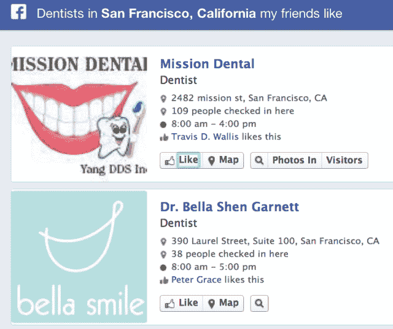
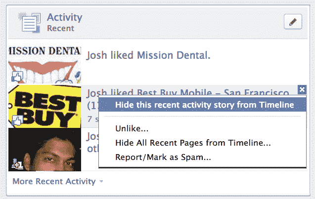

# Facebook 图片搜索让隐私看起来很自私

> 原文：<https://web.archive.org/web/https://techcrunch.com/2013/01/16/contribution-vs-privacy/>

[Facebook 图搜索](https://web.archive.org/web/20230404070709/https://www.facebook.com/about/graphsearch)的微妙影响在于，当你公开分享时，你分享的是对人类的利益。如果你不知道，或者只和少数人分享，你就剥夺了你的知识、推荐和内容。我们每个人现在面临的问题是，我们是优先考虑贡献还是隐私。

脸书的使命一直是“让 T2 的世界更加开放，联系更加紧密”，但直到现在，脸书的服务更擅长将我们与 T4 和我们的朋友 T5 联系起来。

新闻源和时间线将我们发布的内容传递给已经认识我们的人。分享是自我表达——提供我们是谁的数字表现。我们分享的东西最终可能会帮助别人，但我们从所有这些喜欢中得到了自恋的推动，并在这个过程中获得了社会资本。分享并不完全是利他的。

图形搜索为我们的内容创造了一个潜在的观众，我们永远不会满足。你喜欢一个温和的牙医或一个宁静的公园，你的历史地标或必看事件的照片可以更好地影响人们的决定。但你不会知道。对于那些通过图表搜索偶然发现您的捐赠的人来说，您的援助落在了您的网络之外。

这重新定义了我们与脸书共享盒子的关系。突然有了一个分享的理由，即使你不能立即预见它如何或对谁有价值。

那些温暖、模糊的喜欢和让人们认为你是专家的机会可能会让你分享你认为你的朋友关心的事情。然而，害怕得到零赞和惹恼你的朋友可能会阻止你分享最终可能会帮助别人的东西。对于你当地的牙医推荐来说，广播新闻根本就是错误的媒介。

但是，如果有一种方法，可以采取一个安静的行动，被图形搜索索引，你可能会更愿意捐赠你的建议和经验给脸书。问题是这并不存在。最接近的方法是公开分享一些东西，然后从你的时间表中隐藏起来。但这实际上不会隐藏新闻提要中的页面赞，人们可能不在乎他们添加到图表中的内容是否能被访问他们时间线的朋友拉出来。他们只是不想让它在主页上纠缠他们的朋友。脸书需要悄悄做出贡献。

为什么？暂时收起玩世不恭，记住外面有真正喜欢帮助别人的灵魂。虽然有徽章和精英地位，但利他主义是 Yelp 和维基百科等繁荣社区的基础。并非巧合的是，Facebook 图形搜索挑战 Yelp，因为它也可以吸引和提供推荐。如果脸书让伸出援手变得容易，人们会的。它的图表可能会繁荣，世界可能会发现它真正有价值，脸书可以把它变成一个支持进一步创新的企业。

—

图形搜索也有潜在的黑暗面——对分享的寒蝉效应。当脸书在 2006 年末推出新闻推送时，其 1200 万用户中有 75 万人加入了抗议该功能的团体。他们声称，虽然新闻提要中的所有故事只向作者允许的人展示，但这侵犯了他们的“隐私”在 news feed 发布之前，在脸书寻找一些信息的努力已经足够了。尽管有所顾虑，人们最终还是开始珍惜信息流。

脸书在推出 Timeline 时经历了另一轮抱怨。突然之间，旧帖子可以更容易地被挖掘出来。但是，由于浏览多年的内容以寻找冒犯性的东西的摩擦，这在一定程度上保护了雇主、家庭和浪漫的利益。

当图形搜索公开推出时，我们可能会看到同样的违反感，但由于搜索的方便性而被放大了。之前，你可能会广泛或公开地分享一些可能损害你声誉的事情——一张醉酒的照片、一篇有争议的文章、一个低级趣味的笑话——但你会假设它的受众通常是那些在新闻订阅中获得你的更新的人。

图搜索的效率穿透了摩擦的装甲，以发现。招聘人员不必梳理多年的时间线。他们可以搜索你在坎昆拍的照片。他们可以搜索“对拉斯维加斯的恐惧和厌恶感兴趣的人”很快，脸书计划索引帖子，这意味着你所有的状态更新和链接都可以被挖掘出来。

有些人没什么好隐瞒的。但对于那些身份不一定与他们的老板或父母一致的人来说，图搜索可能是一场噩梦。其他人仍然不关心帮助。他们不会去喜欢他们最喜欢的牙医，以防这可能对朋友或陌生人有所帮助。最后，有些人对如此公开地分享感到不舒服。

成为这些中的任何一个都没有错。如果你不想贡献，没关系，这是你的选择。但是现在图形搜索已经存在，这是你必须做出的选择。